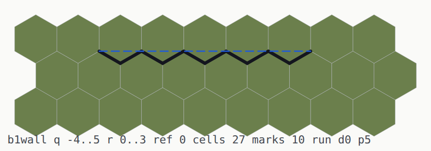
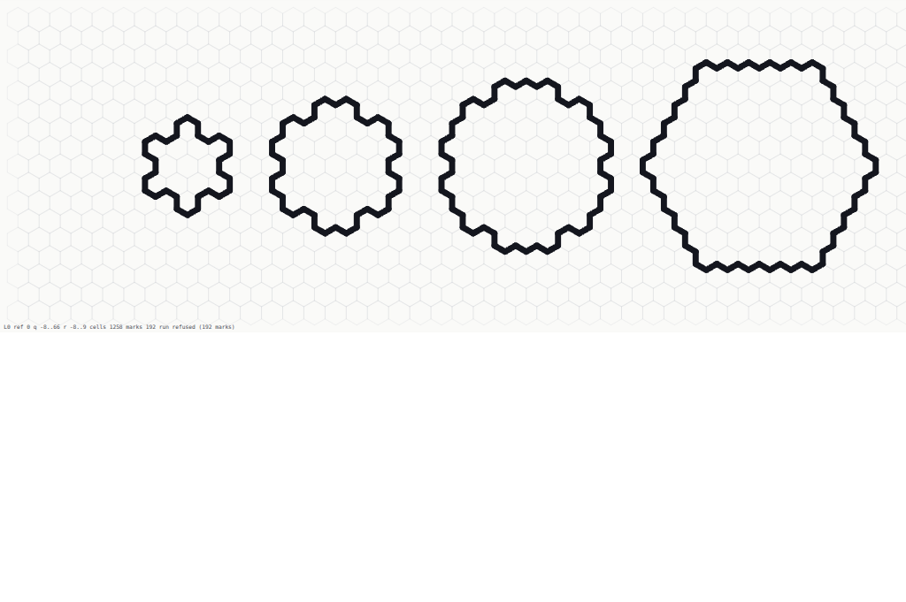
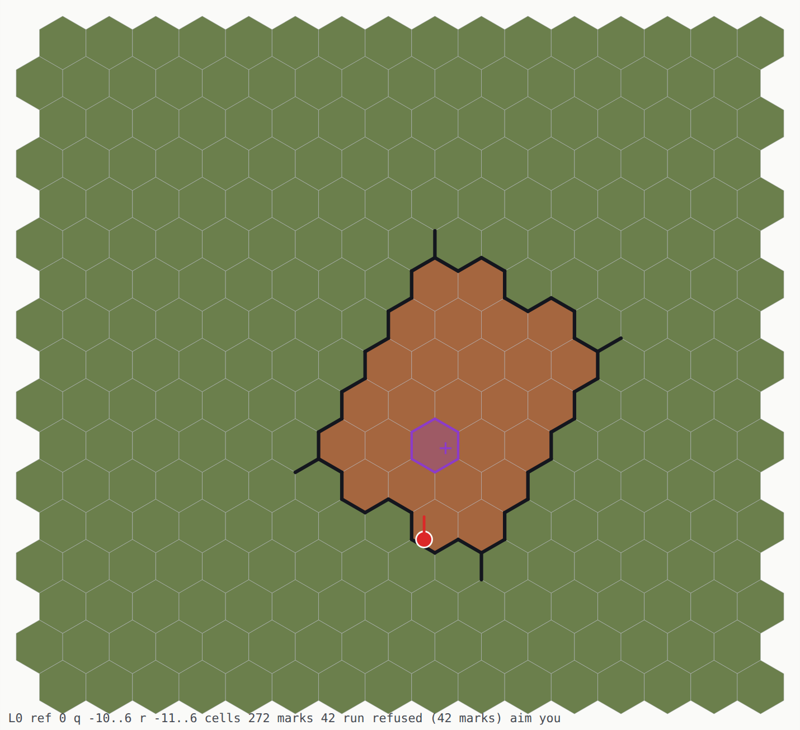
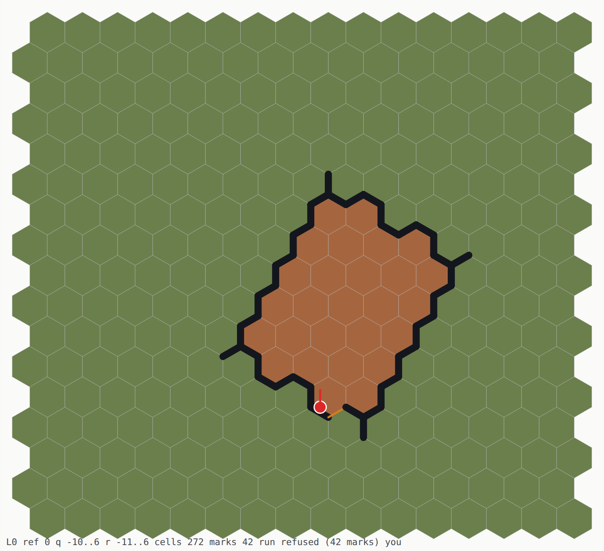
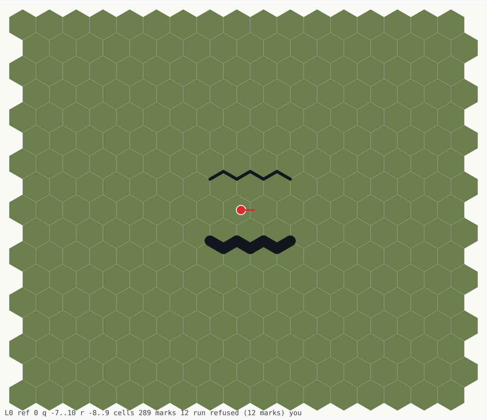
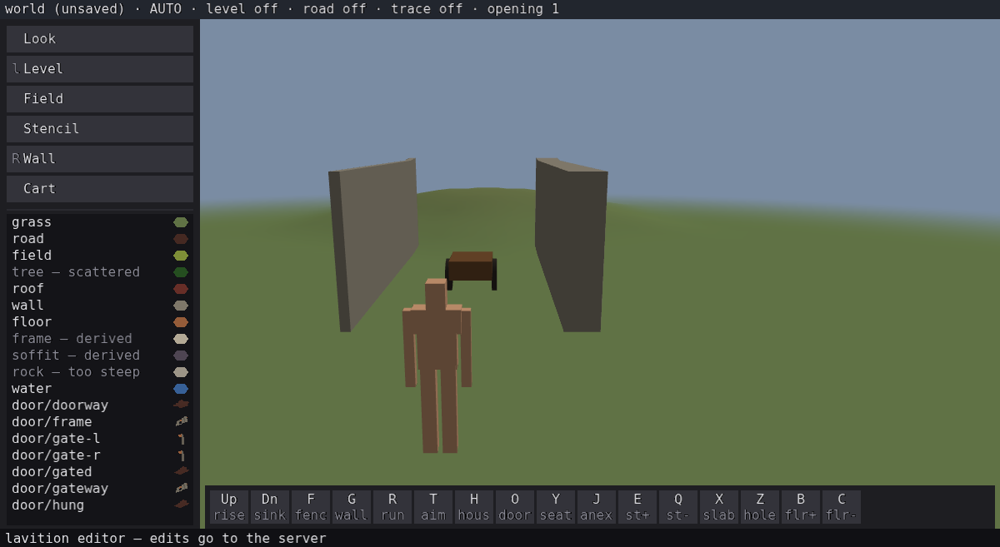
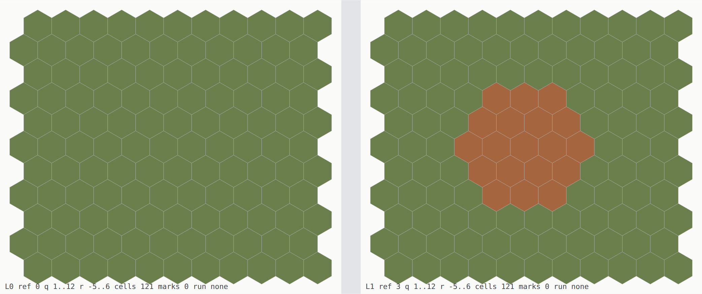

# The blueprint editor — a plan you perfect, then extrude

⛔ **PROPOSED, NOT SETTLED. The wall-type definitions in §2 are a proposal to
[hexbody](FORMAL_CORE.md), which owns the formal core.** `../hexbody` is read-only from here, so
what is written below goes there as a ticket before any of it is normative. Everything it rests
on — the lattice, `D`, the two domains, the recovery regimes — is already settled and is quoted
rather than re-derived.

## The requirement, in the reporter's words

> *"A house blueprint editor outside the in-world one. Where we can design details that need to
> be perfected before we extrude that to a real object and possibly push it into multiple
> layers. The rules/libraries used stay the same. This is done via mostly the same way so a
> character location on the map is still the running way (I want eventual controller support
> here). But this editor doesn't restrict the character anywhere. It can indicate positions of
> doors and windows and make multiple rooms / stairs and position furniture in a typical
> blueprint layout. It should paint the exact thickness of walls and it should allow for a
> different wall type that is rounded instead of straight for rounded structures like
> balconies/towers. And it should allow for octagonal walls for bay windows/balcony
> combinations. Multiple floors have a layout beside each other."*
>
> *"The octagon gets the 45 turns — that is why it needs a different material type. It doesn't
> behave like a normal wall. It can create a bay window from a straight wall."*
>
> *"And we allow octagon towers too, they are large enough for a unique deduction of the octagon
> shape."*

## 0. ⚠ WHAT IT IS FOR — and it is not mainly an authoring tool

> *"One reason why I am so interested in the blueprints is that we can really hone the current
> implementations of our libraries in an **easy to review format**. Concentrate on buildings
> first, but eventually I want to allow all possible shapes here — roads, railroads, designs for
> vehicles."*

**So the blueprint is an INSTRUMENT before it is a feature.** A plan view is the cheapest place to
see what the libraries actually do, and this session is the argument: every one of these was found
by reading source or by writing a one-off probe, and every one is a *picture* in plan view —

| what was found | how it was found | what a plan view shows |
|---|---|---|
| every wall drawn **twice** — hex-edge and straight | reading two emitters | two walls where one was drawn |
| `rebuild_construct` returns a **confident hexagon** for an octagon ([`B0p`](../../probe/b0p/README.md)) | a probe written for a different question | a six-sided outline over an eight-sided one |
| a wall laid at 15° reads back as 30° ([probe/l1](../../probe/l1/README.md)) | a round-trip harness | the recovered line beside the drawn one |
| `D`'s in-between twelve are 1.1021° off nominal | printing a library table | a wall that does not meet its neighbour |

⚠ **THAT REFRAMES THE ORDER OF WORK.** A review surface is worth most *before* the library work
it reviews, not after — so the blueprint is not a reward for finishing plan 24, it is how plan 24
gets checked. And it argues for building the **view** first and the **authoring** second.

✅ **AND THE VIEW IS BUILT — [plan 26](../../plans/26-blueprint/README.md) `B0`,
`make plan-view WORLD=<name>`.** The FIELD half only: `hex_mesh::plan_svg` draws one polygon per
cell of a window and one line per stored wall byte, out of a saved world, with the coordinates in
the file being `hex_corner_world`'s own floats. ⚠ **The first picture it drew paid for itself, and
not on any row of the table above**: `house.keys`'s house is 27 cells with a closed wall round them
and **four wall edges that bound none of them**, one at each corner — and **one of the script's two
openings is on one of those four**, so a window nobody has ever questioned bounds nothing. Whether
that is a defect or a wall the description genuinely authors is exactly `B1`, which is the argument
for building it.

✅ **AND `B1` PUT THE DESCRIPTION BESIDE THE FIELD**, which is the pairing this whole section
is about: `hex_editor::wall_recover` reads the store's wall bytes back through
`hex_shape::wall_read_run` and the plan draws its answer, dashed, over the marks it came from.
⚠ **What that pairing found on its first window is the cost of the four stray edges above**: the
same wall recovers as `d0 p5` alone and is **refused** when `wall.keys`'s house stands eight hexes
away, because one of the house's stray edges meets the wall's chain at a vertex. A structure that
does not touch a wall takes its description away.

⚠ **AND "ALL POSSIBLE SHAPES" IS A CONSTRAINT ON THE DESIGN, NOT A LATER PHASE.** Roads and
railroads are domain **B** (`hex_way` linework, `D`'s 24 directions); vehicles are `hex_rig`
assemblies with joints, already carrying the cart. **The editor must not be house-shaped**: what
it draws is *surfaces, features and assemblies*, and a house is one arrangement of those. Anything
that only works for a `Plan` is a wrong turn — which is exactly the trap §2.4 avoided by making a
bay a feature of a wall rather than a fourth kind of house part.

## 1. What the blueprint IS — and it already has a name

⚠ **THE FIRST QUESTION IS WHETHER THIS IS A SECOND AUTHORITY, AND THE ANSWER IS NO — BUT ONLY
BECAUSE OF WHERE IT SITS.** [FORMAL_CORE](FORMAL_CORE.md) §2.4.3 is blunt: *"the canonical text
is **not** a second editor representation, and must not become one — that is exactly the second
layer the editor is not allowed to have."* A blueprint that you edit, and that the world also
edits, is precisely that forbidden layer, and plan 24 exists to remove one of those.

**The formal model already distinguishes the safe case from the unsafe one:**

| | |
|---|---|
| `𝕋` | **canonical texts** — the written form of a model |
| `𝔽` | **field** states — the foxel, what the world holds |
| §2.4.3 | *"an authored **stencil** may carry a description, but once placed the world is foxel"* |

So a blueprint is a **stencil's description** — domain A, authored once in a **local frame**, then
placed. That is `𝕋`, and it is legitimate. What is forbidden is a blueprint that stays live
*beside* the placed world and is edited in parallel.

⚠ **THE INVARIANT, AND IT IS THE ONE THING TO GET RIGHT:**

> **A blueprint is authored, then EXTRUDED. After extrusion the field is the authority, and the
> blueprint is recovered from it by `rebuild` — never kept alongside it.**

"Extrude" is `draw`; "recover" is `rebuild`; §2.4.3 says `rebuild` is *"genuinely load-bearing
rather than a validation nicety — it is how a description is recovered from the world, for
editing"*. **Re-opening a blueprint means rebuilding it from the field**, which is what keeps one
authority. ⚠ If that round trip is lossy, the design fails — and §2 below names exactly where it
is lossy today.

✅ **MEASURED — [`B1p`](../../probe/b1p/README.md): the palette ROUND-TRIPS.** Seven entries out,
seven identical back, alongside cells and edges that survive to an identical world key. ⚠ **And
the finding was a COMPILE ERROR**: `world_to_bytes(w, **palette**, owner)` takes one, which this
design had assumed did not exist. So a wall's body and thickness have a home in the editor's own
format — as **opaque integers the consumer interprets**, which is also what keeps `OCTAGON` from
becoming a Moros word.

⚠ **AND IT RESOLVED A CONTRADICTION RATHER THAN CONFIRMING ONE.** `hex_voxel/tests/boundary.loft`
asserts `wd_body` must **never appear** in the substrate — *"the day this package knows what a
stair is, it has stopped being one"* — which read as a blocker. It is not: the test forbids the
substrate **understanding** a body, not **carrying** one, and an opaque palette is exactly *"the
library owns how a thing attaches to geometry, never the payload"*.

⛔ **WHAT REMAINS UNGATED IS UPSTREAM, NOT HERE.** `@HB-X63` proves
`write(rebuild(load(store(draw(read(T)))))) = T` byte-for-byte over six in-between directions, and
then says in its own words: *"⚠ **`@HB-X12` and `@HB-X13` are NOT covered** — the palette
(`wd_body`, `wd_thickness`, `ItemDef`/`MaterialDef` categories) is untouched and stays **T4**."*

`@HB-X63` still leaves the palette at **T4** in hexbody's own model, and `B1p` measures *moros's
encoder* rather than the model. ⚠ **The run record is the half that genuinely does not survive** —
a wall's authored line is lost on reload while its stamped edges remain, which is
[EDITOR_DEFECTS](EDITOR_DEFECTS.md) 4 and 5 and the defect plan 24 removes. **A blueprint inherits
that fix and does not need one of its own.**

## 2. Three wall types, and the octagon is a MATERIAL because 45° is not a direction

### 2.1 Straight — the only one that is a heading

A straight wall's direction is `d ∈ D`, `|D| = 24`. Written by `hex_shape::wall_write`, recovered
by `wall_read_run`, endpoints on triangle-lattice vertices. Measured 24 of 24 round-tripping
([probe/l1](../../probe/l1/README.md)), and the editor now takes its geometry from there
(plan 24 `H1a`–`H1e`).

### 2.2 Round — ✅ **`THICK_CURVED` ALREADY EXISTS**, and I proposed it anyway

⚠ **THE SHAPE VOCABULARY IS ALREADY THERE AND I DID NOT LOOK.** `@HB-X12` —
*"wall shape vocabulary `WallDef.wd_body`; thickness in the palette"* — and hexbody spells the
list out:

> `SOLID · HALF_HEIGHT · FENCE · BATTLEMENT · THICK_FLAT · **THICK_CURVED** · ROAD_GUIDE` — *"so
> `THICK_CURVED` **is** the rounded slot, and an **octagon body is a new value in this
> enumeration**, exactly the extension shape."*

**So the rounded wall is not a new type to design — it is a palette body that has existed all
along**, in `lib/moros_map/src/palette.loft` in this very tree. What follows is how it is *drawn*,
which is still worth stating, but §2.2 was never an open question.

`hex_edge::surf_arc(cx, cy, r)`, whose own comment is the argument for it: *"the normal is
**radial**, so it is exact everywhere along the curve — no faceting, no mesh."* A round wall is
therefore **not** a many-sided approximation; it is one surface with a centre and a radius.

Drawn by `hex_way::cut_arb`, which takes a `Surfaces` set and gives every boundary edge to its
**nearest** surface. Recovered by `hex_shape::arc_is_disk` / `arc_shell_max`.

✅ **AND THE EDITOR CAN BUILD ONE — [plan 26](../../plans/26-blueprint/README.md) `B4g`.**
`hex_editor::tower_ring` rings the author with the boundary of `hex_shape::arc_fill`'s disk;
`tower <shell>` in the runner, `59:` on the wire. ⛔ **What it replaces is a hexagon wearing the
name `disc`**: `fence_disc` asks `hex_grid::hex_distance <= rad`, which is six straight sides —
which is exactly *why* `ring_runs` can describe it as six runs — and the whole `hex_shape::arc_*`
family had **zero production callers** in this tree.

⚠ **A SHELL, NOT A RADIUS, AND THAT IS `@HB-X49`'s MEASUREMENT RATHER THAN AN API CHOICE.** 161
radii over `0.5 .. 4.5 wu` collapse to **four** distinct fields, so only the shell comes back —
and `arc_fill` draws the shell *below* a number naming none **without a word**, which is why the
gesture refuses with the nearest one instead.

⛔ **AND A DISK IS THE HEXAGON AT EXACTLY THE SHELLS `12R²`** — 12, 48, 108, 192, 300, measured
over every shell to 300 and nothing between them. One shell in three builds the ring this editor
already had, so *round* cannot be tested at a shell chosen for convenience.

⚠ **ROUNDNESS IS A PROPERTY OF THE SHELL, NOT OF THE GESTURE.** The smallest admissible round
tower — shell 36, 13 cells — is a **six-pointed star**; it takes shell 156, 55 cells, before a rim
reads as a circle. Same answer `B0p` got one shape over, and it is the honest reply to *"rounded
structures like balconies/towers"*: exact at every shell, and whether it LOOKS round is a size the
author has to be told. Recorded rather than legislated — refusing a small shell would enforce a
judgement, and the store is exact either way.

⚠ **AND IT REGISTERS NO `WallRun`, WHICH IS A FACT ABOUT `WallRun`.** A run is two endpoints and a
`d24`; a circle has neither. So a round wall is drawn by the **per-edge** emitter — the one
[EDITOR_DEFECTS](EDITOR_DEFECTS.md) 4 slates for deletion — and deleting it would take the only
way a curved wall can be drawn with it, unless the run record first gains an arc.

### 2.3 Octagonal — 45°, and therefore NOT a wall at all

⚠ **THE EXACT REASON, AND IT IS ARITHMETIC RATHER THAN TASTE.** A lattice direction has
`tan θ = m/(k√3)` for integers `(k, m)`. For `θ = 45°`, `tan θ = 1`, so `m/k = √3` — **irrational.
No integer `(k, m)` gives 45°, at any run length.** It is not merely absent from `D`'s 24; it is
absent from the lattice.

**So an octagonal face can never be a straight wall, at any tolerance, and that is why it is its
own material rather than another heading.** `hex_editor::WALL_MAT` carries a `d ∈ D`; the
octagonal material carries a **construction** instead.

✅ **AND HEXBODY HAS ALREADY NAMED THE MECHANISM — the ask is far smaller than §5 first said.**
An octagon is *"a new value in this enumeration, **exactly the extension shape**"*. `@HB-X69` says
why that is cheap: the vocabularies are **open** — *"`text` with the value lists only in comments
… so this is an open vocabulary, and `fits?` is finite only **relative to a palette**, which is
exactly why the palette is the designed extension point."*

⚠ **SO WHAT IS NEW HERE IS THE ARITHMETIC, NOT THE PROPOSAL.** The 45° irrationality above is the
*reason* an octagon needs a body of its own rather than a heading; the *place to put it* was
already decided upstream, and this design would have been a page shorter had `@HB-X12` been read
first.

⚠ **AND IT IS DRAWABLE, WHICH IS THE PART THAT MAKES THIS POSSIBLE AT ALL.**
`hex_edge::surf_straight(s, nx, ny, c)` takes an **arbitrary float normal** — its own header says
*"every one of the 24 headings, **and for anything between them**"* — and `cut_arb` marks edges
against it by nearest-surface. So a 45° face is expressible as a *surface* even though it is not
expressible as a *heading*. **The lattice constrains what a wall's DIRECTION may be; it does not
constrain what a surface may be.** That distinction is the whole of §2.3.

⚠ **THE PRICE IS RECOVERY, AND IT IS NOT SYMMETRIC.** A straight wall is recoverable from its
marked edges alone (`wall_read_run`). A 45° face is not: no `d24` is parallel to it, so the same
reader would refuse it — or worse, return the nearest `D` heading with `ok = true`, which
[probe/l1](../../probe/l1/README.md) measured it doing for walls drawn off `D`. **An octagonal
wall must therefore be recoverable some other way**, and there are two, which is why the
reporter's two cases are genuinely two cases.

### 2.4 The bay — a FEATURE of a wall, not a wall

> *"It can create a bay window from a straight wall."*

A bay grows **out of** a parent straight wall. Formally it is the same category as an opening,
which `@HB-X70` already settles: *"an opening is never 'no wall' — a door, a window and a real gap are
all **materials on a wall that continues**"*, carried as spans by `hex_edge::Features`
(`feature_add(surf, s0, s1, …)`, `apply_features`).

**A bay is that, projecting instead of perforating:**

| | opening (`@HB-X70`) | bay (proposed) |
|---|---|---|
| carried as | a span on the parent wall's surface | a span on the parent wall's surface |
| what it does to the wall | **perforates** — the wall continues past it | **projects** — the wall detours around it |
| its own geometry | a profile (round, pointed) | three faces at 45°, 90°, 45° to the parent |
| recovered from | the parent's feature list | the parent's feature list |

⚠ **SO A BAY IS NEVER AUTHORED AS THREE WALLS.** Its faces are **derived** from the parent's
direction, its span and its projection depth — three numbers, not three headings. That is what
makes it recoverable: `rebuild` reads the parent wall (a `D` run, exactly), then its features.
**Nothing has to deduce 45° from the field, because 45° was never stored.**

⚠ **AND THAT IS ALSO ITS LIMIT**: a bay cannot be moved independently of its wall, cannot outlive
it, and cannot be authored where there is no wall. Those are consequences of the definition and
should be refusals in the editor, not surprises.

### 2.5 The tower — a FORM, and "large enough" is the whole claim

> *"We allow octagon towers too, they are large enough for a unique deduction of the octagon
> shape."*

A freestanding octagon has no parent wall to hang off, so §2.4's recovery does not apply. It must
be deduced **from the field**, which puts it squarely in §6's two regimes:

| regime | when | residual |
|---|---|---|
| **R1** grammar-guided | the shape is in the admitted set and the field determines it uniquely | `ρ = 0` |
| **R2** trace | it is not, or the field is ambiguous | `ρ > 0`, **reported** |

⛔ **MEASURED, AND THE PREMISE IS WITHDRAWN — [`B0p`](../../probe/b0p/README.md).** There is no
such size, because there is nothing to cross: **`rebuild_construct` never returns an eight-sided
form for an octagon at any radius.** Up to inradius 4 the field is byte-identical to a **disc**'s;
at 2, 3, 4, 5 and 5.5 it returns **`R1`, `ρ = 0`, `sides = 6`** — *confidently a hexagon* — and at
4.5 and 6 it refuses with `ρ = n`. ⚠ **And distinguishability is not monotonic** (4.5 separates,
5.5 collapses back onto a hexagon), so *"large enough"* cannot be turned into a rule.

✅ **BUT THE QUESTION WAS MALFORMED, AND THE ANSWER WAS IN THE PALETTE.** §2.5 asked how an
octagon could be **deduced from cells**. `@HB-X12` puts the shape in the **palette** — a cell
stores a wall **id**, and the `WallDef` behind it carries `wd_body`. **So an octagon tower is
never deduced; it is stored.** `rebuild`'s inability to return eight sides was never the
mechanism, and the number this design "lacked" is not needed.

⚠ **THE CONFIDENT HEXAGON IS A LIVE HAZARD, THOUGH.** Anything that recovers a tower's shape from
GEOMETRY rather than from the palette gets `sides = 6` with nothing unexplained and no warning —
the same plausible-wrong-answer shape [probe/l1](../../probe/l1/README.md) caught in
`wall_read_run`. `rebuild_construct` must not be pointed at a walled structure and believed.

⚠ **AND A REGULAR OCTAGON IS NOT A `Form`.** `hex_form`'s law J: a turtle cycle closes when
`sum(turn) = 12` twelfths, one turn per side, each an integer number of 30° steps. Eight sides at
45° need eight turns of **1.5 twelfths** — not an integer, so the octagon **cannot be expressed as
a `Form` at all**. It is not a turtle polygon; it is a set of eight `surf_straight` surfaces cut
by `cut_arb`. ⚠ **That is a second, independent reason it is its own material**, and it means
`hex_recover::rebuild` — which returns turtle forms — **cannot recover it**. `rebuild_construct`
is the candidate, and whether it can is `B0p`'s second question.

## 3. The editor itself

### 3.1 The character still walks, and nothing stops it

> *"a character location on the map is still the running way … But this editor doesn't restrict
> the character anywhere."*

The walk is already one implementation — `lib/hex_editor/src/tick.loft`, called by the server, the
page and `editor_run` alike ([WALK_TICK.md](WALK_TICK.md)). Collision is **not** in the tick: it
is an `EdgeSet` built by `hex_editor::edges_walk`, and `sweep_path` consults it.

✅ **AND THE PERSON IS ON THE PLAN — [plan 26](../../plans/26-blueprint/README.md) `B3`.**
`editor_run`'s `plan <tag>` draws the view at the current tick with the walker it holds: a
marker at the author's own two floats and a facing along `(cos yaw, sin yaw)`. ⚠ The pose it
reports is **read back out of the picture**, not off the walker — a line that re-printed
`wk_x` would compare the walker against itself and pass for a marker nailed to the origin,
which is the row `probe/plan` catches at two of its three stations. ⚠ And a SAVED world has
no author at all, so the file reader says `who none`: the walker lives in whichever driver
runs the tick, which is the same boundary `B1` met from the other side.

✅ **AND YOU CAN SEE WHAT YOU ARE ABOUT TO AUTHOR — `B4a`–`B4c`.** `plan_pick` inverts the
placement (page → level → cell), `pick <x>,<y> <verb>` authors there, and `pick <x>,<y>` alone
AIMS: it draws the plan with the cell outlined and a cross at the point that was actually asked
for. ⚠ **A pick is a TARGET, not a teleport** — the `Author` is built at the picked spot and the
walker does not move, which is what `Author` being a type of its own is for. Measured: picked and
stood-on key the same world, byte for byte.

⚠ **SO "DOES NOT RESTRICT" IS THE ABSENCE OF A CALL, NOT A FLAG.** The blueprint editor builds
**no** collision `EdgeSet` — the walker moves over the plan freely, at plan scale, and the same
tick body runs. Nothing forks. ⚠ **And it must stay the absence of a call**: a `no_collide`
boolean threaded through the tick would be the fourth site that decides what a gesture means,
which [EDITING_MODES.md](EDITING_MODES.md) already counts as a shipped mistake.

◐ **MEASURED — [`B3p`](../../probe/b3p/README.md), AND THE PARAGRAPH ABOVE IS HALF TRUE.**

✅ The **mechanism** is exactly as described. `walk_to` handed an **empty** `EdgeSet` walks
straight through a fence that is in the store, covering `42.67773189849706` — the no-fence
control's distance **to the last digit**. Collision really is the set and not a rule inside the
walk.

⛔ **But no caller of `walk_tick` can decline it.** The tick calls `walk_proxy`
**unconditionally**, and `walk_proxy` assigns `wk_coll` on every rebuild. The only knob is
`reach`, and **`reach = 0` still blocks**: `edges_around` scans a 3×3 neighbourhood into a 1×1
set centred on the walker's own cell — which is the cell the fence crosses. Shrinking the proxy
never empties it.

⚠ **So the sentence above is a REQUIREMENT ON WORK NOT YET DONE, not a description of the API**,
and it read as the latter for as long as it was unmeasured. The smallest change that honours it
is not the boolean it warns against — `walk_proxy` already takes `reach`, so a **negative**
`reach`, or a `walk_tick` that accepts the `EdgeSet` the way `walk_to` does, keeps the decision
in one place. ⚠ **And the probe had to ask BOTH layers**: run only the tick and its shape gets
reported as the library's.

### 3.2 Controller support — ⛔ this is the one real GAP

`loft-libs-game/input` is the right abstraction and already matches the editor's verb design:
named **actions** and **axes** rather than raw keys, with `is_action_pressed`, `get_axis`, and
runtime rebinding. It is what `EDITING_MODES`'s *"a KEY names a verb — declared, small,
remappable"* asks for.

⚠ **BUT IT IS KEYBOARD AND MOUSE ONLY, MEASURED.** `AxisBinding` is a pair of **key codes**
(`ax_neg`, `ax_pos`) returning −1/0/+1; `KEY_MAX = 256` indexes a keyboard scan table; there is no
gamepad anywhere in it, and `graphics` exposes none either.

**So a controller needs two things that do not exist:**

1. `graphics` (or a sibling) must expose gamepad axes and buttons — a host-import gap, the same
   shape as `gl_window_width` was before it was bound;
2. `input` must gain a **continuous** axis. A stick is not a key pair, and `get_axis` returning
   −1/0/+1 discards exactly the information a stick adds.

✅ **AND THE SEAM ALREADY EXISTS**: `input_tick_from_state` takes the state rather than reading
the keyboard — its own comment says *"network rollback would feed it"*. A gamepad feeds the same
door. **This is library work, upstream, and it should be raised before any of it is built here.**

### 3.3 Wall thickness, painted exactly

> *"It should paint the exact thickness of walls."*

⛔ **AND THIS SECTION HAD THE DATA MODEL WRONG.** It read *"the author can see and set it **per
wall**"*. Thickness is **not** a per-wall value and cannot be: `@HB-X12` puts it in the
**palette**, and `@HB-X69` shows that is forced rather than chosen —

> *"`wd_thickness` is palette-side **by necessity**: a uniform wall's 38 edges carry **1** distinct
> id and nothing else, so a per-edge thickness would be an eighth slot, which `L13` forbids."*

**A cell stores a wall *id*; the `WallDef` behind it carries `wd_body` and `wd_thickness: float`.**
So the blueprint gesture is *choose or define a wall TYPE*, not *drag a thickness handle on this
wall*. Two walls of different thickness are two palette entries, and that is the model working as
designed — `@HB-X69` again: *"the palette is the designed extension point."*

✅ **BUILT — [plan 26](../../plans/26-blueprint/README.md) `B4d`.** `hex_editor::wall_type` reads
the type off the EDGE palette and the plan paints the wall at the thickness it declares.
⚠ **The row said *blocked on `@HB-X63`* and re-measuring dissolved it**: that gate is upstream's
foxel round trip, and what this needs is that a type survives THIS tree's encoder — measured,
name/body/thickness identical, with a control. ⚠ **And the declaration half already existed**:
`declare edge <slot> <name> body=… thick=…` was built for house types (plan 22 `T1a.1`) and
`pal_kind_of` has always taken `edge`, so a person could declare a wall type and nothing could
read it.

⛔ **The BODY vocabulary is not closed by the reader, deliberately** — `body=OCTAGON` is carried
through, because `@HB-X12` names exactly that as *"a new value in this enumeration"* and a reader
that checked against a list would refuse §2.3's own extension shape. What is refused is what is
structurally wrong: a thickness that is not a number, or one below zero.

✅ **AND THE GESTURE THAT CHOOSES ONE — `B4e`.** `WALL_MAT` is 1, so `declare edge 1 …`
typed every wall already standing and a second type had nowhere to stand.
`select wall <slot>` (`58:` on the wire) says which slot the next `wall`, `run` or `aim`
stamps, and two declared types now stand in one world at their own two widths.

⚠ **AND IT WAS NOT ONE SITE.** An edge byte is a palette slot, so *what a wall IS* had to
become one question — `hex_editor::edge_is_wall` — at six places that each hold a byte and
no world. Without it a chosen type is a wall only where it is PAINTED: a person walks
through it (`wall_stops_walk`), a camera sees through it (`wall_stops_view`), a door cuts
nothing (`open_ahead`), and the run takes the FENCE's shape (`session_run`). ⚠ **None of
those is in the plan view**, which is where this § looks — so a step that built the
selection and the picture would have been green on its own acceptance.

⛔ **AND THE WIRE ALREADY CARRIED A MATERIAL, WHICH OUTRANKED THE CHOICE.** Measured by
`probe/s2c/walltype` on its first run: the server selected correctly and stamped byte 1
anyway, because `tools/script.mjs` sent `25:1`. **Both drivers printed the identical
sentence**, so only the saved world could see it. An empty material field on `23:`, `25:`
and `56:` is *the wall type I chose* now — the contract `36:`/`37:`/`38:` have shared
since plan 22 — and the resolution is the far end's, never the client's.

⚠ **THE COST OF KEEPING THE KIND NUMERIC, SAID OUT LOUD**: `edge_is_wall(mat)` is
`mat == WALL_MAT || mat > EDGE_MAT_LAST`, so a world can declare slot 7 to be a wall type
and **cannot** declare it to be a fence. Deriving the kind from `@HB-X12`'s `body=FENCE`
would allow that and is upstream's design to settle; every caller here holds a byte and no
world, and the walk asks per edge per step.

⚠ **THE DRAWING CONSTANTS ARE A SEPARATE LAYER AND BOTH ARE TRUE.** `hex_shape::wall_new(d24, ox,
oy, **half**, mat)` takes a half-width because that is what a *renderer* needs; `FORMAL_CORE` §6.2
gives the exact band constants in `ℚ(√3)`. What the palette decides is which half-width a given
wall id resolves to. Conflating the two is how a second constant gets introduced.

⛔ **AND UNTIL `B4f` THE PALETTE DECIDED THE PICTURE AND NOTHING ELSE — the sentence above was
a design, not a description.** `wt_thick` had exactly **one** consumer and it was that picture: `run_wall` gave
every wall id `wall_band() * 0.5`, so a world could declare a curtain wall 0.7 across, watch the
plan paint it 0.7, and have the mesher build it at √3/2 — with the store, the palette and the
plan view all agreeing and nothing red anywhere. ✅ **`hex_editor::wall_half(w, region, mat)` is
that resolver now**, read by `hex_mesh::emit_run_wall` and by `plan_svg` alike, and measured off
the emitted mesh rather than off the function that decides it.

⚠ **THE INSTRUMENT IS THE STEP HERE, NOT THE FIX.** The fix is four lines. What could see it is a
test that measures the band as the **spread of the wall mesh's own vertices** — and the row that
makes that trustworthy is the *plain* wall, which must read √3/2 both before and after: an
instrument that could not find the number already there cannot be believed about the number that
is missing. ⚠ **And a `wall_type.loft` row asking `wall_half` what `wall_half` says would have
been green the whole time**, because the resolver was never the broken half.

*The same two declarations `B4e` drew in plan, standing in the world. ⚠ Which wall is
which is **measured, not read off the picture** — the 0.2 brick is laid alone first, so
screen-left is known before the 0.7 curtain arrives beside it.*

⚠ **WHAT IT DELIBERATELY DOES NOT REACH, AND WHY EACH.** `roof_plan_of`'s eave reach and the
camera's `CAM_SKIN` are still the plain band — a `const`, in the camera's case, so it has no world
to ask — and both are about the PROCEDURAL house, whose walls `place_house` stamps as `WALL_MAT`
by the same decision `B4e` recorded. ⚠ The one to know about: **a declared wall thicker than the
band can reach closer to the eye than the camera's skin expects.** Named rather than left to be
found.

### 3.4 Floors side by side

> *"Multiple floors have a layout beside each other."*

A level is `combine_cut_level`'s `at` parameter, and `FORMAL_CORE` §2.4.3's neighbour is the rule
to hold: **a level is not a height** — *"the level is a discrete sheet index and nothing else"*.

So the blueprint shows level `n` at a **view offset**, and that offset is presentation only:
`hex_place::Pose` (`pose_fwd_x/y`, `pose_inv_x/y`) maps between the blueprint's page frame and each
level's own frame. ⚠ **The offset must never reach the field.** If it does, two floors of one
house become two buildings a hex-step apart, and the stair between them stops being a stair.

✅ **BUILT — [plan 26](../../plans/26-blueprint/README.md) `B2`**, `make plan-view REFS=0,3`. The
panel is drawn in the world's own frame and PLACED by a transform on its group, so the same cell
has byte-identical coordinates in every panel and the offset lives in one declared `data-dx`. ⚠
**And the weaker half of the invariant is the one a picture can break on its own**: an offset that
reaches the GEOMETRY makes every number in the file a page position wearing a world position's
clothes, and unmappable back — which is what `Pose` is for when the gestures arrive.

⛔ **What is NOT built is the sheet index.** A panel here is a reference HEIGHT: this store has
layers and heights, `combine_cut_level`'s `at` is `hex_place`'s, and nothing in the editor writes
one. `data-level` is the panel's index and `data-ref` the height — **neither is the formal level**,
and naming them apart is the most that step could honestly do.

### 3.5 Rooms, stairs, doors, furniture

All four already have their answer written down and none of them is new work here:

- **rooms** — [HOUSE_ROOMS.md](HOUSE_ROOMS.md): a house is a floor plan of boxes,
  `hex_place::combine_cut`, and the open question is whether adjacent boxes default to fusing or
  to a partition. ⚠ **The blueprint makes that question urgent rather than answering it**: on a
  plan you can *see* the partition, so the default becomes visible the moment this ships.
- **stairs** — a stair creates level `n+1`; `combine_cut_level` carries it.
- **doors and windows** — `@HB-X70`'s palette (`OPEN_DOOR`, `OPEN_WINDOW`, `OPEN_GAP`), as spans via
  `hex_edge::Features`. ⚠ And `@HB-X70` names a live defect first: `builtin_house_door` leaves the
  edge at material `0`, measured to **break the wall run** (36 edges / 2 dangling ends against
  38 / 0). Every door in a blueprint would inherit it.
- **furniture** — parts and props, which the catalogue and `hex_part` already carry.

## 4. What would falsify this

| probe | question | why it could kill the design |
|---|---|---|
| **`B0p`** | ✅ **RUN — and it refuted its own question.** [result](../../probe/b0p/README.md) | No threshold exists; the shape is stored in the palette, not deduced. ⚠ Its live finding is the **confident hexagon** |
| **`B1p`** | ✅ **RUN** — [result](../../probe/b1p/README.md) | cells, edges **and the palette** all survive; the **run record** does not. The feared *"every blueprint reopens as `SOLID`"* is not what happens |
| **`B2p`** | ✅ **RUN — §2.3's mechanism holds** — [result](../../probe/b2p/README.md) | the bay's 13 edges go **5/4/4** to the two cants and the front and **not one** to the parent. A 45° face is placeable without being a `D` heading |
| **`B3p`** | ◐ **RUN — and it split in two** — [result](../../probe/b3p/README.md) | ✅ the LIBRARY frees the walker exactly; ⛔ **`walk_tick` cannot be asked for it**, so §3.1 was describing work rather than the API |

✅ **`B0p` RAN FIRST AND DID CHANGE THE DESIGN**, which is what a falsifying probe is for: it
removed §2.5's threshold rather than measuring it, and moved the octagon from *deduced* to
*stored*.

⚠ **AND `B2p` ALMOST PASSED WHILE MEASURING NOTHING.** Its first version reported a stray of
**8.2** against a control of **10.0** — a green assertion, and a fact about the room's three
walls the fixture never declared, not about the bay. The **histogram over `edge_surf`** is what
made it an answer: *which surface claimed each edge* is the question, and *did a summary number
improve* is not. **A ratio can improve for a reason unrelated to the claim.**

⚠ **SO `B1p` IS NOW THE LOAD-BEARING ONE.** If the body lives in the palette and `@HB-X63` leaves
the palette at **T4**, the entire recovery of an octagon tower — and of every wall type a
blueprint sets — rests on the one part of the round trip that is **not gated**. A fixture that
compares only cells would re-prove the half that was never in doubt.

## 5. What must go to hexbody first

1. ◐ **The octagonal body** (§2.3–§2.5) — ⚠ **mostly answered already**: hexbody names an octagon
   as *"a new value in this enumeration, exactly the extension shape"*, and `@HB-X69` makes the
   vocabulary explicitly open. What is genuinely new to send is the **arithmetic** (45° is
   irrational on this lattice, so it can never be a `D` heading) and the consequence that a
   regular octagon is **not a `Form`** — law J needs 1.5 twelfths per turn.
2. **The bay as a projecting feature** (§2.4) — an extension of `@HB-X70`'s taxonomy from *perforates*
   to *projects*.
3. **The size threshold** (§2.5) — `B0p` measures it here; the *rule* belongs there.
4. **Gamepad axes** (§3.2) — `graphics` and `input`, upstream, and unrelated to the geometry.

⚠ **NONE OF §2 IS OURS TO SETTLE**, and this file says so at the top because the ground rule is
that the algorithms are never ours. What is ours is the editor, the catalogue, the verbs and the
view — and the measurements that tell hexbody what a consumer actually needs.
