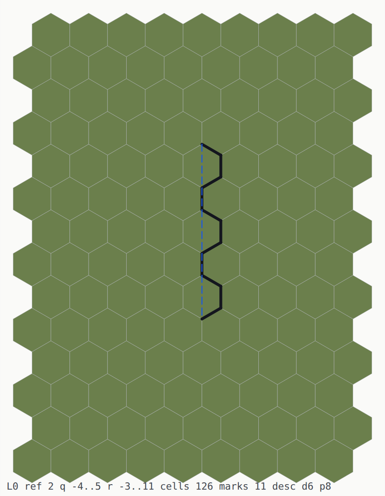
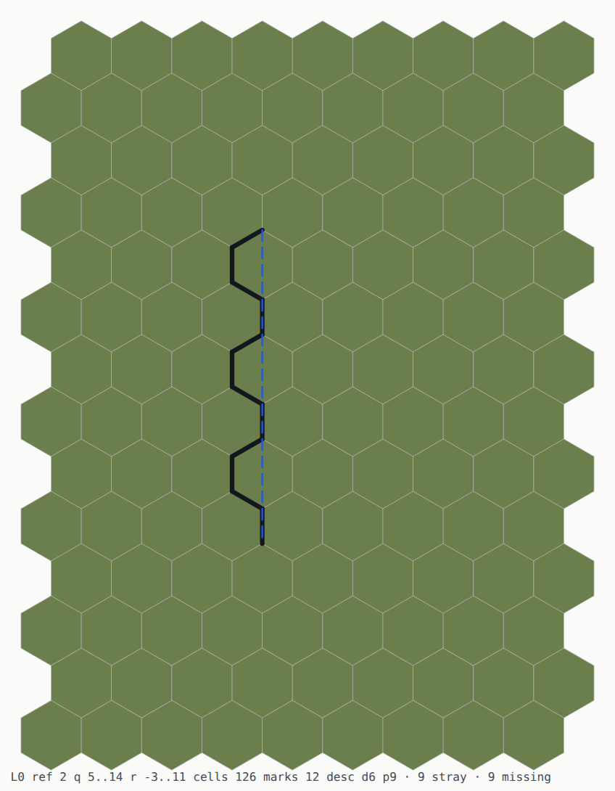
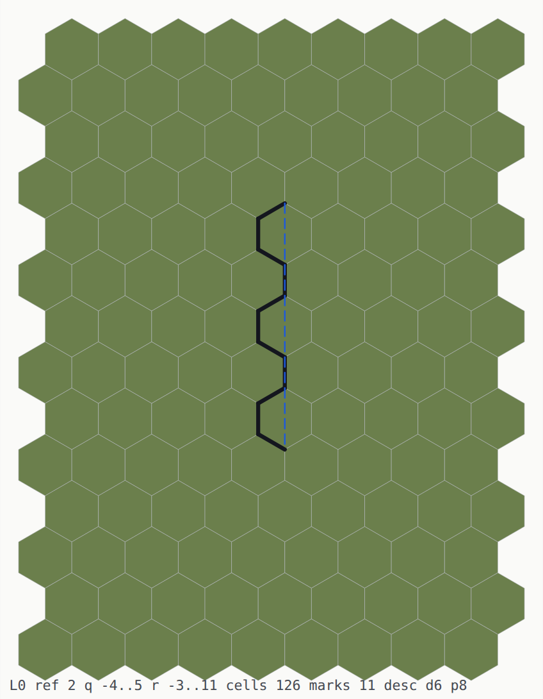

# Editor defects — five found by USING it, 2026-08-21

⚠ **This is lavition's, not Moros's.** [OPEN_ISSUES.md](OPEN_ISSUES.md) says in its own
banner that it covers the Moros toolkit only; these are editor defects and they live here.
Where the editor stands is [STATE.md](STATE.md); the order of work is
[EDITOR_LADDER.md](EDITOR_LADDER.md).

**All five were reported by driving the editor, not by a gate.** That is the finding that
outlives the individual entries: the tree has 49 gates, 1,426 library tests and two browser
tiers, and **not one of them went red on any of these five.** Each entry below therefore ends
with *what would have caught it*, because a defect a suite cannot see will come back.

⚠ **AND THE REPORTER CALLS MOST OF THEM REGRESSIONS.** Where a bisect has been run, this file
says so. Where it has not, the entry says *not bisected* rather than guessing — three of the
five have a mechanism that would look identical whether it broke yesterday or was never
finished, and saying which requires the commit, not the code.

---

## ⚠ The constraint that reshapes two of these — **the editor is IN-GAME**

Stated by the reporter on 2026-08-21, and it is not a detail: *"the editor should be in-game,
so eventually the full game with all assets should be visible in it, and the character model
should be one of possibly **hundreds** of other models — characters, robots, insects, persons,
animals, vehicles."*

That is a **scale and an asset model**, and it changes what counts as a fix:

- **Entry 2's obvious fix is the wrong one.** *Move the five hardcoded boxes into a library* is
  a fix for a world with exactly one body in it. With hundreds, geometry is an **asset**, and
  what belongs in code is the **rig** — which limb hangs off which joint, and how it moves.
  The entry below is rewritten accordingly; the five boxes become a *default*, not a design.
- **Entries 1 and 4 stop being annoyances and become blockers.** Re-meshing everything on every
  write (1) and drawing every wall twice (4) are survivable with one figure and a few chunks in
  view. Multiply by hundreds of animated models and both are the thing that decides whether the
  editor runs at all. ⚠ **Fix them before the asset count grows, not after** — a cost that is
  invisible at n=1 is not a cost anybody can bisect at n=300.

⚠ **AND THE MACHINERY IS MOSTLY HERE ALREADY**, which is why this is a shaping constraint
rather than a new project: `glb_read` is a package, `MSG_IMPORT` already *"imports a `.glb` as
a prop"*, `data/parts/` is a catalogue whose rows render their own thumbnails, `hex_part` holds
parts as small worlds, and `hex_rig` already rigs a **multi-part jointed body** — the cart, with
its axles and rolling wheels. A character is that, with different joints.

---

## Summary

| # | what you see | status | mechanism |
|---|---|---|---|
| 1 | the whole world re-meshes on every write | ⚠ **verified**, and the source already marks it `⏭` | `local_surfaces` takes a neighbourhood, not a disc |
| 2 | no character in the page editor | ⚠ **verified** | the figure is built and posed **server-side only**, and hardcoded |
| 3 | a house floor is not flat by default | ✅ **answered upstream** (`@HB-X67`) | `SEAT_MEAN` lands exactly half a height unit off; it must be refused with an offer, not truncated |
| 4 | every wall is drawn **twice** — hex-edge and straight | ⚠ **verified** | two emitters, and the gesture writes **both** records |
| 5 | after a reload the straight walls are gone | ⚠ **verified** | the save carries the **cells**; the run record is not saved |
| 6 | a wall near a house **loses its description** | ✅ **FIXED 2026-08-27**, [plan 26](../../plans/26-blueprint/README.md) `B4o` | `place` stamps one wall edge past each corner of its footprint; a stray that meets a wall's chain at a vertex makes three marked edges at one point, and `wall_read_run` refuses a marking that is not a path. ⚠ **The reader was right and the QUESTION was wrong** — `house_owns` attributes each mark to a structure before anything is asked what it describes |
| 7 | **the same wall walked the other way is a different field** | ✅ **FIXED 2026-08-27**, [plan 26](../../plans/26-blueprint/README.md) `B4r` — measured at [`probe/b4q`](../../probe/b4q/README.md) | `wall_stamp` takes its halfplane normal from the run's TANGENT, so reversing the walk flips which side a cell whose centre lies exactly ON the line falls on. `hex_shape::wall_read_run` documents the opposite as a fact about the field, so a wall cannot be round-tripped |
| 8 | **a REFUSED house leaves 27 floor cells and 84 wall bytes behind** | ✅ **FIXED 2026-08-28** (found by an adopter's 12-line program) | `place_house` writes the floor and stamps all four walls, *then* calls `roof_over` — and on a roof refusal returns `ack_no` without unwinding. ⛔ The source comment three lines above that return says the opposite in bold: *"A refusal here refuses the HOUSE — half a house is not an answer"*. ⚠ **And the test that reads as the general claim covers the other branch**: `test_a_house_at_an_unplaceable_facing_is_refused_and_writes_nothing` asserts `w.w_tau == before` for the FACING refusal, which happens before any write — so the one refusal path that can leave a half-house is the one path it does not visit. `hex_editor.loft:499` |
| 9 | **every refused house facing offered a facing that is itself refused** | ✅ **FIXED 2026-08-28** | `fp_offer` is a Box ROTATION and an author turns in FACINGS — 90° apart by construction, because `pose_footprint` sets `rot = fdir - 3`. The refusal handed out the rotation, so hour 0 was told *offer 8*, hour 8 answered *offer 4*, hour 4 answered *offer 0*: **three refused facings offering each other in a cycle**, and the K-FIT doorstep's *reason, offer, residual* promise never terminated. ⚠ **Every individual number was correct** — the arithmetic was never wrong, only the FRAME — which is why a test asserting the offer is an even rotation would have passed on the defect. `footprint_offer_facing` is the conversion; the gate takes the offer and places there |
| 10 | a room walked as four walls had a **hole you could walk through** | ✅ **FIXED 2026-08-29**, plan 26 `B4y` | two runs meeting at a corner each project onto their **own** segment, so the corner edge was claimed twice at 30 of 100 corners and never at 10 — `@HB-X36` broken in both directions |
| 11 | **a window that CLIPS a structure never returned** | ✅ **FIXED 2026-08-30**, [`probe/tw`](../../probe/tw/README.md) · `make probe-tw` | `mark_piece_grow` reads the WORLD and writes into the WINDOW, and an edge outside the window's grid cannot be recorded — `edge_set_mat` drops the write and `edge_mat` reads back 0 — so a clipped mark was enqueued **every time it was reached and never marked**, and the queue never emptied. ⛔ **Not slow, endless**: RSS climbed 106 → 238 MB over 96 s. ⚠ **And the first mechanism published for it was wrong** — *the candidate pool grows with the chain's ends* — which is why the fix waited for the measurement that attributes it: `segments_of`'s two floods are both public, and `marks_label` is the one that does not return |

✅ **1, 4 and 5 are ONE defect, and it is decided — see [the decision](#-the-decision--2026-08-21-there-is-no-session-record-only-a-mesh-cache).**

⚠ **4 and 5 are ONE defect seen from two sides.** A wall exists twice over — as edge bytes in
the store and as a `WallRun` in the session — and both are drawn. Only the store is persisted,
so a reload deletes exactly one of the two copies. Fixing 4 by dropping an emitter decides 5;
fixing 5 by saving the runs makes 4 permanent. **They must be answered together, and the
answer is which representation is the authority.**

---

## 1. The whole neighbourhood re-meshes on every write

**Verified, with the client's own numbers.** One key press:

```
client: local — 338688 ground floats in 49 drawables · world 52:3830163900
client: local raise — 1 · world 16502:374721773 · 338688 floats redrawn
```

The count after a single raise is **the same count as the whole boot**. A raise moves one disc
of cells; the mesher rebuilds everything.

`src/editor_client.loft:1316` — `local_surfaces` loops `LOCAL_TILES = 3` in both axes, so
**49 tiles × 11 surfaces = 539 chunk meshes** per call, and it is called from three places:
boot, every gesture (`:1826`), and **every tick that wrote** (`:1976`). That last one is what
makes the reporter's word *frame* right rather than loose: hold a gesture key while walking and
a write happens per tick, so the rebuild happens per tick too.

⚠ **THE SOURCE ALREADY KNOWS.** Both call sites carry a `⏭`:

> *"It redraws the whole neighbourhood because `local_surfaces` takes one — `TickOut` carries
> the disc (`tk_dq`, `tk_dr`, `tk_drad`) and nothing here can yet ask for less, which is probe
> 6's answer: the report is sufficient and the MESHER is not."*

So the **information needed to mesh less is already on the wire** — the tick reports the disc
it touched — and the mesher has no entry point that accepts one. This is not a missing
measurement; it is a missing parameter.

⚠ **AND IT IS NOT A CACHE PROBLEM, which is the obvious wrong fix.** Caching what was meshed
would still re-mesh 539 chunks and then discard 538 results. The disc is the fix.

**What would have caught it:** nothing measures mesh cost in the page at all. `w_tau` is the
tree's cost instrument (CLAUDE.md: *"Cost is measured in `w_tau`, not seconds"`) and it counts
**writes**, not re-derivations — so a mesher that rebuilds the world on every write is exactly
the thing `w_tau` cannot see. A `floats redrawn` assertion in `probe/b2` — *one raise must
redraw less than the boot* — would be one line and would have been red from the first day.

---

## 2. The character is not visible in the page editor

**Verified.** The figure is five meshes — body, two legs, two arms — and every one of them is
built, coloured and posed in `src/editor_server.loft`:

| what | where |
|---|---|
| the geometry | `limb_mesh` `:1000`, `body_mesh` `:1007` |
| its dimensions | `figure_wu` / `head_wu` / `hip_wu` / `shoulder_wu` / `leg_w` / `hip_overlap`, all server-local |
| built once | `:3333`–`:3341`, sent as `M:0`…`M:4` |
| posed per tick | `:7084`–`:7088`, sent as `T:0`…`T:4` via `limb_at` `:2070` |

**The client only ever RECEIVES those.** It has no code that builds a figure, and in local mode
there is no wire to receive them on. The live page says so in its own console:

```
client: 300 frames — meshes 0, placements 0, drops 0, cameras 0, status 0, parts 49
client: local — 338688 ground floats in 49 drawables
```

`meshes 0` — nothing arrived. All 49 drawables are ground. The walker's *state* is fine
(`local walker — 116 steps … feet 0`); there is simply no body attached to it.

⚠ **THIS IS [WALK_TICK.md](WALK_TICK.md)'S DEFECT ONE LAYER UP.** That document records the
walk *tick* having been written twice and unified into `lib/hex_editor/src/tick.loft`. The
figure's **geometry** never made the same trip — it is not duplicated, it simply does not exist
outside the server. So the page walks an invisible person.

⚠ **AND IT IS WHY "IT WAS THERE PREVIOUSLY" IS TRUE AND NOT A BISECT.** Against `make editor`
the figure is sent and drawn; on the page it never was. The regression is **the mode**, not a
commit — which is a distinction worth keeping, because a bisect here would find nothing and
read as *the report was wrong*.

**The fix — and the first version of this entry got it wrong, which is worth keeping.** It read:
*move `limb_mesh`, `body_mesh` and `limb_at` into `hex_rig`* — ~30 lines of arithmetic over
`hex_proj::emit_box`, out of the server and into a shared package. That is correct for the
symptom and **wrong for the system**: it puts one hardcoded humanoid in a library, and the
editor has to show hundreds of models that are not humanoid.

**The shape that survives the constraint is a THREE-WAY SPLIT:**

| layer | holds | where |
|---|---|---|
| the **asset** | the geometry of one model, and its joints | `data/` beside the parts, read by `glb_read` / `hex_part` |
| the **rig** | which limb hangs off which joint, and how a joint moves | `hex_rig` — it already does this for the cart's axles |
| the **gait** | phase from distance travelled, per model | `hex_rig`, parameterised — never per-caller |

The five boxes then become **the default model**, shipped as an asset like `door/doorway` is,
and the server stops being the only thing that can draw a person. ⚠ **The gait is the part not
to lose in the move**: `editor_server.loft:7078` derives the swing from `wk_walked`, not from
elapsed time, *"so the feet cannot skate"* — the same discipline as `hex_body::wheel_value`.
That rule is model-independent and belongs in the rig; the numbers `LEG_SWING` and `ARM_SWING`
belong to the model.

⚠ **Take the figure's height as a PARAMETER either way** rather than reading
`hex_editor::FIGURE_M`: `hex_rig` sits below `hex_editor`, and a dependency the other way is
the layering violation `tools/layering.sh` exists to refuse.

⚠ **AND `MESH_FIGURE_MAX` IS A CEILING OF SIXTEEN.** `editor_server.loft:773` reserves ids
0–15 for *"the figure and anything fixed"* — 0–4 the figure, 5–7 the cart, 8–15 part limbs —
and a chunk's ids start above it. **Hundreds of models do not fit in that band**, and the
comment above it records what happened the last time two things shared it: *"the limb block and
the cart were writing to one another's slots … opening a part deleted the cart"*, invisible to
every gate because *"the wire carries both, the counts were right"*. The id allocation is a
piece of this work, not a follow-up.

**What would have caught it:** `probe/b2` reads the *world* half of the picture and the *panel*
half. Nothing reads the middle, where the person stands. A colour count cannot see an absent
body against ground it matches — this is CLAUDE.md's *"a colour cannot see a COUNT"* again — so
the instrument is the client's own drawable census, not a screenshot: **local mode must install
five drawables it did not receive.**

---

## 3. A house floor is not flat by default

✅ **ANSWERED UPSTREAM — `@HB-X67`, and it is a fix rather than an investigation.** The height slot
is an **integer** at `HEIGHT_SCALE = 0.25` wu, and hexbody measured `SEAT_MEAN` landing **exactly
half a unit off**: `1.125` = 4.5 units. The rule it settles is that an off-grid seat must be
**refused with an offer**, never truncated — *"81 heights swept on quarter- and eighth-steps, 21
admitted, 0 false accepts, 0 disagreements, every offer itself on-grid."*
[FORMAL_CORE.md](FORMAL_CORE.md) carries it. ⚠ **The sloped-cell fixture below is still worth
building** — it is what would have caught this here — but the mechanism is no longer open.

The original entry, kept because its reasoning is what the fixture must check:

◐ **Reported, not localised — the one entry here without a mechanism.** Written down at this
confidence deliberately: guessing a cause and prescribing a fix for it is what
[OPEN_ISSUES.md](OPEN_ISSUES.md)'s own banner warns about (*"the road-linking entry diagnosed a
cause that turned out to be wrong and prescribed a fix that was already in the code"*).

What is **ruled out**: the seating is wired. CLAUDE.md records `footprint_seat` as *"built for
seating a pad and called by nobody, so every house on a slope was buried by up to 22 units"* —
**that is now stale.** `lib/hex_editor/src/hex_editor.loft:413` calls it, under `SEAT_MEAN`, and
the surrounding comment is the record of it being wired. So *the terrain under the house gets a
datum* is no longer the open question.

What is **not ruled out**, and separates the two:

- `SEAT_MEAN` picks a datum that **balances cut against fill** — by construction it does not
  flatten, it chooses a height and returns the residual. Whether anything then writes the
  footprint's cells **to** that height, or only records the cost, is the question.
- `freeze_grade` and the `seat_res` residual are read back at `:418`; a residual that is
  carried but never spent would leave the floor stepped by exactly the terrain it sat on.

**The instrument, and it does not exist:** a gate that places a house on a **deliberate slope**
and asserts the floor cells are one height. Every existing house gate places on flat ground,
where a floor that merely inherits the terrain is indistinguishable from one that was levelled.
⚠ **That is the same shape as CLAUDE.md's one-directional-guard finding** — the fixture cannot
tell the two apart, so it passes either way. Build the sloped fixture first; it may well answer
this entry without any code change.

---

## 4. Every wall is drawn twice — once round the hex edges, once straight

**Verified, and the source says why in its own words.** There are two wall emitters in
`lib/hex_mesh/src/hex_mesh.loft`, and they write into the **same mesh**:

| emitter | line | shape it makes |
|---|---|---|
| `emit_wall_panel` / `emit_wall_panel_cut` | `:1151` / `:1200`, called at `:1875`–`:1876` | one panel **per cell edge** — hugs the hex lattice |
| `emit_run_wall` | `:1261`, called at `:1934`–`:1935` | one **straight band** from `wr_x0,wr_z0` to `wr_x1,wr_z1` |

Both run for every chunk: `for run in runs.items { emit_run_wall(wm, …) }` sits in the same
function that walks the cells. So a wall that exists in **both** representations is emitted
twice, in two different shapes — precisely *once around the hex edges, once straight*.

⚠ **AND THE GESTURE WRITES BOTH, ON PURPOSE.** `lib/hex_editor/src/gesture.loft:637`:

> ⚠ **WHAT IT STAMPS IS UNCHANGED, DELIBERATELY.** The edges below are written exactly as
> before; the six runs are a RECORD laid beside them. That split is what makes the step
> checkable: the world stays byte-identical and only the session gains something.

**That is a correct increment with a missing second half.** Laying the run *beside* the edges
is what let the step be verified — the store stayed byte-identical, so the run could be added
without disturbing anything. But the step that **stops drawing the edges** was never taken, and
until it is, every wall is two walls.

⚠ **SO THIS IS A REGRESSION IN THE PICTURE INTRODUCED BY A CHANGE THAT WAS GREEN BY DESIGN.**
The gate for that step asked *is the world byte-identical* and the answer was yes — which is
exactly what a change that only adds a second drawing of the same thing would answer. This
tree's rule is *measure what was actually emitted, never a number the producer re-derives*;
here the world key was measured and **the mesh was not**.

**What would have caught it:** a triangle count. One wall, one gesture, and an assertion that
the wall surface holds **one** band's worth of geometry. `probe/b2`'s `E2` already reads *which
surfaces were drawn* (`grass,wall`) — it knows the wall is there, and cannot see that it is
there twice. Names, not counts, is the blindness.

⛔ **AND "STOP DRAWING THE EDGES" IS NOT FREE ANY MORE — plan 26 `B4g`.** The intended survivor
is the RUN, and a `WallRun` is two endpoints and a `d24` heading. A **round** wall has neither:
`tower_ring` registers no run at all, so its rim is drawn by the per-edge emitter and by nothing
else. **Deleting that emitter would delete the only way a curved wall can be drawn**, unless the
run record first gains an arc form. The fix this entry asks for now has a prerequisite it did not
have when it was written.

⚠ **AND IT NOW BLOCKS A MEASUREMENT, WHICH IS THE FIRST CONCRETE COST BEYOND THE PICTURE** —
[plan 26](../../plans/26-blueprint/README.md) `B4f`. A wall's thickness is the spread of its
band, and the honest way to read one is off the emitted mesh; with both emitters writing into
that mesh, the per-edge panels sit on the hex edges and **widen the spread of the very thing
being measured**. `wall_thick.loft` gets round it by registering a run without stamping its
edges — a fixture that has to avoid a defect in order to see past it, which is a fair
description of what a second drawing of one wall costs.

⛔ **AND A SIXTH, FOUND LOOKING FOR SOMETHING ELSE — `field_fill` CANNOT SAY *THERE IS A GAP IN
YOUR FENCE*.** Its own comment insists the two refusals must not wear one message — *"'it never
closed' and 'it grew past the cap' are not the same fact … telling an author the wrong one sends
them looking for a gap that is not there"* — and then sets `escaped` and `capped` **at the same
site**, so `return 0` is unreachable. Measured 2026-08-26:

```
open ground, no boundary at all -> -2      ← reported as "it grew past the cap"
a closed ring of radius 3        -> 37     ← control: the instrument discriminates
the same ring with a gap in it   -> -2     ← the case an author actually hits
```

⛔ **AND THE ENTRY ABOVE OVERSTATED IT — CORRECTED BY plan 26 `B4j`, WHICH WENT TO FIX IT.** Two
things it implied are false. **The author was never told the wrong thing**: the server's `MSG_FIELD`
branch already says *"grew past the cap … the boundary is open, OR the enclosure is larger than
this tool will claim"*, and its own comment records the same discovery from the consumer's side —
*"the old message stated a diagnosis the fill could not make"*. This was a re-discovery filed as
new. **And it is not fixable**: measured, `FIELD_CAP` of 4000 is reached at about radius 36
(`3R²+3R+1`), so a bound below that reports a large **closed** field as open — a false diagnosis,
worse than none — and a bound above it never fires, because the cap gets there first. ⚠ *Open* and
*closed but bigger than this tool will claim* are **one observation** to any bounded search.

✅ **What was real is now fixed**: the unreachable branch is gone, `field_fill`'s comment agrees
with its consumer instead of contradicting it, and `field.loft` pins every code the fill can answer
with the case that produces it — including that a **gapped ring answers exactly what open ground
does**, so the wording can never quietly drift back. ⚠ A second stale comment went with it: the
server called the `0` branch *"reachable only if `field_fill` gains another way to decline"*, and it
is reachable two ordinary ways — standing on a road, or on a field you already filled.

⛔ **AND THE PUSH VERB GIVES THE PAIR A THIRD WAY TO COME APART — 2026-08-28.** `WALL_PUSH`
law `L1` is built: a push rewrites the six edges of the cell it transfers, so the store's
marks follow the room. **The filed `WallRun` does not** — nothing maintains it — so on a
house `place_house` built, one push moves the hex-edge drawing and leaves the straight one
where it was. ⚠ **It is this defect and not a new one**: with a single drawing there would
be nothing to diverge, and the fix is the same fix. Named in
[WALL_PUSH](WALL_PUSH.md) §7 so nobody looks at a pushed house and reports it twice.

⛔ **AND WHILE LOOKING FOR IT: `road_lay` HAS ONE CALL SITE AND IT IS A TELEPORT — 2026-08-28.**
`hex_editor::road_lay` is called from exactly one place in the tree,
`src/editor_server.loft`'s `MSG_PLACE` handler. So **holding the road toggle and walking
lays no road**; only an `at` does. The page has no `road_lay` at all, so a road cannot be
laid there by any means. ⚠ **The corpus could not see it**: its scripts drive the character
with `at`, which is the one path that works. Found while building `WALL_PUSH` `G2`, whose
own text cited the road as *the* model for a gesture held over a walk — the model does not
work that way.

---

## 5. After a reload the straight walls are gone

**Verified, and the client prints the reason itself.** On restore
(`src/editor_client.loft:1188`):

```
client: local world — restored 32952:302033958 from 'world.hxw' at tau 92 · ground 1.25
  ⚠ its scene records (runs, roofs, openings, props) are not in a world file
```

The page saves `st.cache` — the `VoxelWorld`, and nothing else. **The `EditSession` is not
saved**: `es_runs`, `es_roofs`, `es_leaves`, `es_open`, `es_annex`, `es_awalls`, `es_props`,
`es_slabs`, `es_holes` all start empty on the next boot.

Put beside entry 4, that is the whole of it:

| representation | drawn by | survives a reload |
|---|---|---|
| cell edge bytes | `emit_wall_panel` — hugs the hex edges | ✅ it is in the store |
| `WallRun` record | `emit_run_wall` — the straight band | ⛔ the session is not saved |

So a reload does not *break* the wall — it **deletes one of the two copies**, and the one it
deletes is the straight one the author was looking at. Roofs, door leaves, openings, annexes,
props, slabs and holes are in the same list and lose the same way; walls are simply the one
that also has a cell-derived twin, so they half-survive instead of vanishing.

⚠ **AND THE GATE PASSES THIS.** `probe/b2`'s `O1`–`O4` check that a reload restores the world,
and it does — `32952:302033958` before and after, byte for byte. **The world key is a key over
the store, and the runs were never in the store**, so the strongest reload assertion this tree
has is structurally incapable of noticing that the scene records are gone. That is CLAUDE.md's
*"a sabotage that leaves the world identical can mean the fixture cannot see it"*, arrived at
from the other direction.

**What would have caught it:** an assertion over the SESSION across a reload, not over the
world. Count the runs before and after.

---

## ✅ The decision — 2026-08-21: there is no session record, only a mesh cache

**Taken by the reporter, in two sentences, and it is the answer to the open question above
rather than a preference:**

> *"The mesh that is built from the world should interpret the walls directly as the correct
> straight version, with no outside hex version anywhere in a mesh."*
>
> *"There should not be a session record at all — just a cache of the meshes that are created,
> one per chunk."*

⛔ **AND IT IS NORMATIVE UPSTREAM, WHICH NOBODY HAD CHECKED.**
[FORMAL_CORE.md](FORMAL_CORE.md) §2.4.3 — the binding extract of `hexbody/ROUNDTRIP.md` — states
it outright: *"the canonical text is **not** a second editor representation, and must not become
one — that is exactly the second layer the editor is not allowed to have"*, with layer 2
*"derived on demand, **never persisted**"* per chunk and *"an edit dirties the chunks it touches,
and their layer-2 meshes rebuild."* §6.1 settles the wall half the same way: *a wall surface is
the exact **AVERAGE** of its edges, never a fit*, gated as `@HB-X47`. **So none of what follows is a
new architecture — it is a debt against one already written down and gated.**

⚠ **THIS IS [WORLD_MODEL.md](WORLD_MODEL.md)'S OWN INVARIANT, ENFORCED** — *the store is the
only authority, everything else is derived, writes go in place.* The `EditSession` is a **second
authority**: it holds shapes the store also holds, in a different form, and the two can
disagree. That is why a wall draws twice (they both reach the mesher) and why a reload loses one
(only the store is saved). Neither is a bug in the drawing — **both are the second authority
being a second authority.**

### Three of the five collapse into one change

| defect | what the decision does to it |
|---|---|
| **1** whole world re-meshes per write | ✅ **fixed by the cache.** One mesh per chunk, invalidated when that chunk's cells change, means a write re-meshes the chunks it touched and no others — instead of 49 tiles × 11 surfaces every time |
| **4** wall drawn twice | ✅ **fixed by deletion.** One emitter, straight, derived from the store. `emit_wall_panel` goes; no hex-edge wall geometry survives anywhere |
| **5** reload loses the straight walls | ✅ **fixed by not existing.** There is nothing to lose — everything drawn came out of the store, and the store is saved |

Entries **2** (the character) and **3** (the floor) are untouched by it and stay open.

### What has to be true for it to work, and one of them is not free

⚠ **THE STORE'S WALL DATA IS HEX-ALIGNED BY CONSTRUCTION, AND HOLDS NOTHING ELSE.**
`lib/hex_voxel/src/hex_voxel.loft:54` — a `StoredHex` carries three edge bytes,
`sv_wall_nw` / `sv_wall_ne` / `sv_wall_e`, and each is a bare `u8` **material index**. There is
no heading, no run identity, no endpoint. So *"interpret the walls as the correct straight
version"* is a **recovery**: the mesher gets a zigzag chain of marked hex edges and has to fit
the line they approximate. `hex_editor::run_wall` already does line → band (`rw_half` is the
offset from the centreline); this is its inverse, and it does not exist yet.

⚠ **AND THE AUTHOR'S EXACT STROKE IS NOT RECOVERABLE, which is a design consequence rather than
an obstacle.** `wr_x0,wr_z0 → wr_x1,wr_z1` are continuous floats; the store quantised them to a
set of edges. A fit through those edges gives *a* straight wall, with its ends at the chain's
ends. **That is a different wall from the one drawn**, by up to a lattice step at each end. It
is almost certainly the right trade — it is what makes the world the only authority — but it
must be decided knowingly, because it means *what you drew* and *what comes back* differ, and a
gate comparing them byte for byte would be asserting something false.

⚠ **THIS IS THE README'S OWN FEATURE, NOT NEW WORK.** `lavition/lavition`'s front page already
promises *"curve detection — recognises round and curved structures from chains of short
straight segments"* and *"24 directions for walls, cliffs and roads."* The recovery pass is that
feature; today the editor sidesteps it by keeping the author's line in a record instead.

### `EditSession` is three different things wearing one name

Deleting *the record* is right; deleting *the struct* would throw away two things that are not
records. The fields sort into three groups and only the first goes:

| group | fields | where it goes |
|---|---|---|
| **derived — DELETE** | `es_runs`, `es_awalls`, `es_roofs`, `es_open`, `es_annex`, `es_props`, `es_slabs`, `es_holes` | the store already holds this, or must; the mesher recovers the shape |
| **the gesture in flight** | `es_draft` (the stroke being drawn), `es_trunk` (the last ring, to attach to), `es_open_kind` (the standing choice), `es_author` | ⚠ **not a record** — it is what the editor is doing right now, and it has no meaning after the gesture ends. It stays, and calling it a session record is what makes it look deletable |
| **genuinely dynamic** | `es_leaves` — how far a door stands open | ⚠ **needs a home that is neither.** `editor_server.loft` says it outright: *"A door's ANGLE is not in the world — the store says an edge is a door, which is the boundary's business, and how far it stands open is the fitting's."* It is not derivable from the store and it is not a cache. This is the one field the decision does not answer |

### The cache, and the one thing that must not be got wrong

One mesh per chunk, invalidated when the chunk changes. ⚠ **Key it on the chunk's own version,
never on a dirty flag set by the writer** — a flag has a setter that can be forgotten, and
CLAUDE.md's most-repeated defect is exactly that shape. `w_tau` already bumps once per write
that changed something; a per-chunk equivalent is the key.

⚠ **AND THE CACHE MUST BE CHECKED AGAINST A SABOTAGE THAT LEAVES THE WORLD IDENTICAL** — which
[WALK_TICK.md](WALK_TICK.md)'s probe 4 records as the case three instruments were blind to:
asked whether the collision proxy was a cache, `deck.keys` gave *the same world* for the cache,
for rebuilding every tick, and for never rebuilding at all. A mesh cache has the same property:
a stale mesh keys a correct world. **The instrument is the mesh, not the world key.**

---

## 7. The same wall walked the other way is a different field

⛔ **`hex_shape::wall_read_run` STATES IT AS A FACT ABOUT THE FIELD** — *"what it cannot
recover is the ORIENTATION, because the field does not store one: A-to-B and B-to-A mark the
identical edges"*. In this tree the field **does** store it. One run record, stamped forward and
reversed, with `run_between` out of the picture: a due-north wall shares **2 of 11** edges with
itself.




*The marks zigzag to opposite sides of one description. `desc d6 p8` against `desc d6 p9 · 9
stray · 9 missing` — plan 26 `B4q`, [`probe/b4q`](../../probe/b4q/README.md).*

**The mechanism.** `wall_stamp` builds its halfplane normal from the run's tangent —
`nx = -ty, nz = tx` — so reversing the record flips the normal, and a cell whose centre lies
exactly **on** the line falls on the other side of it. A due-north wall in odd-r passes through
alternate rows' cell centres, so exactly those flip.

⚠ **WHY IT HAS SURVIVED: DUE EAST IS UNMOVED**, and that is how every wall in the corpus is
walked. `east`, `NE` and `steep NE` are identical in both directions; `north` and `shallow NW`
are not.

⚠ **`B4q` MADE IT VISIBLE**: `hex_editor::run_edges` is `wall_stamp`'s marking rule extracted so
the recovery can GENERATE the wall its description names and compare it edge for edge, and
`RunRead` carries `rr_stray`/`rr_missing` for the caption to say.

✅ **FIXED AT `B4r`, AND IT IS TWO HALVES.** `hex_editor::run_normal` answers *the LINE's own
normal* — canonical in sign, and anchored at the **midpoint** rather than at an endpoint. ⚠ The
second half is not decoration: fixing only the sign fixed three headings of eight and
**regressed a fourth**, because `n·p0` and `n·p1` are equal in arithmetic and differ in the last
bits, and the tie-break compares against exactly `0.0`. The midpoint is bit-identical either way.




*After. Both zigzag to the same side of their description and neither caption carries a
residual; compare the pair above.*

**Gated** on all 24 headings, both directions, asserting the two fields are identical **edge for
edge** and that each reproduces its own description. ⚠ **The corpus does not move** — `house`,
`door`, `wall`, `b4o`, `b4p` and `deck.keys`'s `cea971a0…` are byte-identical — and the control
that says so is not a hope: `b4q.keys`, which lays a due-north wall, moves from `897448168` to
`2064361579`. The stillness is a fact about the corpus, not a blind instrument.

⛔ **AND `road_stamp` LOOKS LIKE THE SAME DEFECT AND COULD NOT BE SHOWN TO BE.** Its fences carry
the identical marking — tangent normal, endpoint anchor, same tie-break — but a road driven both
ways is identical at twelve authored headings and at four hand-built centrelines, including one
tuned to put a fence exactly on a cell-centre column. The change was written and **reverted**:
a behaviour change no row can see red is not a fix. The reading is recorded at the code.

---

## ✅ 10. A room walked as four walls had a hole you could walk through — fixed 2026-08-29

⚠ **THE NUMBERING HAS GAPS AND ONE OF THEM IS A DANGLING CITATION.** There is no 6, 8 or 9
here, and [FOCUS](FOCUS.md) §4 cites *"EDITOR_DEFECTS 8 and 9"* for the two defects the
adopter's first program found on 2026-08-28 — a refused house leaving 27 floor cells behind,
and a refusal offering a facing that is itself refused. Both are real and both were fixed;
neither was ever written into this file. This one takes **10** rather than quietly occupying
a number somebody else's sentence points at.

⛔ **7 OF 25 POSITIONS, AND EVERY WALL THE AUTHOR ASKED FOR WAS THERE.** Two runs meeting at a
corner each decide their marks by projecting onto their **own** segment, so the corner edge
was claimed **twice** at 30 of 100 corners (a one-edge **spur** sticking out of the corner)
and **never** at 10 (a **gap** — the enclosure open). Measured over 25 rectangles, plan 26
`B4y`, [`probe/b4y`](../../probe/b4y/README.md).

**It is `@HB-X36` broken in both directions** — *a corner edge is claimed exactly once* — and
the two shapes are one fact: `twice-claimed` equals `spurs` in every one of the 25 rows,
because the doubly-claimed edge **is** the spur, its far vertex the free end and its near
vertex the junction.

⚠ **THE READER WAS BLAMED FOR THIS FOR A WEEK.** `drawn` equals `marks` on all 25, before and
after — the plan view draws every mark it is given. What the cross-tabulation settled is that
a rectangle **leaks exactly when a corner is a gap** (7 of 7, 0 of the other 18) and is
**described as more than four walls exactly when a corner is a fork** (17 of 17), so the two
failures have different causes and both are in the field.

✅ **Fixed at the stamp** — `hex_editor::wall_corner_close`, from `wall_stamp`: a free end of
this run's own field and a free end one hex edge from it are one chain, so the edge between
them is written. **7 of 25 leak → 0**, and 7 markings that are one closed chain → **23**.

⛔ **THE SYMMETRIC REPAIR IS REFUTED AND MUST NOT BE BUILT.** Dropping the edge two runs both
claim also closes the topology and **makes the two walls unrecoverable**: `run_edges`
generates a run's whole field, so with one edge taken out no run generates it and the
acceptance refuses the wall the edge came from — 5 or 6 descriptions become 6, 7 or 8.

⚠ **What it does not fix**: 17 of 25 still describe four walls as five or six. That is the
peel's seed, not the corner.

---

## ✅ 11. A window that clips a structure never returned — fixed 2026-08-30

**[`probe/tw`](../../probe/tw/README.md), `make probe-tw`.** Found while cutting
`planview_region.loft`'s runtime, which is why it reads as a test-suite matter and is not:
`src/plan_view.loft` takes `Q0 R0 Q1 R1` from the environment, so **an author choosing a
window was one hex from a picture that never came back.**

The tee fixture — seven hexagonal cell outlines, marks spanning `q −4..4` — with the window
moved in one column at a time, one process:

| `q0` | cells | before | after |
|---|---|---|---|
| −6 | 169 | 36 marks, 0 desc, refused · 3.2 s | unchanged |
| −4 | 143 | 36 marks, 0 desc, refused · 2.9 s | unchanged |
| −3 | 130 | 34 marks, 8 desc · 2.6 s | unchanged |
| ⛔ **−2** | 117 | ⛔ **> 180 s, no answer** | ✅ **29 marks, 8 desc · 3.1 s** |
| ⛔ **−1** | 104 | ⛔ **> 180 s, no answer** | ✅ **24 marks, 8 desc · 5.5 s** |

⛔ **THE WINDOW WAS GETTING SMALLER ACROSS THE CLIFF**, which is what ruled out *a big
window is slow*.

### ⛔ The mechanism — the flood read the world and wrote into the window

`marks_label` seeds from the window's own scan and hands each seed to `mark_piece_grow`,
which floods the marking through shared vertices. Its enqueue rule is *the WORLD holds a
mark here* (`mark_left`) **and** *this piece has not recorded it* (`edge_mat(out, …) == 0`).
For an edge outside `out`'s grid **both are permanently true**:

| asked of an edge outside the window | measured |
|---|---|
| `edge_set_mat(e, …, 7)` then `edge_mat(e, …)` | ⛔ **0** — the write is dropped |
| …the same pair inside, as a control | ✅ **7** |
| `wall_of(world, q = ±4, …)` for a cell the window does not hold | **1 wall byte** — the window is not consulted |

So the mark is enqueued every time it is reached, from every neighbour that reaches it.
✅ **It is endless, not slow, and RSS is what says so** — 106 → 238 MB over 96 s, climbing
monotonically, where a fixed computation that is merely slow does not grow.

### ⚠ Two wrong answers on the way, and both are worth keeping

⛔ **The first published mechanism was the peel's candidate pool** — *`run_within` is
quadratic in the chain's ends, and clipping makes more ends*. Coherent, and **wrong**: the
readers are never reached. `segments_of` is two floods and both are public, so which one
hangs is a question that can be **asked** — `touched_cells` returns, `cells_label` returns
1, `marks_label` does not return. ⚠ *A coherent explanation is a hypothesis*, and this one
cost nothing to check because the library had already exported the two halves.

⛔ **And the first prediction from the RIGHT mechanism failed too.** *A mark two cells
outside the window on any side* predicts the `q0` cliff exactly — and the `q1` and `r0`
sides both **answer**, in under 3 s, with marks two cells out. `eg_index` canonicalises
three of the six directions onto the neighbour cell, so which clipped edges are addressable
depends on which side the window cuts. ⚠ **A test that clipped one side would have been
green on three quarters of the defect**, which is why
`test_a_marking_clipped_on_any_side_terminates` walks all four.

### ✅ And the class has one member, checked rather than assumed

`segments_of` runs **two** floods of this shape. `cells_label` enqueues a cell that is in the
set and unlabelled, and `touched_cells` sets both cells of every mark — so a boundary mark's
outside cell would be the same trap. It is not: **`HexSet` has no halo where `EdgeSet` has
one**, so the outside `hexset_set` is dropped, `hexset_get` is false, and the flood's own set
guard stops it. ⚠ One flood was exposed and the other was not, and the difference is a
storage detail neither function mentions — which is why it was measured (`make probe-tw`,
`PHASE=halo`) rather than reasoned about.

### ✅ The fix — a piece grows only within the field it is recorded into

`mark_in_field` in `hex_editor::gesture`, one condition in the flood, no new parameter:
`out` already carries its own window (`edgeset_q0/r0/w/h`).

⚠ **The bound is the window's own SCAN, not the storage.** `edgeset_*` addresses a one-cell
halo too, and bounding by what can be written would admit edges no other reader counts —
`marks_unclaimed`, `edges_mat_claimed`, `corner_pool` and `run_span` all walk
`q0..q0+wq, r0..r0+hr` with `d` in `[4, 5, 0]`. ⚠ **That the three unused directions name
the same edge from the neighbour is measured**, over every cell and direction of a 7 × 7
patch, because a bound written the other way round clips the wrong side.

✅ **Seen red first**: `[timeout] deadline reached after 70s … entry=test_a_marking_the_window_clips_still_terminates`, and 2.4 s green after.
⚠ **Its failure mode on the defect is the FILE DEADLINE rather than an assertion**, which
the test says at its head so a later reader knows what a timeout there means.

---

## ✅ 12. The corner rule deleted a door standing in the corner — fixed 2026-08-31

**Found by plan 21 `R5b.2` while wiring an unrelated predicate, and it predates that step
entirely — `B4y`, 2026-08-29.**

`corner_write`'s header has always said *"The **unmarked** edge whose two corners are exactly
these two vertices, written … a miss means the edge is already there and nothing is owed."*
Its test was `edge_is_wall`, **which is false for a DOOR**. So a doorway standing exactly on
the join edge two runs leave open was not a miss — it was a candidate, and it was overwritten.

Measured, [`probe/r5b/door_corner.loft`](../../probe/r5b/door_corner.loft), on `probe/b4y`'s
own `8 × 3` gap corner:

| | |
|---|---|
| the join edge, **found rather than named** | `(4,−2)` dir 0 — the one edge neither run lays |
| a door planted there before the second wall | edge holds `2`, **1 door** |
| ⛔ after the second wall | edge holds `1`, **0 doors** |

⚠ **THE AUTHOR IS TOLD NOTHING.** The stroke reports its own marks and the world it leaves is
a closed corner, which is what the gesture was asked for; the door is simply gone.

### ⛔ And the byte predicate had been protecting a DECLARED door by accident

`edge_is_wall` answers *wall* for every byte past `EDGE_MAT_LAST`, so a world's own door at a
high slot was skipped — correctly, for the wrong reason. **Resolving that site to the world's
palette, which is all `R5b.2` set out to do, would have spread the defect to it.** ⚠ *A
consistency fix that spreads a defect is not a fix*, and that is the general shape worth
keeping: **before resolving a predicate, ask what the unresolved one was accidentally right
about.**

### ✅ The fix is the header, not a new rule

`wall_of(…) != 0`. An edge carrying anything is already a boundary, so nothing is owed at it —
`@HB-X70`, *an opening is a material on a wall that continues*. It also takes an
`edge_is_wall` site off plan 21's docket by **removing** the question rather than answering it,
because the question there was never *is it masonry*.

`lib/hex_editor/tests/corner_close.loft` is 5 of 5 with the new row and `B4y`'s four claims
unmoved. ⚠ **The new test's first version asserted the wrong channel and went red for it** — it
asked for 2 free ends where a door in the corner leaves **4**, because `marks_of` collects
masonry and a door is not masonry: the two runs are two chains in *that* channel while the
boundary is continuous through the doorway.

## What to do, in the order the facts force

1. ✅ **Decided — see above.** The store is the authority; the mesher recovers the straight
   wall from the edge chain; the only derived state kept is one mesh per chunk. ⚠ The roof
   comment in `editor_server.loft` (*the drawn shape is the PLAN's, so the renderer needs the
   plan rather than the cells*) is **now wrong** and should be corrected where it sits, not left
   to argue the opposite from inside the source.
   **Build it in this order, because each step can go red on its own:**
   a. ✅ **BUILT — [plan 26](../../plans/26-blueprint/README.md) `B1`.** The recovery pass is
      `hex_editor::edges_mat` (the store's wall bytes into `EdgeSet`'s **material** channel —
      the gap `probe/l1` named) and `hex_editor::wall_recover` (`hex_shape::wall_read_run`
      paired with world-unit endpoints), with tests on both. ⚠ **Its consumer today is the
      PLAN VIEW, not the mesher** — which is `b`, and is what turns this from a step into a
      switch that can be compared;
   b. the **mesher** switched to it, with `emit_wall_panel` still present, so the two can be
      compared in one picture before either is deleted. ⚠ **And `B1` measured what that switch
      walks into**: the recovery refuses a window whose marks are not one path, which every
      house is and which one stray edge is enough to cause. A mesher that recovers per chunk
      needs an answer for *refused* that is not *draw nothing*;
   c. `emit_wall_panel` **deleted**, and a gate that counts triangles rather than naming
      surfaces;
   d. the **per-chunk cache**, keyed on the chunk's version;
   e. the **session record** deleted, field group by field group.
2. **Make the figure an ASSET plus a RIG** (entry 2) and call it from both drivers. Independent
   of 1, and it is the one the reporter sees first — but do not shortcut it into a hardcoded
   body in a library, because the constraint above says there are hundreds of them.
3. **Build the sloped-house fixture** (entry 3) — it may answer its own entry.
4. **Entry 1 is step 1d**, not a separate task — the per-chunk cache is what stops the whole
   neighbourhood re-meshing. ⚠ The disc carried in `TickOut` is still the cheap interim if the
   cache is further off than the reporter can wait.

⚠ **AND ADD THE FOUR MISSING INSTRUMENTS BEFORE THE FIXES, not after.** Every one of them is a
line or two, every one of them would be red right now, and a fix landed against a suite that
could not see the defect is a fix nobody can prove.
