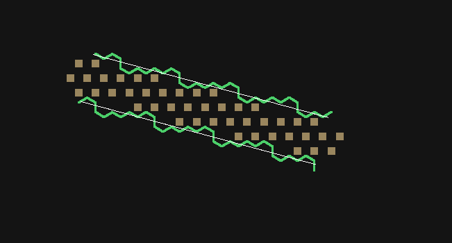

# The editor ladder

*(**lavition**'s editor — Moros is a consumer, not the product. See
`loft/doc/claude/LAVITION.md`.)*

The editor is built one **rung** at a time, and each rung is a *complete editor* for
everything below it. This is the overall map; each rung is its own plan, because the
editor in its completion is far too big for one.

> The rule that shapes the whole ladder: **a rung does not generalise in advance.** Build
> what the rung needs, thickly, and let the *next* rung decide what the shared shape was.
> Generality is earned by a second real case, never predicted from the first — which is
> also why W1 is the rung that decides the tool shell's shape, not W0.

## The rungs

| rung | adds | plan |
|---|---|---|
| **W0** | a flat plane, hills, a character that walks and climbs | *shipped* — see [plan 7](../../plans/7-hex-editor/README.md) |
| **W0.5** | persistence: the voxel world, one durable home | [#8](https://github.com/jjstwerff/moros/issues/8) · [plan](../../plans/8-voxel-world/README.md) |
| **W1** | roads — ways that follow the ground | [#9](https://github.com/jjstwerff/moros/issues/9) |
| **W2** | fences — edge structures, the wall bytes made real | [#10](https://github.com/jjstwerff/moros/issues/10) |
| **W3** | fields — bounded regions with a fill and a boundary | [#11](https://github.com/jjstwerff/moros/issues/11) |
| **W4** | houses — multi-storey structures, stencils, roofs, openings | [#12](https://github.com/jjstwerff/moros/issues/12) |
| **W5** | trees and bushes — scattered instances at density | [#13](https://github.com/jjstwerff/moros/issues/13) |
| **W6/7** | decorative elements and vehicles — props and multi-rig connectors | [#14](https://github.com/jjstwerff/moros/issues/14) |
| **W8** | routines — triggers, actors, the sandbox seam | [#15](https://github.com/jjstwerff/moros/issues/15) |

The substrate that carries them — the anchor, the layer stack, the seam rules — is
[plan 7](../../plans/7-hex-editor/README.md) and
[EDITOR_SUBSTRATE.md](EDITOR_SUBSTRATE.md). The landscape they all write into is
[WORLD_MODEL.md](WORLD_MODEL.md).

## The order of work

Sequential — each row assumes the ones above it. **✋ marks a checkpoint that needs your
eyes**, not a report: something to open, drive, and judge.

| # | work | plan | size | done when |
|---|---|---|---|---|
| ~~0~~ | ~~decide: one world file or regions~~ — **answered: one file**; stencils and placeable assets live in separate files | #8 | — | ✅ 2026-07-26 |
| ~~1~~ | ~~the file~~ — header, opaque palette, directory, chunk I/O, per-chunk CRC, `ε > 2θ` on open | #8 V2 | M | ✅ 2026-07-26 — 15 gates, four mutations each seen red |
| ~~2~~ | ~~sparsity~~ — elision on both axes, maintained on write | #8 V3 | S | ✅ 2026-07-26 — P4/P5/P12 proven exactly; gates now in the suite too (24 green) after loft H9 was fixed |
| ~~3~~ | ~~change and cache~~ — edit clock, per-layer versions, payload-free scan | #8 V4 | M | ✅ 2026-07-27 — `T1`/`T2` gated, four mutations red. Snapshot reads (`M2`) move to row 6 with copy-on-write |
| — | ✋ **worlds persist** | | | save a world, reload it, confirm it is the world you built |
|  | *(rows 1–3 are library work with no visible surface. An earlier checkpoint was offered — dual-writing through `hex_world` beside the peaks path — and declined 2026-07-26: their effect is checkable by gates, and the scaffolding would have been a temporary path with a habit of becoming permanent.)* | | | |
| ~~4~~ | ~~the editor moves onto `hex_world`~~ — `Peak` and the local world format deleted | #8 V5 | L | ✅ 2026-07-27 — all seven gates green, each on a fresh server |
| — | ✋ **the editor is no worse** | | | build hills, save, reload, walk around. This is the risky one — it replaces what works |
| ~~5~~ | ~~roads~~ — a graded strip laid while walking | #9 | M | ✅ 2026-07-27 — gate green, control red; all other gates still green |
| — | ✋ | | | draw one |
| 6 | fences and walls; `hex_edge` collision; the camera's occlusion class | #10 | L | walls block movement; the camera treats solid walls like terrain and fences not at all |
| 6a | ↳ the exact perimeter, and the halo — one `edge_owner`, `6(2R+1)` edges | #10 | ✅ | `tools/gates/world/fence.mjs`; three mutations seen red |
| 6b | ↳ collision — `hex_edge::sweep_path` over the wall bytes; a doorway is not a wall | #10 | ✅ | `tools/gates/character/collide.mjs`; three mutations seen red |
| 6c | ↳ the camera's occlusion class — the predicate the consumer supplies | #10 | ✅ | `tools/gates/world/occlude.mjs`; the fence clause seen red |
| 6d | ↳ a wall is a RUN — `hex_way` centreline, offset fences, geometry off the line | #10 | ✅ | `tools/gates/world/straight.mjs`; the staircase mutation seen red |
| — | *(#8's own rows run beside the ladder: many authors and long-running stores are both **DONE** — `M1` `M2` `X2` `X3` `X5` gated. What remains of #8 is the crystal port and the convergences)* | #8 | | ✅ |
| — | ✋ | | | walk into a wall, orbit beside one |
| ~~7~~ | ~~fields~~ — a bounded fill, refused when open | #11 | M | ✅ 2026-07-27 — gate green: refuses on open ground, fills 167 cells inside a road ring |
| — | ✋ | | | |
| 8 | **houses** — multi-storey, stencils, roofs, openings, cellars | #12 | XL | a building with a cellar and an upper floor; layers under real pressure |
| 8a | ↳ storeys and cellars — the layer stack, end to end | #12 | ✅ | `tools/gates/world/storey.mjs` |
| 8b | ↳ stencils — a structure placed as a BAND (`P1`/`P2`) | #12 | ✅ | `tools/gates/world/stencil.mjs` + `hex_world/tests/stencil.loft` |
| 8c | ↳ roofs — derived pitch, own material, own mesh | #12 | ✅ | eave 61 → mid 65 → ridge 69, exact |
| 8d | ↳ openings — a door is a material, never a cleared edge (`X70`) | #12 | ✅ | `tools/gates/world/opening.mjs` |
| 8e | ↳ the `K-FIT` doorstep — reason, offer, residual; nominal ≠ ordinal | #12 | ✅ | `tools/gates/world/doorstep.mjs`, both leak-site controls seen red |
| 8f | ↳ **the stair** — `30:`, one stride a press, and the walk on the surface rule | #12 | ✅ | `tools/gates/character/deck.mjs`; three mutations seen red. An upper storey is somewhere you can STAND, which is what made the deck half of the camera's, the road's and the walk's rules testable at all |
| 8g | ↳ **the floor has a picture** — the seventh surface, flat at its stored height, with a slab edge | #12 | ✅ | same gate. Found by standing on a deck and hanging in the air: every terrain mesh was built from the OUTDOORS, so a storey's deck and a cellar's floor were walkable and undrawn |
| — | ✋ **the layer stack is right** | | | build a tower with a dungeon under it, then **walk up into it** — E cuts a step into the cell you face, three steps is a storey. If the model is wrong, it is wrong here |
| 9 | trees and bushes at density | #13 | M | a forest that reads as landscape, not a list |
| 9a | ↳ scatter at density — the forest as a field | #13 | ✅ | `tools/gates/world/vegetation.mjs`; LOD and instancing still open |
| 10 | props and vehicles; the multi-rig connector | #14 | L | a cart whose wheels turn from distance travelled |
| 10a | ↳ the cart — three rigs, one frame, a derived roll | #14 | ✅ | `tools/gates/world/cart.mjs` |
| 10b | ↳ props as dressing — `D1` in a running editor | #14 | ✅ | `tools/gates/world/prop.mjs`; `glb` import still open |
| — | ✋ | | | |
| 11 | routines — triggers and the sandbox seam | #15 | XL | a trigger that survives the ground beneath it moving |
| 11a | ↳ anchors — follow, break, or foreign (invariant II) | #15 | ✅ | `tools/gates/world/trigger.mjs`; the sandbox seam still open |
| — | ✋ | | | |
| 16 | **the client split** — voxels cached and meshed in the client, the view solved there | [#16](https://github.com/jjstwerff/moros/issues/16) | XL | a drag costs no round trip; the wire carries no geometry |
| 16a | ↳ **S1 — a wasm/loft client that draws** the wire the JavaScript drew | [#16](https://github.com/jjstwerff/moros/issues/16) | ✅ | `make client-check` beside `make editor-check`; control seen red (258 colours → 2) |
| — | ✋ **the wasm client is the one to build on** | | | open `/client` beside `/`. Both renderers are green; which one continues is yours, and `editor.html` stays until you say |
| 16b | ↳ S2 — voxels on the wire, meshes still from the server | [#16](https://github.com/jjstwerff/moros/issues/16) | M | the client's cached bytes and the server's agree, by the format's own CRC |
| ∞ | convergences: chunk helpers → `hex_grid`, dirty set → `gridmesh`, `input` adopted; the crystal ports; groups extract once battle-tested | #8 V6-V9, #7 | — | the family has no duplicate function |

**Two things deliberately not in the order.** *Extraction* has no row: a group leaves when it
has been through a rung and earned it, which is a consequence of the work above rather than
a step in it. And *multi-author* (#8 V6-V7) sits in the ∞ row because nothing above needs
it — it lands when a second person is actually editing.

**Where the risk is.** Row 4 replaces a working editor, and row 8 is where the layer stack,
stencils and the fit doorstep all meet real pressure at once. Those two are worth slowing
down for; the rest are additive and cheap to unwind.

## Why this order

**Each rung adds exactly one representational kind**, and the order runs from the kind
everything else sits on to the kind that references everything else:

- a **height field** (W0) — everything rests on the ground
- a **path** (W1) — a curve across the ground
- an **edge** (W2) — a boundary between cells
- a **region** (W3) — an area with an inside
- a **volume** (W4) — a thing occupying layers
- an **instance** (W5–W7) — a placed object with its own frame
- a **reference** (W8) — a thing pointing at things the editor does not own

W4 is where the layer stack, stencils and the fit doorstep all get their first real test,
which is why it is foundation rather than content: everything after it inherits the
placement machinery.

## What every rung must satisfy

A rung is not done when it draws. It is done when it also:

1. **round-trips** — what it authored survives save and load unchanged;
2. **survives edits underneath it** — a road stays attached when the hill beneath moves,
   or refuses and says why (`K-FIT`: refuse with a named reason, offer, residual);
3. **has a gate with a control** — an assertion that has been *seen red*, not merely
   observed green;
4. **holds performance** — the 3-D routines keep up at each rung, measured, not assumed.

Obligation 2 is the one that distinguishes an editor from a paint program, and it is the
anchor's whole subject: we own **how a thing attaches to geometry**, never the payload.

## Related

- [Editor substrate](EDITOR_SUBSTRATE.md) — the package map, consumers, seam rules
- [World model](WORLD_MODEL.md) — the landscape every rung writes into
- [Scene editor](SCENE_EDITOR.md) — the UI design
- [Scene editor plan](SCENE_EDITOR_PLAN.md) — the older UI/tool checklist

## What rung 8 found — absence is not a value (2026-07-27)

The ladder says of W4: *"if the model is wrong, it is wrong here."* It was not the
model that was wrong. The first multi-layer write in the editor's life was refused
by `F1`, correctly, and the refusal read *"layer 2 is 7 above layer 0, needs 8"* —
a fold nobody had asked for.

The cause was in the CALLER, and it is the one mistake the voxel design invites.
`world_column` returns one cell per layer **of the chunk**, so a layer a given
column does not use comes back as an absent cell — and an absent cell's height is
`0`. Taking `co_cells[len-1]` as "the roof" therefore read a zero as ground level
and put the first floor 12 above nothing; it landed 7 above the real ground, and
the model caught it. `E1` ("absence has one representation") is usually read as a
rule for writers. It is just as much a rule for READERS: height `0` is a perfectly
legal ground height, so the only safe question is *is this cell occupied*, never
*what does the last slot say*.

Two things follow, both now in the code:

- a column's roof and floor are the topmost / lowest **occupied** cells (`col_top`,
  `col_low`), never the ends of the vector;
- a storey is applied in **two passes** — check the whole disc, then write — because
  a refusal must mean nothing happened. Removing the check does not make illegal
  cellars legal: the height underflows `u16`, `?? 0` turns it into ground level, and
  `F1` rejects it as a fold. Right refusal, wrong reason, after a partial write.
  The pre-check is what makes the refusal honest, not what makes it exist.

The gate mutation-checks both: reinstating the last-cell read turns it red, and so
does removing the floor check.

**Still open on #12**: stencils writing a whole column at once, roofs as their own
geometry, openings (`X70` — an opening is not absence), and the `K-FIT` doorstep.

### Open: the gate harness, and a server that stops answering

Rung 8's suite run exposed three defects in the harness itself, all now fixed in
`Makefile`'s `GATE_RESTART`, and one in the server that is **not** fixed:

1. it stopped the editor via `editor-stop`, which knows only the PID file — a
   no-op against a server started by `play-fast`, a previous gate loop, or by
   hand. `port-free` (which identifies the process by port) is the right tool.
2. its readiness wait had no failure path, so a server that never started looked
   exactly like one still starting. It hung for forty minutes.
3. it waited for the BANNER, which prints **before** the socket binds. A server
   that then died on "address already in use" had already written the line the
   wait watched for, so the wait went green and the gate talked to the PREVIOUS
   server. Every "isolated" gate run before this was sharing one long-lived
   world. The signal is `listening on port`, not the banner.

**And then the suite went green.** With restarts genuinely happening, every world
gate timed out — which looked like a server that stops answering clients, and was
not. Two more causes, both found by measuring instead of reasoning:

- **A stale compile cache.** A `git checkout` round-trip on `editor_server.loft`
  left `src/.loft/cache` holding a build that span at 100% CPU: it printed the
  banner AND `listening on port`, accepted TCP connections, and never processed
  an event. `rm -rf src/.loft/cache` fixed it outright. Worth knowing because
  every readiness signal the harness could watch was already true — the only
  symptom was CPU.
- **A gate that slept instead of waiting.** `persist` read the restored height
  after a fixed 1100 ms and got 5.583 instead of 6.25 on about one run in two —
  visible only once gates stopped sharing a warm server. It now waits for the
  server's own `S:loaded …` acknowledgement and THEN for the height to stop
  moving. Both bounds are needed: stability alone settles on the value from
  before the command landed, and reported a wipe that had done nothing.

The multi-client path itself was never broken — measured with three concurrent
clients (604/605/606 frames each) and with sequential reconnects. What WAS wrong
is that the tick sent all seven frames per client by `cid`, and a departed client
is invisible: `server` skips disconnect events internally, and `send_to` returns
"true on success" meaning QUEUED, not delivered (measured: a client gone four
seconds still took `true` from every send). The six shared frames now go through
`broadcast`, which iterates the library's own active set in Rust. The camera
frame cannot join them — it is solved per client from that client's aspect — and
a stale entry costs exactly that one frame per tick, bounded, because the library
reuses a freed slot (measured: five sequential clients all came back as `cid 0`).


## What rung 9 found — a fourth surface, and a bound that re-tuned itself

Vegetation is the item byte and nothing else: the author paints a DENSITY, and
placement is a pure function of the cell coordinate. That buys idempotence (a
stroke overlapping an earlier one does not thicken the wood), no scatter journal
to keep in sync with the cells, and the same forest on every machine.

**Idempotence here is structural, not gated.** With no stored randomness, ANY
pure function of the cell is idempotent, so no local mutation can falsify that
clause — I tried two and both stayed green for the right reason. It is a real
property guaranteed by construction; it is not evidence the gate would catch a
regression. What IS mutation-verified is the density band and the dial: removing
the density roll turns both red.

**The mesh wire layout, settled.** I first shipped this rung claiming the gates
disagreed about the layout and that the older ones rested on an unverified
convention. That was wrong, and the correction is the useful part.

`graphics::mesh_to_floats` writes POSITION FIRST — `x,y,z,nx,ny,nz` per vertex —
confirmed against a captured payload:

```
M:<id>;<ramp>;0.42,0.5,0.3;13.856406,5.25,0,-0.5160468,0.76613086,-0.38306543,13.856406,4.5833335,1,…
                └─ colour ─┘ └── x0 ──┘ y0 z0 └────────── normal0 ──────────┘ └── x1 ──┘ y1  z1
```

A reader must strip **three** fields — id, ramp, colour — before splitting on
','; then a height is at index `1 + 6k`, which is what every other gate does and
it is correct. Strip only two and the blue channel joins the first x as
`"b;x0"`, index 2 parses to NaN, every offset shifts by two, and a height read
lands on a normal (0.707) or a horizontal extent (47.5). That was my gate, not
theirs. With it fixed, vegetation reads 1.1 on the flat and 7.1 on a 6.0 hill —
a 0.55-scale tree is 1.1 tall, so both numbers are exactly what the geometry
predicts, and pinning trees to y=0 turns the gate red while the ground still
reads 6.

The lesson is narrower than "verify your conventions": three readings that
cannot all be right meant one reader was wrong, and the way to find out was to
read the producer and capture one payload — not to infer from maxima, which is
where I spent the time.

**A bound expressed in the wrong unit re-tunes itself.** Adding the fourth
surface moved every number in the stream gate by exactly 4/3 — peak 156 → 208 —
while streaming behaviour was unchanged, because the gate bounded MESHES. It now
bounds chunks. The mesh-id scheme went `cid*3 + 15 + k` → `cid*4 + 15 + k`, and
all three decoders moved with it in the same commit; the stream gate's counts did
not, which is precisely the drift rung 7 was supposed to have taught me.


## What rung 8b found — the picture is not the world

Stencils are wired to key `14:<roof>`. The band is `[anchor - FOUNDATION, anchor
+ roof]` where the anchor is the surface you are standing on, so a house cuts up
to one storey into a slope, keeps a cave deeper than that, keeps a deck above it,
and is refused whole when a deck is too close to fit. The placement is atomic
across its 19 columns: every column is asked with `world_band_check` — the same
check the write runs, exposed rather than reimplemented — before any is written.

**A refusal that was the rule working.** The first bridge scenario built decks on
raw hillside, where a storey is added `STOREY_H` above each column's OWN top, so
the decks follow the terrain while a roof is flat. Over a radius-2 footprint the
two pinched to 4 apart and `F1` refused. That was correct — no flat house fits
under a sloping deck — and the fix was to level the ground with the thing that
levels it: a stencil floor is flat across its footprint, so the gate places one,
raises the decks off that, and the deck is uniform by construction.

**`> 0` is not a gate.** The cave clause first asserted `keptBelow > 0` and stayed
GREEN under a mutation that replaced the whole column — because
`world_set_column` writes only layers `0..n-1`, so layers deeper than the band
survive by accident. 18 cells of a 56-cell cave looked like preservation. The
clause now asserts the number the rule predicts: 19 columns × 3 cellars, less the
one whose top cellar fell inside the band, is 56.

**The server said the world had changed but not that the picture had.** `persist`
kept flaking — about one run in five — because a load is acknowledged when the
CELLS change, while the meshes are rebuilt several ticks later, so a settle in
between stabilises on the previous picture. The rebuild is now broadcast
(`S:rebuilt N chunks`), which is the missing half of that handshake, and every
mesh-reading gate can wait for it. Five consecutive green runs, then the suite.

**The pre-flight, now mutation-verified — by moving the conflict.** It first
looked untestable: a placement walks `dq` from -2 to +2, and when the offending
column is the FIRST one examined nothing has been written yet, so deleting the
check left the gate green. The fix was not a better assertion but a better
scene — put the conflict at the END of the walk:

- house A at hex `(0,0)`, floor 0 and roof 12, then two storeys — decks at 24 and
  36, uniform because A's own floor levelled its footprint;
- stand 4 hexes west at `(-4,0)`, so B's footprint spans `q -6..-2` and meets A's
  only at `q = -2` — B's LAST `dq` band;
- ask for a roof at 18: it builds on the five clear columns, and at `q = -2`
  leaves 6 under A's deck at 24, where ε is 8, so `F1` refuses.

Deleting the pre-flight now writes four `dq` bands before the fifth refuses, and
the gate sees it: column `(-6,0)` reads `1,19` — a floor and a roof, with the
terrain at 17 swallowed by the band — instead of the `17` it started with.

**That needed a new capability, and it is worth keeping.** A structure is
INVISIBLE: floors and roofs carry `FLOOR_MAT`, and the renderer draws ground,
road, field and vegetation. So the gate could see that a placement was refused
but not whether it had changed anything first — the exact difference between
"refused" and "half built, then refused". Message `15:<q>,<r>` reports a column's
occupied heights, and it is the only way to check a write that draws nothing.


## What rung 8c found — a gate that measures the machine

Roofs are verified: eave 61, mid 65, ridge 69 — four units a ring, exactly as
`roof_height` derives them — with 1368 roof vertices drawn. Flattening the pitch
turns the gate red. All nine world gates and all three character gates pass.

Getting there cost a detour worth recording. The gates began failing on a box
running a sibling agent's test suite, and the failures looked like defects: the
field gate reported a fill refusing inside a closed ring, and the storey gate
read `(none)` for every step. Both were the gates measuring the MACHINE.

**Fixed sleeps encode an assumption about how fast the box is.** `wait(1200)`
after a fill meant "the refusal will have arrived by now", and under load it had
not, so the gate read no-refusal and failed a working feature. Worse, the field
gate's road ring placed 32 points at 150ms each; when the server fell behind, the
ring LEAKED and the fill correctly refused an open enclosure — a green feature
failing a red gate for a reason that looked exactly like the feature being wrong.

The fix is the one `persist` already had: wait for what the server SAYS. That
needed one new acknowledgement — `S:placed x,z` — because walking a path had
nothing to wait on at all. With placements, roads, fills, storeys and rebuilds
all acknowledged, a gate no longer has an opinion about timing.

**And a false trail.** I blamed the fifth surface for a 70-second first-client
latency and merged the vegetation and roof traversals to fix it. The merge is a
genuine improvement — one pass over the columns instead of two — but it moved the
number by one second. Measuring the PREVIOUS commit, which showed the same 70
seconds, is what identified the box rather than the code. The rule: before
optimising the thing you just changed, measure the thing you did not.


## What rung 8d settled — `X70`, and the number that proves it

A door is a WALL MATERIAL (`DOOR_MAT`), not a missing wall. Moros used to store
one as material 0, and hexbody measured the cost: the wall run breaks, **38 edges
with 0 ends becoming 36 with 2**. `X70` turned that into a decision, and `L13`
makes us the palette's owner, so the opening material is ours to define.

The claim is countable, so the gate counts it: a radius-2 footprint has twelve
perimeter cells owning three edges each, and putting a door in must leave **36
edges** standing — one of them simply a different material. Storing the door as 0
instead gives **35 edges with one cleared**, which is hexbody's finding reproduced
exactly, and three clauses go red.

The control matters as much as the count: an interior cell reads `[0,0,0]`. Without
it the gate would pass just as well for an editor that put walls on everything.

**Named, not hidden:** the wall set is "the three owned edges of every outer-ring
cell", not a geometrically exact perimeter. Which edges truly bound a footprint is
the `K-FIT` question and is still open — and `wall_n`/`wall_se` are still named for
edges they do not hold (plan §10.4). What `X70` needs is only that a doorway holds
an opening rather than a zero, and that is what is gated.


## What rung 8e installed — the doorstep, and why an offer is not always a kindness

Invariant **I** says no edit is ever silently corrected: an action is applied
exactly, refused with a NAMED REASON plus an OFFER and a RESIDUAL, or applied as
an explicit approximation with its residual shown. A refusal that says only "no"
is half the obligation — the author is owed what they can have instead, and how
far off they were.

The editor was violating it in the plainest way. `if roof_up <= 0 { roof_up =
STOREY_H; }` is leak site 1 verbatim: the author asked for one thing and got
another with nothing said. It now reads

> `stencil refused — roof 5 is below the minimum 8 (offer 8, residual 3)`

and nothing is written. Mutating it back to a silent snap turns four clauses
red, `wroteNothing` among them, because the house gets built at a height nobody
asked for.

**The second half is the one worth keeping in mind.** An offer is only meaningful
for an ORDINAL parameter — a height, a length — where a nearest admissible value
exists and the distance to it is a correction. For a NOMINAL one — a material, a
species, a palette index — there is no "nearly": 255 is not almost 256, and
offering it reads as a small correction while changing what the wall is made of
(`X68`). So:

> `scatter refused — species 9 is not a species; nominal, so there is no nearest one`

The distinction lives in the `Fit` type and in one rendering function, not in each
caller's memory — a nominal refusal cannot grow an offer by someone forgetting.
Mutating `fit_nominal` to offer the nearest index turns exactly one clause red,
which is the control the plan asks for.

**Routing the rest found a message that was a story.** The brush's clamps, the
scatter's density and the field's cap have now gone through:

- **the density had no check at all** — `13:1,500` placed on every cell and called
  it density 500. Ordinal, so it refuses with `offer 100, residual 400`;
- **the brush clamps at the floor**, and that is invariant I's THIRD state, not a
  violation: a stroke covers many cells and the floor is a property of each. What
  the invariant forbids is silence, so it reports `ground approximated — 91 cells
  hit the floor (residual 6)`. Levelling reports once per run rather than per
  footfall;
- **the field's cap is its own refusal**, and unlike an open boundary it has an
  offer to make — the cap itself.

Splitting that last one exposed the real find. The fill used to answer *"the
enclosure is not closed"*, and the code had never determined that: `escaped` is
set at exactly ONE place, the cap, so the fill has no way to observe an open
boundary except by growing until it gives up. The "open" branch was unreachable,
and the message stated a diagnosis the tool could not make — sending an author to
hunt for a gap that might not exist. It now says what actually happened: it grew
past the cap without closing, and either reading is possible.

That is the doorstep earning itself. Requiring every refusal to carry a reason,
an offer and a residual forces you to ask what the code actually knows — and one
of ours knew less than it claimed.

**And the last one, the road's grade.** A quantisation IS an approximation: the
feet stand at a real height, a grade is an integer, and freezing one from the
other loses up to half a unit. Measured on a hill flank:

> `road true at grade 15 (quantised from 14.834192462690478, residual 0.16580753730952225)`

That difference is not cosmetic — it is exactly what decides whether the strip
cuts into the hill or rides up it. Levelling froze its floor the same way and now
reports the same, since it is the same operation on the same value.

**Every author action in the editor is now through the doorstep.** Applied
exactly, refused with reason + offer + residual (ordinal) or reason alone
(nominal), or applied as an explicit approximation with its residual on the wire.
Five mutations red: snapping the roof, offering a nominal value, clamping the
density silently, leaving the brush's clamp unreported, and dropping the grade's
residual.


## What rung 10a used rather than wrote

`hex_body` already owns the roll: `wheel_value = travel / (2πr)`, `wheel_angle`,
and `wheel_skid` — with the skid documented as **machine-ε rather than algebraic
zero**, because `travel → value → r·θ` is a float round-trip f64 does not close
bit-for-bit. Writing our own would have been a second definition of a rule that
already has one, and a worse one.

Measured: travel 10 gives value `3.9788735772973833`, which is `10/(2π·0.4)`;
travel 20 doubles it to the bit; travel back to 0 returns the value to exactly 0.
That last one is the point of deriving rather than accumulating — a running total
drifts and never quite closes, and the gate catches a drift of one part in ten
million.

The **skid mutation is the library's own control**: `slip = 0.05` makes
`wheel_skid` non-zero and turns the clause red, so "no-slip holds by
construction" is a measurement here, not a quotation.

**The cart is deliberately NOT in the world.** It is rigs and transforms, like
the character. The world file mutates under game mechanics while the things
placed into it — dressing, vehicles, parts of vehicles — live in their own files
so they stay stable, which is the split decided earlier in this plan. A cart
written into terrain layers would also collide with `P2` the moment it wanted a
dressing layer, which it does not, because it is not landscape.

**Still open on #14:** set dressing in an actual `KIND_DRESSING` layer — nothing
creates one yet, `world_set_column` materialises every layer as terrain — and
`glb` import. The connector here is one frame with fixed offsets, which is what a
cart needs; trains and robots need the general case.


## What rung 11a established — the three outcomes, and only three

Invariant II is the one that separates an editor from a paint program: *no anchor,
and no binding to one, ever silently dangles.* An anchor names GROUND at a hex,
and every geometry change resolves it into exactly one of three states:

- **it followed** — the hill rose from 13 to 25 and the anchor went with it;
- **it broke** — paving over it makes the ground it named *gone*, and it says so
  (`the ground it named at (10,0) is now material 2`);
- **it is foreign** — `story::act2_begins` is not ours to resolve, so it is shown
  as foreign and left exactly as found.

**The middle one is the whole invariant, and its mutation is the comfortable
bug.** Deleting the material check makes the anchor quietly re-point at the road:
everything keeps working, nothing reports anything, and the trigger now means
something nobody chose. The gate goes red on `reported`. Resolving a foreign name
instead of leaving it alone reds `foreignKept`.

**A gate-writing lesson worth keeping.** `ack` only sees messages arriving AFTER
it is called — right for a reply, wrong for a report the world VOLUNTEERS. The
BROKEN notice is broadcast the moment the road lands, several steps before the
gate thinks to look, so the gate missed a message that had already arrived and
reported the feature broken. Replies need `ack`; volunteered reports need a
search of everything seen so far.

**Still open on #15:** the sandbox seam — what a routine may touch and how it is
isolated. This rung establishes only how a routine's binding ATTACHES to
geometry, which is the half we own; *condition → content* belongs to the engine we
build no part of.


## What rung 10b caught — a clause about nothing

Props go into real `KIND_DRESSING` layers now (`19:<item>`), read back through
`20:<q>,<r>`, and draw in the same per-column traversal vegetation and roofs use
— which they must, because `D1` makes dressing invisible to a terrain read, so a
props mesh built from `world_column` alone would draw nothing at all.

The gate's interesting clause is *a terrain write does not delete a prop*, and
the first version of it **passed with the protection deleted**. The reason is
worth keeping:

- the **brush** writes a ONE-CELL terrain column, so it only ever addresses layer
  0 and can never reach a dressing layer appended after it. Raising the ground
  over a prop therefore proves nothing;
- a **storey** builds its column from `world_column`, which carries one entry per
  chunk layer INCLUDING the absent placeholders for dressing. That column
  addresses layer 1, and the skip in `world_set_column` is exactly what stops the
  placeholder being written back over the prop.

Swapping the raise for a storey makes the mutation red: both props vanish and the
dressing view comes back empty. Same assertion, same code under test — the
difference is entirely whether the scenario reaches the line.

That is the third time this session a green clause turned out to be measuring
nothing (`> 0` on the cave, the pre-flight's first-column refusal, and now this),
and each time the fix was the SCENE rather than the assertion.


## `glb` import is ours to build, and it needs two pieces

Measured 2026-07-28, before writing anything: **`glb` 0.1.2 is a writer.** Its own
catalog line says so — *"glTF 2.0 binary (.glb) **writer** — exports Mesh / Scene"* —
and `save_glb` / `save_scene_glb` are its whole public surface. Nothing in the
registry reads one, and nothing in the registry parses JSON either.

So importing a `.glb` needs **a JSON parser and a glTF accessor reader**, and both
are ours to write — a library gap is never an upstream ask, because upstream
cannot verify a library against the use that needs it.

The shape is already known from reading the writer:

- 12-byte header — magic `0x46546C67`, version 2, total length;
- chunks of `[len i32][type i32][data]`, JSON `0x4E4F534A` then BIN `0x004E4942`,
  the JSON padded to 4 bytes with ASCII spaces;
- positions / normals / UVs as f32 triples and pairs, indices as u32, reached
  through `accessors` → `bufferViews` → the BIN chunk.

**And the verification is unusually clean**: the writer exists, so a round trip is
exact. Write a known mesh, read it back, compare vertices and triangles — no
fixture to trust, no external tool in the loop.

⚠ **The trap to avoid.** Our writer emits a fixed JSON layout, so a reader could
skip real parsing and seek to known offsets. That reads *our* files and nothing
from Blender, which is the entire point of importing. The round-trip test would
pass and the feature would not exist — the same "green for the wrong reason" this
plan has now hit four times.

**Built** — `lib/glb_read/`, 2026-07-28. A JSON reader (`json.loft`, ~230 lines:
objects, arrays, strings, numbers, booleans, null, with a flat node vector so
recursion stays cheap) and a glTF reader over it that walks
`meshes → primitives → attributes → accessors → bufferViews → BIN`. Refusals are
named: `GR_MISSING`, `GR_MAGIC`, `GR_VERSION`, `GR_TRUNCATED`, `GR_JSON`,
`GR_SHAPE`, `GR_COMPONENT`.

Four gates. Three are the round trip — write a cube with `glb::save_glb`, read it
back, and compare positions, normals and winding. **The fourth is the one that
matters**: a hand-built glb with a JSON shape our writer never emits — members in
a different order, newlines where ours is compact, members the reader ignores
(`extras`, `name`, `mode`), `NORMAL` listed after `POSITION` with accessor index
2, and u16 indices where ours writes u32.

The mutation proves the split. Replace the two attribute lookups with our
writer's fixed indices — `POSITION = 0`, `NORMAL = 1` — and **all three
round-trip tests still pass** while the foreign one fails. A seeker is
indistinguishable from a parser until you hand it a file it did not write, which
is exactly why that test exists and why the round trip alone would have shipped
the wrong thing.

**Wired in.** `22:<path>` exports editor geometry, `21:<path>` imports a `.glb`
and places it as DRESSING — imported geometry is set dressing, not landscape, so
`D1` owns where it goes. Imported meshes take ids 8-15 out of the reserved block
(0-4 figure, 5-7 cart), and the bound is CHECKED: running off the end would
silently overwrite the figure. `tools/gates/world/import.mjs` runs the loop an
author actually uses — out to a file, back in as a prop — and requires the
reader's own named refusal to survive the trip rather than being flattened to
"could not import".

## The editor was burning a core to watch nobody

Asked why an `editor_server` sat at 100%, and the answer needed three
measurements rather than a reading of the loop:

- **not a broken sleep** — `sleep_ms(2)` × 500 takes 1025ms, so the primitive is
  honest;
- **not the startup stream** — with no client ever connected it held ~85% at 20s,
  40s, 60s and 90s, flat, long after the one stream completed;
- **the 30Hz tick, running its full body for an audience of none.** The walk, the
  terrain sample, the streaming scan and the rebuild check all ran whether or not
  anyone was looking.

So the tick is gated on having a watcher, and the idle loop falls back to a 50ms
sleep. Nothing the tick computes is observable without a client — the character's
position is resumed from state rather than integrated from wall-clock, so no
visible time passes. Measured properly (a `/proc` utime delta, since `ps %cpu` is
a lifetime average and hid this): **idle 0% of a core, one client 12.9%.**

⚠ **This is not blocking on the socket, and should not be mistaken for it.**
`server` offers `next()` (blocks on ACCEPT) and `run()` (blocks forever, but does
not surface HTTP, which is why this pump is manual). There is no "wait for WS
traffic or a timeout". Adding one would let the idle path fall to a true zero
instead of a 50ms poll, and it is a library change — ours to make.

### The blocking wait, designed and not yet built

The idle path is a 50ms poll because `server` has nothing to block on. What it
needs, located: the event queue is a `VecDeque` in
`loft-libs-net/server/native/src/lib.rs`, with **no condvar** — `poll_event` calls
`ws_next_event_native`, which drains or returns immediately.

**The change is one native function and one loft wrapper:**

```
ws_wait_event_native(timeout_ms: i32) -> bool     // native/src/lib.rs
pub fn poll_event_wait(self: Server, timeout_ms: integer) -> WsEvent   // server.loft
```

Two implementations are possible and the cheap one is worth measuring first:

1. **Sleep-poll inside Rust** — loop on the queue with a 1ms sleep until an event
   or the timeout. Crude, but it moves the wait OFF the loft interpreter, and
   that is where the cost actually is: the editor's 12.9% is the interpreter
   running the pump ~500×/s, not the syscall. Likely most of the win for an
   afternoon's work.
2. **A condvar on the queue** — the accept/read threads signal, the waiter blocks
   properly and wakes on the frame. True zero idle, and the right end state.

**Why it is not built here.** `loft-libs-net` is a SHARED checkout. The change
needs a native rebuild, a version bump, a lock update in moros, and verification
on both sides — and a half-finished edit in a tree another agent may pick up is
worse than none. It is ours to make (a library gap is never an upstream ask), but
it wants a session with room for it, not the tail of one.

**What it would buy:** the editor's idle path falls from a 50ms poll to a true
zero, and the watched path drops well below 12.9%, because most of those wakeups
find nothing to do.


## What rung 6a found — every disc in the editor was a sheared blob

A region's boundary is **every edge between a member and a non-member**, and a hex
stores three of its six edges — so half of any boundary is stored in the cells
OUTSIDE the region. That is #10's design question, and as a count it is closed
rather than approximate: a disc of radius `R` has `6(2R+1)` boundary edges, of
which exactly `3(2R+1)` are stored outside, because each of the six directions
faces `2R+1` of the ring and three of the six belong to the neighbour.

The gate asserts that arithmetic — and it did not hold. It read **34 edges where
the geometry says 30**, at every centre, in both parities and both signs.

**The cause was not the fence.** `moros_map` exports a `hex_distance` that is the
AXIAL cube distance, `max(|dq|, |dr|, |dq+dr|)`, and this editor's coordinates are
odd-r OFFSET. The unqualified name resolved to it, so "distance" called `(0,0)` and
its SW neighbour `(-1,-1)` two steps apart. The disc it defined was a sheared blob
whose true boundary really is 34 edges — the count was right about the shape, and
the shape was wrong.

⚠ **It was wrong for every other disc too**: the road's width, the scatter's reach,
the storey's footprint and the house's own outline had all been sheared, and no gate
could see it because each measured the shape the editor drew. Rung 6 is where it
showed, because a fence is the first thing whose count is a closed form. Every
`hex_distance` in `editor_server.loft` is now qualified to `hex_grid`'s; removing
the parity-blind copy from `moros_map` is moros#3's.

**What the fix cost, and what that says.** `opening.mjs` went red — it walked the
house's ring with the same axial formula, so gate and editor had agreed by making
the same mistake. Two wrongs that agree read exactly like a right.

### Three mutations, each red for its own reason

| mutation | what the gate saw |
|---|---|
| mark the ring's own three edges (the naive loop) | 15 of 30 boundary edges, **0 stored outside**, and 36 bytes written — too many edges AND too few of the right ones |
| store the gateway as absence (`X70`) | 29 edges, and the fill **leaks out and is refused** — "an enclosure with a doorway is still enclosed" is the difference between 19 cells and no field at all |
| the parity-blind distance, in the fence alone | 16 edges — and `7` outside at even rows against `9` at odd, which is the parity signature made visible, and why the gate rings four centres |

### The counts that are now pinned

- 30 boundary edges for `R = 2`, at four centres — even and odd rows, positive and negative;
- 15 of them stored outside the disc — the halo, counted rather than asserted;
- the same 30 arrived at independently, by summing every non-zero wall byte in a
  window: the server's own count comes from the same `edge_owner` map the write
  used, so two directions colliding in one byte would report 30 and store 25. The
  map cannot check itself;
- a fill inside the fence takes exactly `3R²+3R+1 = 19` cells, through the gateway
  and no further.


## What rung 6b found — collision worked once, which reads as never

`hex_edge` owns the query and it is the right one: `sweep_path` walks a SEGMENT
across the lattice one edge at a time, so there is no step size to tune and a
dropped frame cannot tunnel through a fence. What is ours is the PREDICATE —
which materials stop a walker, which stop the camera — and those are two
different functions for one reason:

| material | stops a walker | stops the camera |
|---|---|---|
| `WALL` | yes | yes |
| `DOOR` | no | no |
| `FENCE` | yes | **no** |

**The camera's discriminator is not "does it block movement".** A fence stops a
character and is visually almost nothing, so giving way to one would make the
camera lurch every time you walked beside a paddock. It is whether the camera can
be INSIDE the thing. That was settled before walls existed
([EDITOR_SUBSTRATE.md](EDITOR_SUBSTRATE.md)) and this rung is where it was spent.

**The bug worth keeping.** Wired up, the character walked straight through the
fence — and the proxy was right, the sweep was right, and a long sweep from the
character's own position reported the wall at exactly the distance it should be.
The per-tick sweeps reported nothing. One line of the log had the answer:

```
walk_to from (109.89788) to (110.00457)  t=0.8186  hd=0     ← blocked, stops at 109.98522
walk_to from (109.98522) to (110.09192)  t=1       hd=-1    ← and walks straight through
```

**Stopping exactly ON the bisector puts the next query on the far side of it.**
The stop is correct, and the position it leaves you in is ambiguous: `hex_at` has
to round, it rounds to the cell beyond the wall, and the next tick begins there
with the wall behind it. So collision worked for exactly one tick, which is
indistinguishable from never working.

A cell test cannot be made exact at its own boundary, so the fix is not a better
test but a `SKIN` — the walk stops 1 cm short, unambiguously on the walkable
side. The gate measures it: the fence is at 6.062 and the character stops at
6.052.

⚠ **`hex_edge`'s own comment anticipates half of this** — it excludes the cell you
came from precisely so that a sweep starting on a bisector is not lost — but that
memory only exists WITHIN one `sweep_path` call. A fresh call starting exactly on
a bisector has no previous cell, and is genuinely ambiguous. Worth telling the
library.

**A stop, not a slide.** Sliding needs the wall's true normal, and a hex edge
carries six of them — `hex_edge` measures the error against a wall crossing the
lattice diagonally at up to 90°. A slide along the wrong normal is worse than a
stop, so the analytic surface comes first and the slide after it.

### The mutations

| mutation | what the gate saw |
|---|---|
| ignore the sweep's hit | walks 19.4 wu through the fence |
| stop exactly on the bisector (no skin) | walks 19.5 — *further than the free run*, which is the tell that it stopped once and resumed |
| a doorway blocks like a wall | the gateway leg stops at 6.05 like the fence, and it is the only clause that moves |
| the camera avoids fences too | the eye beside a fence becomes identical to the eye beside a wall — the lurch, measured |

### And the gate that had to be rewritten before it measured anything

The first collision gate timed the walk: hold W for 2600 ms and compare distances.
On a loaded box it reported the FREE walk as shorter than the blocked one. Nothing
here is timed now — "blocked" is *the position stopped moving while W was still
held*, which is the thing itself rather than a proxy for it. Same lesson as rung
8c's fixed sleeps, in a suite that had already learned it once.


## What rung 6d found — the index is not the thing

A wall marks a staircase of hex edges. It has to: an edge is a boundary between two
cells, and a line crossing the lattice crosses a staircase of them. **That is the
INDEX.** Drawing it is what made every fence wobble, and no amount of care in the
marking could have fixed it, because the marking was never wrong.



Green is what the world stores — the edges, zigzagging. White is what is drawn —
the run, straight. Same place, different shape, and the picture is the only reason
any of this was visible: a screenshot of the editor cannot answer "is this
straight", because the camera sits behind the character at a shallow pitch and
perspective bends everything. `tools/plan.mjs` draws the cells, the edges and the
wall mesh in plan, to scale, into a PNG it writes itself.

**Four corrections, each found by the one before it.**

1. **A fence around the character is not a fence** — it is a cage. The order is
   road first, along the walk, then the fence *along the road*.
2. **A road is a centreline** (`hex_way`), not a strip laid per footfall, and its
   heading snaps to one of the 24 compass steps with the residual reported.
3. **A fence is the OFFSET LINE, not the band's outline.** `way_stamp`/`cut_arb`
   cut the boundary of the marked cells — the outline of a set of hexes. 82 edges
   wobbling around a 44-cell road. `track_offset` + `edges_halfplane_surf` gives 65
   in two bounded parallel runs.
4. **And the geometry comes from the run.** Measured: 1200 wall vertices, all at a
   perpendicular distance of **exactly 2.5** from the centreline — one value, spread
   0. Restoring the per-edge panels beside it takes that to 1980 vertices spread
   across 0.93 of a hex, which is the staircase, measured.

**The clip needed the library too, and not the obvious call.** `seg_param` returns
the parameter of the NEAREST point on a segment and therefore CLAMPS, so it reports
every point in the window as inside — the fence ran off both ends of its road.
Distance-to-segment and distance-to-line are equal exactly where the nearest point
is interior; two library calls, no arithmetic of ours.

**What the run buys beyond looks:** the wall's true normal. `hex_edge` measured a
hex edge's own normal as wrong by up to 90° against a wall crossing the lattice
diagonally — which is why a slide was deferred at rung 6b. The run has the exact
one, so the slide is now a small change rather than a wrong one.
