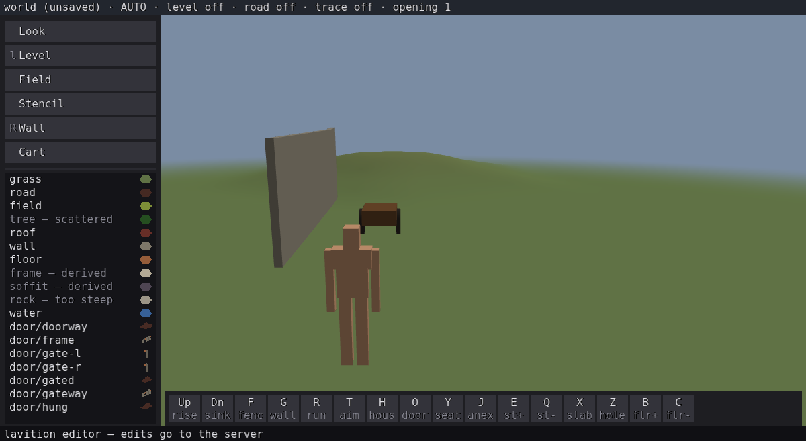
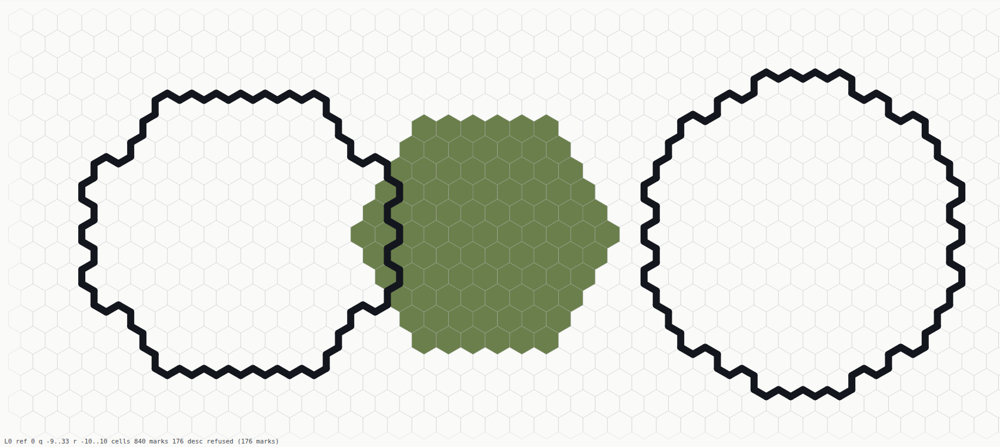
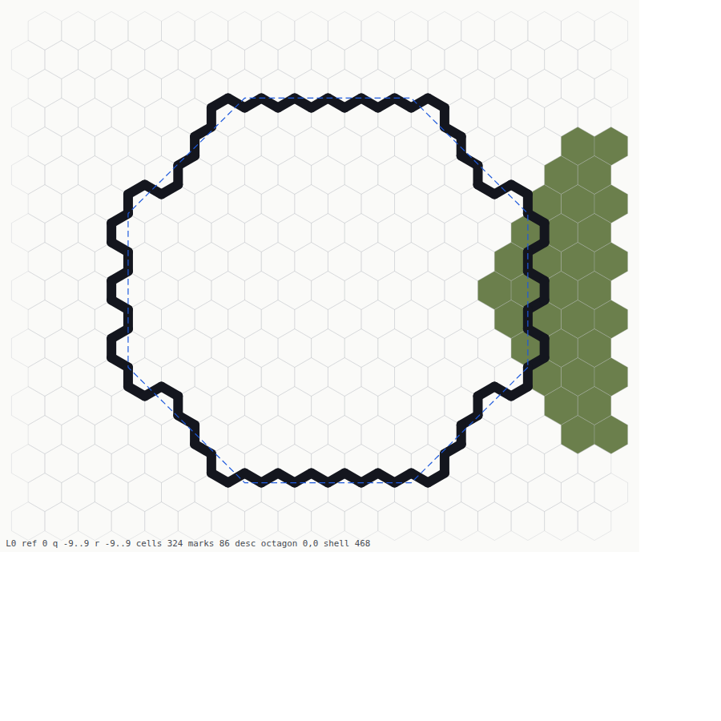
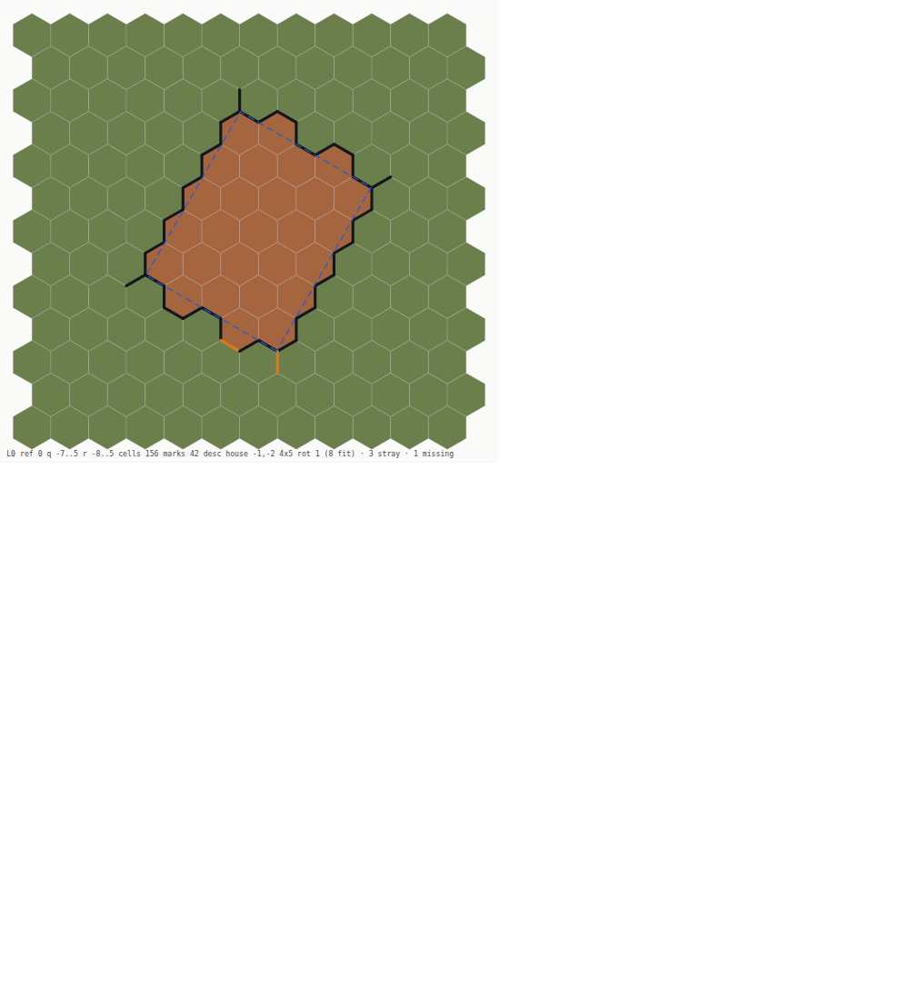
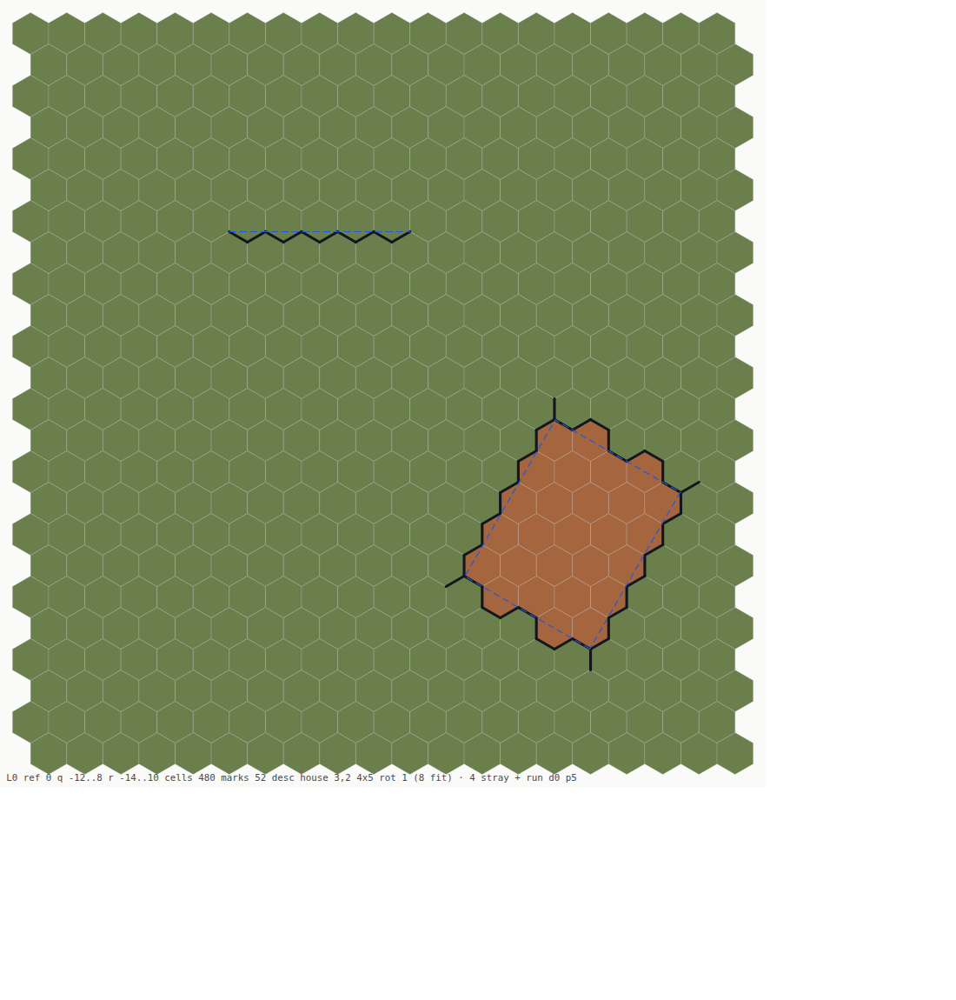
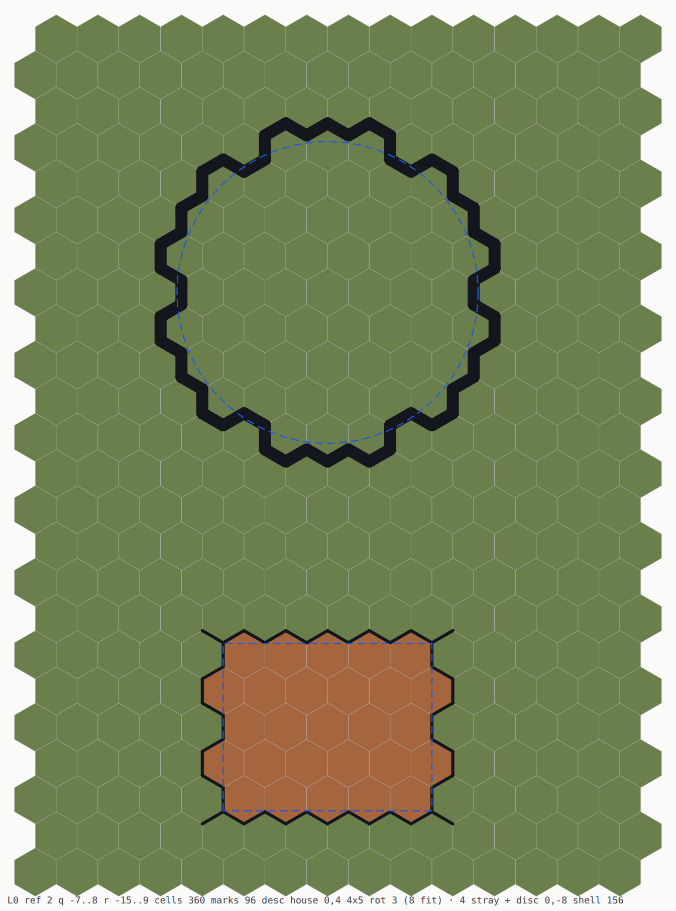

# `26` — The blueprint editor: the plan view first

**Issue:** [`jjstwerff/moros#26`](https://github.com/jjstwerff/moros/issues/26) ·
**Value:** `F` · **Effort:** `H` (`B0` is the step in hand)

## Status

[BLUEPRINT.md](../../doc/claude/BLUEPRINT.md) is designed and **nothing of it is built**.
Four falsification probes have run — `B0p` withdrew its own premise, `B1p` measured the
palette round-tripping, `B2p` confirmed a 45° face claims its own edges, `B3p` split in
two — so the design's load-bearing claims are settled and the geometry is upstream's.
What is open is the editor, and its §0 decides the order: **the view before the
authoring**, because a plan view is the format the libraries get reviewed in.

`B0` is the field half: what the STORE holds, drawn. Nothing in this tree can show that
today — the only picture is a 3D render whose own defects are what a plan view is for.

## Goal

A plan view of a hex world: cells and their stored edges, drawn from a saved world into a
format a person can open, exact enough that what it draws can be compared against the
store digit for digit — and then the authored description beside it, so field and
description are in one picture.

## Anchors

- [`doc/claude/BLUEPRINT.md`](../../doc/claude/BLUEPRINT.md) — the design; §0 is the order
  of work, §1 the invariant, §2 the three wall types
- [`doc/claude/FORMAL_CORE.md`](../../doc/claude/FORMAL_CORE.md) §2.4.3 — *the canonical
  text must not become a second editor representation*; a blueprint is a **stencil's
  description**, authored then extruded
- [`doc/claude/EDITOR_DEFECTS.md`](../../doc/claude/EDITOR_DEFECTS.md) 4 and 5 — the wall
  drawn twice, and the copy a reload deletes. Plan [#24](https://github.com/jjstwerff/moros/issues/24)
  fixes it; this plan is how it gets **seen**
- [`probe/b0p`](../../probe/b0p/README.md) · [`probe/b1p`](../../probe/b1p/README.md) ·
  [`probe/b2p`](../../probe/b2p/README.md) · [`probe/b3p`](../../probe/b3p/README.md)
- Source: `lib/hex_mesh/src/planview.loft` (the view), `src/plan_view.loft` (the driver),
  `lib/hex_mesh/tests/planview.loft` (the gate)

## Invariant gate

The plan view's surface is exact — a mark is at a lattice corner pair or it is not — so
each phase states all three parts.

**`B0`**

- **Expected result.** For a world holding one edge, `wall_set(w, 3, 0, 0, WALL_MAT, …)`,
  the emitted view holds **exactly one** edge mark, and its two endpoints are
  `hex_corner_world(3, 0, 0, (6 - c) % 6)` for the corner pair
  `hex_grid::hex_edge_corners(0)` — the same two calls `hex_mesh` already makes for a
  doorway, to the digit.
- **Invariant.** *The view draws what the store holds and nothing else* — one mark per
  non-zero wall byte in the window, none for a zero byte, none for a cell outside it.
- **Negative control.** Four seeded faults must go **red**, not merely look wrong: the
  corner mirror `(6 - c) % 6` dropped, the slot→direction table permuted, a zero byte
  drawn, and the window's upper bound made inclusive.

⛔ **`B1`'s gate is RESTATED, and the correction is the library's own.** It read *a wall
authored at 15° emits a recovered line at 30°*, which compares HEADINGS — and
`wall_read_run` says at its own signature that the field stores no orientation, so the
answer comes back as `d24` **or** `d24 + 12` with the ends swapped: *"`read.d == d` is
therefore the wrong round-trip assertion; compare the ENDPOINTS."* Written as measured:

- **Expected result.** A run laid by the editor's own `run_between` from `(0,0)` towards
  `(6,0)` recovers to **its own two endpoints**, in either order, and the description
  drawn from it stays within **0.6 wu** of every mark it was recovered from.
- **Invariant.** *The description is `wall_read_run`'s answer, drawn in the field's own
  frame* — never a line fitted to the marks.
- **Negative control.** A gesture-style chain — anchor where the author stood, 15° off
  the lattice — must draw a description that **misses its own wall** by more than 0.6 wu.
  If that stray is small too, the picture cannot show a difference it does not have.

**`B2`** — **expected result**: the world key is byte-identical before and after emitting
a two-level view. **Invariant**: *the page offset never reaches the field*. **Negative
control**: an offset applied to the store must be refused by the same check.

**`B3`** has no exact-invariant surface beyond the pose it prints, which is `Walker`'s own
two floats.

**`B4a`** — **expected result**: for every cell of a two-level window, the page point at
that cell's own centre picks **that cell**, on the panel it was drawn in. **Invariant**:
*page → cell is the exact inverse of the placement `B2` declared* — one pitch, one origin,
no second derivation of either. **Negative control**: three points must be **refused with a
reason**, never snapped to the nearest cell — one in the gutter between panels, one in a
panel's margin outside the window, and one left of the page entirely (where truncating
division would otherwise answer *panel 0*).

**`B4b`** — **expected result**: the world key after authoring at a picked spot equals the
key after the same verb authored by standing there. **Invariant**: *a pick is a TARGET, not
a teleport* — the `Author` is built at the picked spot and the walker does not move.
**Negative control**: a pick that lands on no panel must author **nothing**, and the world
key must be unchanged.

**`B4e`** — **expected result**: a script that declares two edge types and chooses each in
turn leaves a world holding **two distinct edge bytes**, drawn at the two thicknesses those
declarations state. **Invariant**: *an edge byte is a palette slot, so what a wall IS is
one question — `edge_is_wall` — and a chosen type is a wall everywhere, not only where it
is painted.* **Negative controls**: a session that never chose stamps `WALL_MAT`, so every
script in the corpus keys the same world; a door cut into a chosen type must consume
exactly one of its edges; and a slot a world stamped but **declared nowhere** must still
draw magenta, or the picture has simply stopped reading the palette.

**`B4f`** — **expected result**: a run laid at a type its world declares **0.4 across is
built 0.4 across**, measured off the emitted mesh rather than off the function that
decides it, and the plan paints that same number. **Invariant**: *the palette decides
which half-width a wall id resolves to* — BLUEPRINT §3.3's own sentence — so there is
**one** resolver, `hex_editor::wall_half`, read by the mesher and by the picture, and no
width chosen at a drawing site. **Negative controls**: a wall no world declared must
still be built at the family band, which is what keeps every world the corpus keys
unmoved; a type stating **no** thickness and one whose declaration is **damaged** must
both take that same default rather than a wall of no width at all; and `run_wall` asked
for a different half must give a different strip, or nothing here is reading the number.

**`B4h`** — **expected result**: the rim `B4g` stamps recovers to its own centre and its
own shell, and the plan draws that as a circle where the run reader gave up.
**Invariant**: *a disc is `(centre, shell)`, so it is GENERATED and compared to the field
edge for edge* — `FORMAL_CORE` §6's R1 regime, never a circle fitted to marks (§6.1).
**Negative controls**: a straight run and a rim with one edge missing must both be
refused — and deliberately **not** a hexagon, because at `12R²` a hexagon genuinely IS a
disc and demanding its refusal would be demanding the wrong answer; a disc with a wall
across it must be refused too, which is the half a one-directional check cannot see; and
the drawn radius must lie inside the band its own rim's edge midpoints span, or the
description misses the wall it came from.

**`B4i`** — **expected result**: a key builds a round tower at the shell the session
holds, and that world differs from the one `verb wall` builds. **Invariant**: *the body
says a wall is ROUND and cannot say how big* — a disc IS the hexagon at `12R²` and
`fence_ring`'s radius 3 is shell 108, so the size is a selection and the tower is a verb
of its own, reading `session_shell` and `session_wall_mat` each through one reader.
**Negative controls**: a default on the `12R²` family must make the tower and the ring
one world, which only a test comparing the two can see; a number naming no shell must be
refused without moving the standing choice; and the digest must carry the seventh
selection, because `B4e` measured it reporting one of six.

**`B4l`** — **expected result**: a world declaring `body=THICK_OCT` and one
declaring `body=THICK_CURVED` build **different fields** at one shell, from the same
key and the same selection, and what the octagon leaves is **refused as a disc**.
**Invariant**: *the palette decides the SHAPE wherever the gesture already has a size*
— `@HB-X69`'s designed extension point, admitted here for exactly the reason `B4i`
refused it for `verb wall`: a body cannot say how big, and `verb tower` already knows.
**Negative controls**: at seven shells a regular octagon quantises back onto the disk
and the two bodies key **one** world — those must be refused with the next shell up
rather than built, and only a test comparing the two worlds can see it; a body this
tree does not know and a **damaged** declaration must both still build the circle,
because the vocabulary is open and a geometry site is not where a palette is debugged;
and the round tower must be unmoved, which the shared boundary walk makes a real risk
rather than a formality.

**`B4m`** — **expected result**: the plan draws the octagon it was given **as an
octagon** — `octagon 0,0 shell 468`, an eight-point outline over the rim it was
recovered from — and the same field under a `THICK_CURVED` declaration draws a disc.
**Invariant**: *the palette picks the MODEL and the field fixes its parameters* —
§2.5's *an octagon tower is never deduced; it is stored*, with the recovery itself
`FORMAL_CORE` §6's R1, generate-and-compare and never a fit. **Negative controls**: a
gapped rim and an octagon larger than its own marks must both be **refused**; a body
this tree does not know must fall through to the round reader, because the vocabulary
is open; and the reader must not offer a shell the gesture refuses — which is not
hypothetical, because **a disk and an octagon are the same field at four sizes**, so a
reader admitting the whole grid describes every round tower of shell 156 as the octagon
of 192.

**`B4n`** — **expected result**: a placed house draws a **rectangle** on the plan —
`house -1,-2 4x5 rot 1 (8 fit) · 3 stray · 1 missing` — where it has drawn nothing since
`B1`. **Invariant**: *the description is recovered from the FLOOR, and the marks are what
it is then measured against* — `place_house` fills its footprint with
`hex_shape::box_fill`, so the cells ARE a `Box`'s rasterisation and §6's R1 applies;
the wall marks never enter the recovery. **Negative controls**: a floor with one cell
taken out must be **refused**, carrying its own cell count, or the reader is a fit; a
window with no floor must say so differently; the rectangle the search returns must
reproduce the floor through a door the search does not use; and the ambiguity must be
**reported** — the size is quantised, so several rectangles fill one field and a single
number would claim more than the field supports.

**`B4o`** — **expected result**: a window holding a house **and** a wall draws **two**
descriptions — `house 3,2 4x5 rot 1 (8 fit) · 4 stray + run d0 p5` — where it has drawn
one since `B1`. **Invariant**: *a mark belongs to one structure, and which one is decided
before anything is asked what it describes* — the rectangle owns its boundary and the
mitre one cell past it, and nothing further. **Negative controls**: the mitre count must
be the **same** with and without the wall in the window, or the house is claiming
somebody else's marks — which is exactly what `B4n` shipped; the run reader asked of the
whole window must still **refuse**, because those marks genuinely are not one path; and a
wall alone must read identically through both doors, or the split has changed what a run
is.

**`B4p`** — **expected result**: a window holding a house **and** a round tower draws
**two** descriptions — `house 0,4 4x5 rot 3 (8 fit) · 4 stray + disc 0,-8 shell 156` —
where `B4o` draws `+ 54 unexplained`. **Invariant**: *the leftover is asked the same
chain the window is* — one ordering, one palette question and one search per shape, with
a single flag deciding only WHOSE marks; `B4o`'s second asking was a hand-written excerpt
of the first and the excerpt was the run reader alone. **Negative controls**: the same
field under a `THICK_OCT` declaration must draw an **octagon**, which only a chain asking
the palette of the LEFTOVER can do — the window's own marks disagree about the body and
would reach the disc reader, which refuses an octagon correctly, having been asked the
wrong question; a tower **alone** must read identically through both doors, or the split
has changed what a disc is; the whole window must still be **refused**, because a house
and a rim genuinely are not one disc; and a leftover holding **two** structures must be
counted rather than drawn, since the split is one level deep and a chain that answered
there would be inventing a shape over marks belonging to two.

**`B4q`** — **expected result**: the plan draws `run d6 p9 · 9 stray · 9 missing` for a
wall whose own description does not reproduce it, and nothing extra for one that does.
**Invariant**: *a run's description is GENERATED and compared to the field edge for edge*
— `FORMAL_CORE` §6's R1, which `disc_recover` and `oct_recover` have used since `B4h` and
the run reader could not, because the marking rule lived inside `wall_stamp` where nothing
else could ask it. So `hex_editor::run_edges` is that rule extracted, with **one** copy and
two callers. **Negative controls**: the generator must reproduce `wall_stamp`'s own world
edge for edge over six headings, or the comparison is against a wall nothing here builds —
and `hex_shape::wall_write` must NOT be used for it, because it agrees with ours on five of
ten headings **at identical counts**; a wall the editor authored must report **zero** of
both, or the caption is loud about everything; the same run record walked backwards must
report a residual, which is the defect this measures; and `stray` and `missing` must be
pinned where the answer is **one-sided** — a description covering half the wall, and one
running past it — because every description the reader itself produces is wrong in both
directions at once and a swapped pair would pass every other row.

**`B4r`** — **expected result**: a wall walked A-to-B and B-to-A leaves **one** field,
and each direction reproduces the single description both recover. **Invariant**: *the
halfplane's tie-break belongs to the LINE, not to the walk* — `edges_halfplane_surf` marks
on `sa < 0.0 && sb >= 0.0`, so a cell centre exactly ON the line always joins the `>= 0`
side, which is correct and necessary; what was wrong is that we chose that side with the
run's TANGENT and anchored the offset at an ENDPOINT. **Negative controls**: the two fields
must be compared **edge for edge**, because `B4q` measured two fields of 12 sharing 3 and a
count reads as a match; all 24 headings must be walked, since due east — the corpus's own
heading — was never affected and four of eight sampled headings were; the corpus must be
**unmoved** with a script that DOES move as the control, or the stillness is a blind
instrument rather than a fact; and a description that genuinely is not its wall must still
report a residual, or the fix has been made by switching the measurement off.

**`B4g`** — **expected result**: a gesture rings the author with a rim whose cells are
exactly `hex_shape::arc_fill`'s disk — every edge between a member and a non-member
stamped, no interior edge stamped — and the disk recovers to the author's own cell and
its own shell. **Invariant**: *the round shape is the library's, never ours* — `arc_*`
in exact integers, and `@HB-X49`'s round tower rim is what `THICK_CURVED` names.
**Negative controls**: at shell 36 the rim must **differ** from the hexagon `fence_disc`
builds, because a disk IS that hexagon at exactly the shells `12R²` and a fixture that
picked one of those would be green on a gesture that never called `arc_fill`; a number
naming no shell must be **refused with the nearest one**, since the library draws the
shell below without a word; and the rim must carry the material it was handed, read back
as a byte.

## Phases

| Phase | Effort | Verify | Status |
|---|---|---|---|
| **`B0`** — the field, drawn: cells and stored edges from a saved world | M | `lib/hex_mesh/tests/planview.loft` — the emitted text parsed back and compared against a second, independent walk of the store; four seeded faults seen red | ✅ **SHIPPED** `6bc8144` |
| **`B1`** — the description beside it: the recovered run over the same window | M | `lib/hex_editor/tests/edges_mat.loft` + `lib/hex_mesh/tests/planview.loft` — the authored run's ENDPOINTS come back, the description stays within 0.6 wu of its own marks, a wandering chain's does not; four seeded faults seen red | ✅ **SHIPPED** `ba3af3c` |
| **`B2`** — levels side by side, offset in the page frame only (§3.4) | S | `lib/hex_mesh/tests/planview.loft` — the world key is unmoved by an emit (checked against a mutation), the same cell has identical `points` in every panel, the panels do not overlap, and the two levels are not the same picture; four seeded faults seen red | ✅ **SHIPPED** `0c35614` |
| **`B3`** — the author on the plan: pose and facing, from the walker | S | `probe/plan` — three stations of a committed script, `feet` against the marker READ BACK out of the picture, with a control that the three differ; four suite faults and the probe's own seen red | ✅ **SHIPPED** `9d81b93` |
| **`B4a`** — page → cell: the inverse of the panel transform, refusing what is on no panel | S | `planview.loft` — round trip over all 338 cells of a two-level window; the gutter, the margin, past-the-end and a point left of the page each **refused** with a reason; four seeded faults seen red | ✅ **SHIPPED** `e70efbf` |
| **`B4b`** — a gesture from a picked spot, with the walker left where it is | M | `probe/plan` rows D–F — picked and stood-on key one world, the walker does not move, a pick off the page authors nothing; the teleport seen red | ✅ **SHIPPED** `e70efbf` |
| **`B4c`** — the picked spot drawn back, so you can see what you are about to author | S | `planview.loft` — the highlight's outline is the cell's own **byte for byte**, the cross is the point asked for and not the snap, both marks survive an author on the same panel; `probe/plan` row G; four faults seen red | ✅ **SHIPPED** `e24a9b0` |
| **`B4d`** — wall TYPE and thickness, from the palette (§3.3) | M | `wall_type.loft` — a type round-trips through the encoder name/body/thickness identical; a damaged one is refused and an unknown BODY is carried; `planview.loft` — the wall is painted at the thickness its type declares; four faults seen red | ✅ **SHIPPED** `6e756c0` |
| **`B4e`** — a gesture that stamps a CHOSEN wall type, so two can stand in one world | M | `wall_type.loft` — the chosen slot is the byte the verb writes, two declared types stand in one world, a chosen type stops a walker and takes a door, the vocabulary's own bytes refused by name; `planview.loft` — a declared type drawn as a wall at its own width and an undeclared one still loud; `probe/plan` row H and `probe/s2c/walltype`; five faults seen red | ✅ **SHIPPED** `10337dc` |
| **`B4f`** — the declared thickness reaches the GEOMETRY, so the plan and the build are one number | S | `wall_type.loft` — the resolver's four answers (declared, undeclared, damaged, states-none); `hex_mesh/tests/wall_thick.loft` — the band measured off the EMITTED mesh, and the plan's stroke against it; `run.loft` — a different half gives a different strip; five faults seen red | ✅ **SHIPPED** `34cec07` |
| **`B4g`** — a ROUND enclosure: the tower rim, from `hex_shape::arc_fill` | M | `tower.loft` — the boundary is the disk's and only the disk's, the centre and shell recover, a non-shell is refused with an offer, the rim carries its material, and the `12R²` coincidence is asserted before it is relied on; `probe/s2c/tower`; five faults seen red, **one of them only after the sweep demanded a sixth instrument** | ✅ **SHIPPED** `8e39a8a` |
| **`B4h`** — a round wall's DESCRIPTION: centre and shell, drawn on the plan | M | `disc.loft` — the rim recovers to its own centre and shell at two sizes and off-origin, the circle lies inside its rim's own band, a run / a gapped rim / a disc with a wall through it are refused, membership pinned against `arc_fill`, and the shell walk's monotonicity measured; five faults seen red, **one green because the fault was not one** | ✅ **SHIPPED** `b01fbd0` |
| **`B4i`** — the round tower gets a VERB, a key and a size to choose | M | `tower_verb.loft` — the verb builds at the chosen shell, tower and ring differ at their defaults, the default is a non-hexagon shell that reads round, a non-shell is refused without moving the choice, the digest carries and follows it, the key is bound and rebindable; `keymap.loft` + `verb.loft` vocabulary 16 → 17; five faults seen red | ✅ **SHIPPED** `46999f2` |
| **`B4j`** — the refusal says only what a capped flood can know | S | `field.loft` — every code the fill can answer with the case that produces it, a gapped ring answering exactly what open ground does, and a CLOSED field past the cap refused with a control that fills under it; five faults seen red, row 1 re-run against the row written for it | ✅ **SHIPPED** `2035e1b` |
| **`B4k`** — is a BAY a feature of its wall? (probe) | S | [`probe/b4k`](../../probe/b4k/README.md) — predictions pre-registered; an unbounded span on the parent reaches **0** edges of a projecting face, with the perforating control holding at 8 | ✅ **RUN** `735814c` |
| **`B4l`** — an OCTAGONAL tower: the palette's BODY chooses the shape | M | `octagon.loft` — eight distinct corners, convex and mirrored in both lattice axes; two shells naming one octagon with a control that a far pair does not; the seven collapsing shells enumerated and each refused with the next up; the octagon and the circle keying different worlds at one shell **while their rim counts coincide**; an unknown body and a damaged one both building the circle; `probe/s2c/octagon` byte-identical; five faults seen red | ✅ **SHIPPED** `d0898cd` |
| **`B4m`** — the octagon's DESCRIPTION, and which reader the palette asks | M | `octagon.loft` — the centre and shell recover at two sizes and off the origin, a gapped rim and an over-large candidate are refused, **a disk and an octagon are measured to be one field at four sizes** and the admitted set is what separates them; `planview.loft` — the outline is eight points read out of the picture, the palette decides which description is drawn, an unknown body falls through, and `plan_tally` gets the five rows the driver's counter never had; five faults seen red | ✅ **SHIPPED** `552343b` |
| **`B4n`** — a HOUSE's description: the rectangle its floor determines | M | `house_box.loft` — the membership pinned against `box_fill` at twelve rotations, the drawn corners round-tripped through `box_to_local`, the anchor the house's own cell and not the origin, a bitten floor refused with its count, the class reported, and **`B0`'s four stray edges measured at last**; `planview.loft` — the rectangle drawn as four points read out of the picture and the caption carrying both residuals; five faults seen red | ✅ **SHIPPED** `0efad03` |
| **`B4o`** — two descriptions in one window: whose mark is this? | M | `house_box.loft` — a house accounts for every one of its own marks and leaves none over, the mitre count is unmoved by a wall entering the window, **`B1`'s wall recovers once the house's marks are attributed**, and a wall alone reads identically through both doors; `planview.loft` — both descriptions drawn and tallied as two, and the caption not calling the wall the house's mitre; five faults seen red | ✅ **SHIPPED** `8e97ae0` |
| **`B4p`** — the leftover runs the WHOLE chain: a house and a TOWER in one window | M | `house_box.loft` — a tower beside a house recovers its own centre and shell through the leftover door while the whole window is refused, a tower alone reads identically through both doors, the **leftover's** palette is what picks its reader, a leftover of two structures is refused rather than described, and a third structure is measured being dropped in silence; `planview.loft` — the circle and the octagon each drawn beside the rectangle and tallied as two, and a leftover the chain cannot explain counted rather than drawn; `tools/scripts/b4p.keys`; five faults seen red | ✅ **SHIPPED** `686e4d4` |
| **`B4q`** — a run's description measured against its own field | M | `run_fit.loft` — the generator reproduces `wall_stamp`'s world over six headings, an authored wall reports zero of both, **the same run walked backwards reports 9 stray and 9 missing of 11**, due east is the control that is unmoved, a wandering chain is answered AND says so, a refusal carries its mark count, and `stray`/`missing` are pinned on a one-sided fit; `planview.loft` — the caption clean for one wall and loud for the other, read out of the picture; `tools/scripts/b4q.keys`, [`probe/b4q`](../../probe/b4q/README.md); five faults seen red | ✅ **SHIPPED** `a305679` |
| **`B4r`** — the wall walked either way is one field | M | `run_fit.loft` — **all 24 headings, both directions, identical edge for edge and each reproducing its own description**; the wandering chain still answers AND still reports a residual, off a cell centre; `planview.loft` — the two pictures compared element by element and one clean caption each, with a loud one kept beside them; the corpus byte-identical with `b4q.keys` moving as the control; `probe/t4` unmoved; five faults seen red | ✅ **SHIPPED** |

### Why `B0` is one phase and not two

- **Upper (safety).** Nothing is replaced: the view is additive, and its own test runs the
  emitted picture and the store side by side and compares them exactly. There is no
  moment where the only way to see whether it worked is to swap and look.
- **Lower (validity).** It goes red on its own for four real reasons, listed above, and it
  is **called** the moment it lands — `make plan-view` over a world the corpus already
  builds. Splitting *write the emitter* from *call it* would manufacture this tree's
  commonest defect on purpose.

⚠ **And `B0` deliberately stops at the FIELD.** The description half needs the run record,
which the save does not carry ([EDITOR_DEFECTS](../../doc/claude/EDITOR_DEFECTS.md) 5) —
so `B1` is a different question with a different source, not the second half of one step.

⚠ **THIS FILE IS OVER `plans/README.md`'s 100–300 LINE BUDGET — 1,500 LINES — AND IT IS
THE STEP RECORDS BELOW THAT PUT IT THERE.** The convention says length means reference content is
leaking in — and the fix is the one the closing checklist already names: each finding
moves to the doc that owns it (`BLUEPRINT.md` §0 and §3.4 and `EDITOR_DEFECTS.md` entry 6
already carry the load-bearing halves), and this keeps the closure record. ⚠ Thinning
them **before** that move is how a finding that cost a day becomes a line nobody can
check — `STATE.md`'s own lesson, in its own banner.

## What `B0` turned up

**Shipped `6bc8144`.** `hex_mesh::plan_svg` + `src/plan_view.loft` + six tests;
`make plan-view WORLD=<name>`. The four seeded faults were each seen red on their own
row — the mirror dropped (2 failed), the slot table permuted (2), a zero byte drawn (3),
the window bound made inclusive (1) — with the control green either side of the sweep.

### ⚠ The first picture it drew found two things, and neither is what it was aimed at

`house.keys` is the oldest script in the corpus and the one every acceptance shot is
taken from. Drawn flat, its house is **27 floor cells with a closed wall around them —
and four wall edges that bound none of them.**


*Three black stubs hang off the corners and a fourth stray edge is the orange one below the
south wall — the window. `make plan-view WORLD=headless Q0=-7 R0=-8 Q1=5 R1=5`.*

| | |
|---|---|
| stray edges | `(-2,-6)` slot E · `(2,-4)` slot NE · `(-5,-1)` slot NE · `(-1,2)` slot E |
| what they touch | each shares **exactly one vertex** with the footprint, and no cell of it |
| how many | **four** — and the house has four sides |

⚠ **AND ONE OF THEM IS AN OPENING.** `house.keys` cuts two, and its own comment
records the day they finally landed — *"`opened profile 1 at (-2,1)` and `opened
profile 2 at (-1,2)` come back on the wire"*. Measured in the field: profile 1 bounds
floor cell `(-2,1)`; **profile 2 bounds nothing at all.** It hangs off a corner by one
vertex, which is why nobody saw it — a window at the corner of a house is exactly where
a window looks right.

⚠ **THIS IS NOT YET A DEFECT CLAIM, AND THE DIFFERENCE IS THE WHOLE PLAN.** A wall is a
straight RUN and a footprint is that run rasterised, so a stamp that over-runs the fill
at each corner may be drawing a wall that genuinely exists in the description and
genuinely bounds nothing in the field. **Which of the two is right is `B1`'s question**,
and it is the argument for `B1` rather than a bug report: the field half alone can say
*this edge bounds no room* and cannot say *and no wall was authored there*.

### ⚠ The gesture says 84 and the world holds 42

`place` acknowledges *"house placed 27 cells, **84** wall edges"*. The saved world holds
**42** non-zero wall bytes, counted over **every layer** rather than the drawn one — so
this is not the plan view looking at the wrong height.

They are different questions: `marked` counts what `wall_stamp` marked, and an edge is
stored once and read from both its cells. ⚠ **But this exact pair is the one that hid a
real defect** — `hex_editor.loft`'s own comment records `place_house` printing *84 wall
edges* while the store held **23**, two of the four walls destroyed, every suite green.
A number that cannot equal the store is a number no one can use as a health check, and
the plan view is the first thing here that draws the other side of it.

✅ **ANSWERED BY `B1`, AND IT WAS ALREADY WRITTEN DOWN.** `probe/l1` measured it a plan
earlier — *"`wall_stamp` writes every edge twice — 16 writes for 8 distinct edges …
every `marked` count this tree prints is double"* — so the two are one doubling and not
two questions. It is an assertion in the suite now rather than a sentence in a probe
write-up: `planview.loft` checks the drawn mark count against `m / 2`.

### What the instrument cannot see, said before it is trusted

- **One reference height per picture.** `plan_svg` takes a `ref` and draws the layer
  `edge_layer` selects for it — so a deck's fence and the yard below it are two
  pictures, not one. The driver defaults to the world's own ground default, and to `0`
  when it has none, which on a world with a cellar is **the cellar**.
- **The field only.** No run, no `rebuild`, no palette — `B1`.
- **It is not a gate.** The picture is for a person; the claims are the loft tests.

## What `B1` turned up

**Shipped `ba3af3c`.** `hex_editor::edges_mat` (the bridge `probe/l1` named and could not
put anywhere), `hex_editor::wall_recover` + `RunRead`, the dashed description in
`plan_svg`, and a caption that says which of three states the description is in. Four
seeded faults each seen red: the bridge writing nothing, the far end collapsed onto the
anchor, the triangle frame's axes swapped, and the caption's verdict hard-wired.

### ⚠ A house eight hexes away makes an unrelated wall unreadable

`tools/scripts/wall.keys` lays one wall west-to-east and then places a house at `(-8,-8)`.
The same window over the same wall, with and without that house:

| | marks | description |
|---|---|---|
| the wall alone | **10** | ✅ `run d0 p5` — the authored `(-4.3301, 0.5)`-`(4.3301, 0.5)` |
| the wall, with the house in the world | **11** | ⛔ `refused (11 marks)` |


**The eleventh mark is the short stub at the top left**, and it is one of the house's — the
same corner over-run `B0` found. It meets the wall's chain at a vertex, which makes three
marked edges at one point, and `wall_read_run` will not answer for a marking that is not a
path. ⚠ **So `B0`'s four stray edges are not cosmetic.** A structure eight hexes away
silently costs a wall its description, and nothing in this tree could see that before the
two were drawn together.

### Two things `probe/l1` wrote down, now pinned by tests rather than by prose

- **Every `marked` count this tree prints is double.** `lib/hex_mesh/tests/planview.loft`
  asserts the drawn mark count is exactly `m / 2` for the stamp's own return. That closes
  `B0`'s open pair — *the gesture says 84 and the world holds 42* was never two questions,
  it is one doubling, and the assertion is now in the suite.
- **A wandering chain is answered confidently, not refused.** `probe/l1`'s `P4` predicted
  `ok = false`; measured again at the new entry point, `wall_recover` returns `ok` with
  ends that are not the authored ones. The test says so, and says in its own message what
  it would mean if the library ever gained a path check.

### What the instrument still cannot see

- **One run per window.** `wall_read_run` asks *what run do these marks describe*, so a
  window holding a closed loop or two walls is refused whole. A house therefore draws no
  description at all — the caption says `refused (n marks)` rather than falling silent,
  because *no marks* and *marks the reader refused* are different facts.
- **No `rebuild`, no palette.** A wall type, a thickness, a bay — none of that is asked
  for yet; `wall_read_run` answers about a straight run and nothing else.

## What `B2` turned up

**Shipped `0c35614`.** `plan_levels` takes a list of reference heights and draws one panel
per level, each in its own `<g>` carrying `data-level`, `data-ref` and `data-dx`;
`plan_svg` is the one-level wrapper. `make plan-view WORLD=b2deck REFS=0,3`.


*`deck.keys`'s world, ground and the storey above it. Same window, same coordinates,
placed by one transform each.*

### The offset is declared, and the geometry never learns it

`plan_panel` draws in the world's own frame and does not take a `dx` at all; the group
places it. So the same cell has **byte-identical `points` in every panel**, and `data-dx`
and the `transform` are two statements of one number, checked against each other — a
picture whose two statements of its own offset disagreed would be unmappable and would
look perfectly right.

⚠ **THE REFACTOR WAS PROVEN BEFORE THE FEATURE WAS ADDED.** `plan_svg`'s body became
`plan_panel` + `plan_levels`, and the **282** emitted elements of one window were compared
byte-for-byte against the pre-refactor output: identical. `data-h` went on the cell only
after that, as a deliberate content change rather than a silent one.

### ⛔ And the sabotage sweep caught ME first

The first row-1 sabotage — *bake the offset into the geometry* — was spelled as a shift of
`hex_corner_world(q + 1, …)`, and the suite stayed **green**. That is correct: the test
asks whether the panels differ **from each other**, and a shift applied to all of them
equally is not that defect. The faithful sabotage is the obvious wrong implementation —
pass `dx` into `plan_panel` and add it to the coordinates — and it is caught, with the
assertion's own words. ⚠ **A sabotage has to BE the defect, not a change in its
neighbourhood**, and a green row is a claim about the sabotage before it is one about the
test.

### The upper panel draws the lawn, and that is the store's answer

A panel at `ref 3` shows the deck **and** the ground around it, because `world_surface`
answers *what would someone at this height be standing on* and outside the deck that is
still the ground. The answer is right and it looks like grass on the first floor.
`data-h` — the cell's own stored height — is what tells them apart, and it is the store's
number rather than a rule invented here. ⚠ Whether an upper panel should BLANK what is
not on its level is a decision for the authoring half, not a defect: on `b2deck` the
heights emitted are `0 1 2 3 5 6` for the raised ground and `12` for the deck, so the
plan already carries the contour a reader needs.

### What it still cannot see

- **A level here is a reference HEIGHT, not a sheet index.** `FORMAL_CORE` §2.4.3 says
  *"the level is a discrete sheet index and nothing else"*, and this store has layers and
  heights — `combine_cut_level`'s `at` is `hex_place`'s, and nothing in the editor writes
  one. So `data-level` is the panel's index and `data-ref` the height it was read at, and
  **neither is the formal level**. Naming them apart is the most this step can honestly do.
- **One run per window still**, per `B1`.

## What `B3` turned up

**Shipped `9d81b93`.** `plan_author` takes a `hex_editor::Author` — the same four
numbers every gesture takes — and the plan draws a marker at the author's own two floats
with a facing tick along `(cos yaw, sin yaw)`. `editor_run` gains `plan <tag>`: the view
at the current tick, windowed on the author. `make probe-plan`, and it is in `make fast`.


*A house, and the person who built it standing against its south wall, facing north. The
caption ends `you`; the same four stray edges `B0` found are on the corners of this
placement too.*

### The pose is read back OUT of the picture

`editor_run`'s `plan` line prints the marker it parsed from the SVG it just wrote — not
`wk_x`. ⚠ **A line that re-printed the walker would compare the walker against the walker
and pass for any drawing at all**, including one that put the marker at the origin. That
is exactly the row `probe/plan` catches: with the marker nailed to `(0,0)`, **station 1
still passes** — the author really is at the origin there — and stations 2 and 3 fail.
Three stations and the *are they even different points* control are what make the row an
answer.

### Which panel the author stands on is the store's answer

They are drawn on the level whose reference selects the same LAYER under their own cell as
their own feet do — `edge_layer` asked twice and compared. A rule of the shape *within half
a storey of the reference* would be a number invented here, and `FORMAL_CORE` is explicit
that a level is not a height. Tested both ways round on the two-storey fixture: standing on
the ground they are on `L0` and **not** `L1`; standing on the deck, `L1` and not `L0`.

### ⚠ A saved world has no author, and the picture says so

`src/plan_view.loft` reads a `.hxw` and reports `who none`, because the walker lives in
whichever driver is running the tick — the store carries the world and not the person.
**That is the same boundary `B1` found from the other side** (the run record is not saved
either), and it is why the author appears in `editor_run`'s `plan` rather than in the file
reader: a program that invented a pose from an argument would be drawing a claim rather
than a fact.

⚠ **AND THE THREE STATES DO NOT READ ALIKE** — `who none`, `who (x,z)`, `who (x,z)
OFF-PLAN`. An absent marker means *nobody was given* and *somebody is elsewhere* at once,
which is the collapse `probe/l1` lost a run to and the third time this plan has had to
separate one.

## What `B4a`/`B4b` turned up

**Shipped `e70efbf`.** `plan_pick` turns a page position back into a cell on a level;
`editor_run` gains `pick <x>,<y> <verb>`. [`probe/plan`](../../probe/plan/README.md) grew
rows D–F.

### One frame, and the extraction proven before it was used

`plan_bounds` and `plan_pitch` now answer for the drawing **and** the pick. A second
derivation of that arithmetic would be wrong by a margin — right in the middle of every
panel and wrong at its edges, which is where nothing is ever tested by hand. The
extraction was proven first: **282 emitted elements byte-for-byte identical** to before it.

### ⚠ `mesh_tile_of`'s bug, in a new place, caught before it shipped

loft's `/` truncates toward zero, so a page point **left** of the picture divides to
**panel 0** — a click a metre outside would author inside the first panel. The bound is
tested before the division, and the sweep row that removes that test goes red. ⚠ This tree
has already paid for this once, in `mesh_tile_of`, and its test file says why in its own
banner: *every fixture in this tree stands at the origin, which is the one place the wrong
spelling is right*. The refusals are checked as **four named reasons** — gutter, margin,
past-the-end, off-page — because *the nearest cell* is not an answer to *no cell*.

The accept side is a **round trip over all 338 cells** of a two-level window, for the same
reason: a transform wrong by a margin still picks the right cell in the middle of a panel.

### A pick is a TARGET, not a teleport

Clicking a plan to hang a door does not walk the person across the room. The `Author` is
built at the picked spot and handed to the same `press_verb` every other spelling uses —
so the verb is the verb, and this is not the fifth place that decides what a key means
([EDITING_MODES](../../doc/claude/EDITING_MODES.md) already counts four). ⚠ **That is what
`Author` being a type of its own is FOR**, and until this step nothing in the tree had used
the distinction.

Measured, and it is the whole argument for the step: **picked and stood-on key the same
world**, `32952:2278076870` — with the control that the fence moved the world off the bare
key `32952:3318286153` at all, because two worlds nobody authored in agree perfectly.

### ⚠ And a failure that was not this tree's

Three runs died on `unable to find library -lloft_graphics_native`. It is a **sibling's
loft CI** rebuilding the native cdylibs: `~/.loft/build-cache/graphics-0.8.0/release` is
emptied and refilled, and every `--lib lib/` link here fails while it is empty. Nothing to
fix and nothing to kill. `LOFT_NO_NATIVE_LIBS=1` is the way through, and it changes what is
exercised. [`probe/plan/README.md`](../../probe/plan/README.md) carries the incantation.

✅ **RE-RUN PLAINLY ONCE THE CACHE REFILLED AND THE CAVEAT IS DISCHARGED**: `make fast`
exits 0 with `probe/plan` green on the native path inside it, and `hex_mesh` is **94 on
both backends**. ⚠ The window it took was between two of the sibling's rebuilds, so the
green is a fact about this run and not a promise about the next one.

## What `B4c` turned up

**Shipped `e24a9b0`.** `pick <x>,<y>` with no verb **aims**: it resolves the point,
writes the plan with the spot marked, and authors nothing. With a verb it authors — one
word, two arities, and the difference is *look* against *do*.


*The house, the person at its south wall, and the violet cell they are pointing at with
the cross showing where they actually pointed. The caption ends `aim you`.*

### A pick is two facts and the picture draws both

The cell it resolved to, as an outline; the point that was asked for, as a cross. ⚠
**Drawing only the first hides the SNAP**, and hiding the snap is how an author blames the
store for a gesture that landed exactly where they pointed. In the picture above the cross
sits visibly off its cell's centre, which is the whole of it.

### ⛔ Row G found a real defect on its first run

The author's overlay **assigned** where it should have appended, so the highlight was
wiped whenever the author stood on the panel they were aiming at — **which is every aim a
person takes at their own plan** — while the caption cheerfully named the cell.

⚠ **The suite could not see it.** Every test written before it passed one overlay or the
other and never both; the case only exists where they meet. And ⚠ **the row caught it
because of how it asks**: *does the PICTURE carry the mark*, not *does the caption say so*.
A row phrased the second way would have been green on a file with nothing drawn in it —
which is the same sentence this plan has now written three times, about three different
instruments.

It is fixed, pinned by a test that passes both overlays, and that test was seen red with
the assignment put back.

### Two extractions, both proven before use

`cell_points` — one derivation of a cell's outline, so a highlight cannot sit a hair off
the cell it claims to be highlighting — and `PlanOver`, which makes the author and the aim
one parameter rather than pushing `plan_levels` past loft's own parameter nudge. **282
emitted elements byte-for-byte identical across both.**

⚠ **And a smaller one worth keeping**: the test helper that finds the highlight first used
a hand-counted prefix length and silently matched nothing — the failure read as *the pick
was not drawn*. It counts with `.size()` now. A reader that measures its own needle by hand
is a reader whose default answer is *absent*.

## What `B4d` turned up

**Shipped `6e756c0`.** `hex_editor::wall_type` reads a wall TYPE off the edge palette and
the plan paints the wall at the thickness it declares.


*The same house as `B3`, after `declare edge 1 brick body=SOLID thick=0.35` and
`declare edge 2 doorway body=OPEN_DOOR thick=0.1`: 41 marks painted at 0.35 and the
doorway at 0.1, visibly narrower than the wall it perforates.*

### ⚠ The block was a claim, and re-measuring it dissolved it

The row said **Blocked on `@HB-X63`**, which gates the FOXEL's round trip upstream and
leaves the palette at **T4** in hexbody's own model. That is upstream's gap. What this row
needs is that a wall type survives **this tree's** encoder — and it does: a type written
into `PALW` comes back through `world_to_bytes`/`world_from_bytes` with its name, body and
thickness identical, with a control that a world holding no palette declares none.
[NOTATION](../../doc/claude/NOTATION.md)'s doctrine, applied to our own table: **`Blocked`
is a claim to re-measure, not a fact.**

### The declaration half already existed, and nobody had noticed

`declare <axis> <slot> <name> <fields…>` was built for house types (plan 22 `T1a.1`) and
`pal_kind_of` has always accepted **`edge`**. So a person could already declare a wall type
and nothing could read it. `B4d` is the reading and the painting; the writing was there.

⚠ **And `WALL_MAT` is 1**, so `declare edge 1 …` types every wall already standing — which
is how the picture above was made from a script with no new gesture at all. What is
missing is a gesture that stamps a **chosen** slot, so two types can stand in one world;
that is `B4e`.

### ⛔ The body vocabulary is not closed here, deliberately

`@HB-X12` names the bodies and `@HB-X69` says why the list lives in a comment rather than
in a type: *"an open vocabulary … which is exactly why the palette is the designed
extension point."* So `body=OCTAGON` is carried through and a test pins it. **A reader that
checked the body against a list would refuse the design's own next value, politely** — and
§2.3 of the design is that an octagon body is *"exactly the extension shape"*.

What IS refused is what is structurally wrong: `thick=fat` and `thick=-0.5`, each naming
what it saw. ⚠ **And a type with no `thick=` at all is a type that STATES NONE**, which is
a third answer — the same distinction `house_type` refuses a malformed type on, and the
reason `palfield.loft` deliberately has **no `pal_float`**: a float reader with a fallback
would have to answer the same for *absent* and *unparseable*.

### What it costs, said rather than discovered later

The picture resolves the palette **per edge** — a text parse for each mark. At 42 marks
that is nothing; at ten thousand it would be the slowest thing in the emitter. It is a
file writer and not a frame loop, so this is a note rather than a defect.

## What `B4e` turned up

**Shipped `10337dc`.** `hex_editor::session_select_wall` + `session_wall_mat` (read by
`wall`, `run` and `aim` from one place), `edge_is_wall`, `select wall <slot>` in the
runner, `58:` on the wire, and `tools/scripts/walltype.keys` through both drivers.


*`declare edge 5 brick thick=0.2` and `declare edge 6 curtain thick=0.7`, each traced
with `select wall <slot>` before it. One verb, two choices, two widths.*

### The gap was never where `B4d`'s note put it

`B4d` closed saying *"what is missing is a gesture that stamps a **chosen** slot"* — one
selection, in the shape the other five already have. That half took an afternoon. What
it did not say is that **an edge byte's meaning is asserted at six other places**, each
holding a byte and no world:

| the site | what it would have done with a chosen type |
|---|---|
| `wall_stops_walk` | a person walks through stone |
| `wall_stops_view` | a camera sees through it |
| `open_ahead` · `open_span` | a door cuts nothing, and reports the count |
| `session_run` | a wall run takes the **FENCE's** shape |
| `hex_mesh::emit_run_wall` | the run loses its half-width |
| `planview::edge_colour` | the wall is painted as *I cannot explain this* |

⚠ **Not one of those is in the plan view**, which is where the row's own acceptance
looks. A step that had built the selection and the picture would have been green on its
stated verify and shipped a wall you can walk through.

### ⛔ And the wire already carried a material, which outranked the choice

`probe/s2c/walltype` went red on its first run and the shape of the failure is the
finding. The server **received `58:` and selected correctly** — its own log says
`editor: wall 5 selected` — and then stamped byte 1 anyway, because `tools/script.mjs`
sends `run` as `25:1` and `wall` as `23:1,3`. The material was on the wire, and a
payload beats a session.

| | runner | served |
|---|---|---|
| `WALL_MAT` bytes in the saved world | **0** | **12** |
| what the driver printed | `wall laid 12 edges, heading 0 …` | `wall laid 12 edges, heading 0 …` |

⚠ **THE TWO SENTENCES ARE IDENTICAL**, so no acknowledgement, no count, no log line and
no gate that reads one could have found this. Only the saved world could — which is
`probe/s2c`'s whole argument, made again on the first script added to it since `htverb`.

✅ **And the fix was written down two years of notes ago.** `editor_client.loft`'s own
comment: *"`fence`/`wall` are one `ring` verb waiting for a material selection, exactly
as the opening family waited for `es_open_kind` — so until that selection exists they
are two verbs, each implying its own material."* An **empty material field** on `23:`,
`25:` and `56:` now means *the wall type I chose*, which is the contract `36:`, `37:`
and `38:` have shared since plan 22. An explicit material stays a one-shot that does not
move the selection; `25:3` is still the road and `tools/plan.mjs` still sends it.

⚠ **AND THE RESOLUTION IS THE FAR END's, NOT THE CLIENT'S.** A client that put its own
answer on the wire would need a copy of the session it is attached to, which is
[EDITING_MODES](../../doc/claude/EDITING_MODES.md)'s four-site divergence in one line.

### ⛔ `session_digest` reported one selection of six

That is *why* the defect above had to be found in the bytes. The digest exists to say
**what the editor remembers** beyond the store — it is the other half of `world_key`,
and `probe/k3d`, `probe/s2c` and the page-versus-runner comparison all read it — and it
printed `chosen: opening <k>` and nothing else. The seat, the annex, the aim's reach,
the part and now the wall type were invisible to every one of them.

It prints all six now, which moved 34 `probe/k3d` baselines on that one line and nothing
else. ⚠ **The blindness was measured on the step that added the sixth**, which is the
only reason it was found at all: four of the five were already there.

### What a wall TYPE is, and the limit that comes with it

`edge_is_wall(mat)` is `mat == WALL_MAT || mat > EDGE_MAT_LAST` — the four bytes this
editor's vocabulary owns (`WALL_MAT` 1, `DOOR_MAT` 2, `FENCE_MAT` 3, `WINDOW_MAT` 4) are
structural kinds, and everything past them is a wall a world declared. ⚠ **The kind stays
NUMERIC deliberately**: every caller holds a byte and no world — the walk asks per edge
per step — and `@HB-X12`'s body vocabulary is upstream's and open, so deriving
fence-ness from `body=FENCE` would be a signature change at six sites for a capability
nothing has asked for. **The cost, said out loud rather than discovered: a world cannot
declare slot 7 to be a fence.** It declares slot 7 to be a wall type.

⚠ **AND THE PICTURE'S LOUDNESS CHANGED SUBJECT RATHER THAN LOOSENING.** `B0` wrote *an
unknown edge material is magenta, because the whole point of an instrument is that what
it cannot explain looks different from what it can*. A declared slot 5 **is** explained,
in full, by the palette — so shouting at it is shouting at the feature. What keeps the
magenta is a byte **nothing declares**, and the pair is pinned by two tests one
declaration apart.

### The sabotage sweep, and the row that told the instruments apart

Five faults, each restored from a copy taken before the sweep — never `git checkout`, and
the subject was asserted **present** before row 0, because a sweep over an absent feature
answers *nothing went red* to every question.

| # | the fault | what went red |
|---|---|---|
| 0 | *(control — nothing sabotaged)* | **nothing**, as it must |
| 1 | `session_wall_mat` pinned to `WALL_MAT` — the choice never reaches the gesture | `wall_type` · `probe/plan` |
| 2 | `edge_is_wall` back to `mat == WALL_MAT` | `wall_type` · `planview` · `probe/plan` |
| 3 | a declared type stays magenta — the plan stops reading the palette | `planview` · `probe/plan` |
| 4 | the wire's default back to `?? FENCE_MAT` | **`probe/s2c` alone** |
| 5 | the selection accepts the vocabulary's own bytes | `wall_type` |

⚠ **ROW 1 IS THE ONE WORTH READING, AND IT IS THE ROW `probe/s2c` DID *NOT* CATCH.** With
the library's selection broken, both drivers are broken the same way, so the two saved
worlds agree perfectly. **`probe/s2c` measures DIVERGENCE, never correctness** — which is
exactly why row 4 is its alone: a default that lives only on the wire cannot make the two
drivers agree, and nothing else in the tree looks at both.

### What it deliberately does not reach, and who owns each

`place_house` and `annexes_runs` still stamp `WALL_MAT`, so a house built after
`select wall 5` has byte-1 walls. ⚠ **That is not the selection failing to reach a site —
it is a different question with a different owner.** A house's walls belong to its TYPE
(`declare house 1 castle wid=… dep=…`, plan 22 `T1a.1`), which is where *a castle is made
of curtain wall* belongs; wiring the author's standing choice into it would make one
gesture read two authorities. ⚠ **And it is what keeps `house.keys` byte-identical**,
which is the whole upper bound of this step. `VB_FENCE` keeps `FENCE_MAT` for the same
reason one level down: a fence is a KIND the vocabulary owns, not a type a world declares.

### Four tests were asserting the opposite of the truth

`9` was the tree's canonical *impossible material*, in `fence.loft`, `press.loft`,
`session.loft` and `tools/gates/world/fence.mjs`. It is a wall type now. ⚠ **What is
still impossible is what a BYTE cannot hold, and stating it found something the old
ceiling hid**: `wall_set` widens with `mat as u8? ?? 0`, so a material of 256 does not
fail — it stores **0**, the byte that means *no edge at all*. `fit_nominal(mat,
FENCE_MAT, …)` never let one through; `edge_stamp_ok` has to say it.

## What `B4f` turned up

**Shipped `34cec07`.** `hex_editor::wall_half` — one resolver from a wall **id** to the
half-width it is built at — `run_wall` taking that half instead of choosing it,
`hex_mesh::emit_run_wall` and `planview::plan_svg` reading the one function, and
`lib/hex_mesh/tests/wall_thick.loft`, which measures a wall's band as the spread of the
wall mesh's own vertices.




*`declare edge 5 brick thick=0.2` and `declare edge 6 curtain thick=0.7`, in the WORLD
this time rather than in the plan. ⚠ **Two pictures because one cannot say which wall is
which**: the thin one is laid alone first, so screen-left is measured to be slot 5 rather
than argued from a handedness convention — and the wall that arrives in the second is the
one carrying a top face you can see. Before this step both were √3/2 and the pair would
have been one picture twice.*

### `wt_thick` had exactly one consumer and it was a PICTURE

`B4d` read a wall's thickness off the palette and `B4e` let a person choose the type
that carries it, and between them they wired it to the plan view and to nothing else.
`run_wall` resolved **every** wall id to `wall_band() * 0.5` — √3/2 — so:

| | |
|---|---|
| the palette says | `declare edge 5 curtain body=SOLID thick=0.4` |
| the plan paints | `stroke-width='0.4'` |
| the mesher builds | **0.8660254037844386** |

⚠ **AND EVERY SUITE WAS GREEN**, because the store, the palette and the picture all
agreed — the disagreement was between the picture and the *world the picture is of*,
and nothing in the tree compared those two. This is [CLAUDE.md](../../CLAUDE.md)'s named
commonest defect landing on the step immediately after the one that built the thing:
*check that what you built is called*, asked one rung too late.

⚠ **AND IT IS WORSE THAN AN UNCALLED FUNCTION, BECAUSE THE PLAN VIEW IS THE REVIEW
SURFACE.** BLUEPRINT §0's whole argument is that a plan is the cheapest place to see what
the libraries do; a plan that paints 0.4 over a wall built at 0.866 is an instrument
reporting its own input.

### The instrument was the step; the change itself is a dozen lines

The band is measured as the **z-spread of the wall mesh's vertices** — the run lies along
+x, so its two faces are the extreme z. Two things make that trustworthy rather than
plausible:

- ⚠ **The plain-wall row must be green BEFORE and AFTER.** An instrument that cannot find
  the √3/2 that was already there cannot be believed about the 0.4 that was missing —
  and it is also the step's **upper bound**, since every world the corpus keys is laid at
  the band.
- ⚠ **The run is registered WITHOUT stamping its edges.** `wall_stamp` does both, and the
  per-edge panels the mesher then draws from the store ([EDITOR_DEFECTS](../../doc/claude/EDITOR_DEFECTS.md) 4 —
  every wall drawn twice) sit on the hex edges and would widen the spread. The defect
  that step 4 records is, concretely, a second wall in the way of measuring the first.

⚠ **AND NO RESOLVER TEST COULD HAVE FOUND THIS.** `wall_type.loft` gains four rows here
and not one of them could have gone red before the step: the resolver was never the
broken half — the mesher's **call** was — so the only instrument that could fail is one
that reads the emitted geometry.

### Moving a constant into a parameter turned its own test into a tautology

`run.loft`'s `test_the_strip_is_the_family_band_thick` pinned the wall's width since `S3`:
*the thickness is `hex_draw`'s, not a number chosen here*. The moment `run_wall` took
`half` from its caller, that test passed `BAND_SIDES * 0.5` in and asserted `BAND_SIDES`
came out — **a table checked against the table**, and it went on passing without a word.

⚠ **It is a shape worth watching for, because the refactor was right and the test's decay
was invisible.** What restores it is a second row at a *different* half: without it every
assertion in that file would pass on a `run_wall` that had gone back to choosing the band
itself. The claim the old row really made — *an undeclared id is presented at the family
band* — moved to `wall_half`, where it is now a fact about the resolver and, off the mesh,
about the geometry.

### The region is the run's own start cell, not the chunk

`emit_run_wall` is handed `q0`/`r0` of the **mesh chunk** it is filling, and a wall is
meshed once per chunk it crosses — so resolving the palette against those would give one
wall two thicknesses at a regional boundary. It resolves against the cell the run
**starts** in, which is the same choice `wr_mat` already makes about its material.

### What it deliberately does not reach, and who owns each

`roof_plan_of`'s eave reach and the camera's `CAM_SKIN` are still the plain band. Both are
about the **procedural** house, whose walls `place_house` stamps as `WALL_MAT` — `B4e`'s
decision, unchanged — and `CAM_SKIN` is a `const`, so it has no world to ask at all.
⚠ **The consequence, said out loud rather than discovered: a declared wall thicker than
the band can reach closer to the eye than the camera's skin expects.**

### The sabotage sweep

Five faults, each restored from a copy taken before the sweep — never `git checkout` —
and the subject asserted **present** before row 0 (`wall_half` in the tree *and* called
by both emitters), because a sweep over an absent feature answers *nothing went red* to
every question.

| # | the fault | what went red |
|---|---|---|
| 0 | *(control — nothing sabotaged)* | **nothing**, as it must |

### Both backends, and three failures that were not this tree's

`hex_editor` **669 passed** and `hex_mesh` **106 passed** on the interpreter; `make fast`
green, with `probe/s2c` keying `walltype` IDENTICAL with and without a server. On
`--native` `hex_editor` is 669 and `hex_mesh` came back **103 passed, 3 failed** — all
three in `arch.loft`, a file this step does not touch, all three
`native compile: error: linking with cc failed`. ⚠ **`pgrep -f cargo-nextest` was
answering**, which is [CLAUDE.md](../../CLAUDE.md)'s documented condition: the sibling's
`make rebuild-native-cdylibs` empties and refills the build cache, and any `--lib lib/`
link here fails while it is empty. Re-run alone, `arch` is **3 passed** on native, and
`wall_thick` is **3 passed** on native — so the two backends agree, which is the claim,
and the interruption is a fact about the box.

### A note on cost, and the instrument it is NOT measured with

`emit_run_wall` now asks the palette once per run per mesh chunk — two section
lookups, and for a world that declares nothing they return on the first line. A world
that *does* declare wall types pays one text split per run per chunk, on a path that
rebuilds the whole neighbourhood on every write ([EDITOR_DEFECTS](../../doc/claude/EDITOR_DEFECTS.md) 1).
⚠ **It is written down rather than timed, because [CLAUDE.md](../../CLAUDE.md) measures
cost in `w_tau` and a mesh build does no writes** — so the honest statement is *where*
the work is, not how many milliseconds it took on this box.

### The sabotage sweep, and the row only ONE instrument could catch

Five faults, each restored from a copy taken before the sweep — never `git checkout` —
and the subject asserted **present** before row 0: `wall_half` in the tree *and* both
emitters calling it, because a sweep over an absent feature answers *nothing went red*
to every question.

| # | the fault | what went red |
|---|---|---|
| 0 | *(control — nothing sabotaged)* | **nothing**, as it must |
| 1 | `wall_half` pinned to the band — the declaration never reaches the geometry | `wall_type` · `wall_thick` · `planview` · `probe/plan` |
| 2 | `run_wall` ignores its `half` and chooses the band again | **`run` · `wall_thick` alone** |
| 3 | the plan forgets to double the half — the picture halves what is built | `wall_thick` · `planview` · `probe/plan` |
| 4 | `wall_half` returns the full width instead of the half | `wall_type` · `wall_thick` · `planview` · `probe/plan` |
| 5 | `thick=0` read as *zero wide* rather than *states none* | **`wall_type` alone** |

⚠ **ROW 2 IS THE ONE TO READ, AND IT IS THE ROW THAT ALMOST HAD NO INSTRUMENT.** A
`run_wall` that quietly re-chooses the band is invisible to the plan view — the picture
resolves the palette itself and would go on painting 0.4 over a wall built at √3/2,
which is the original defect wearing the fix's clothes. `wall_thick` sees it because it
reads the MESH. ⚠ **And `run` sees it only because of the row this step added**:
measured with the fault in place, the failure is

```
FAIL tests/run.loft::test_the_strip_is_as_thick_as_it_was_asked_for
     a strip asked for 0.2 either side is 0.8660254037844386 across at half 0.4330127018922193
     (1 failed, 5 passed)
```

**Five passed.** Every assertion that pre-dates this step hands `BAND_SIDES * 0.5` in and
asserts `BAND_SIDES` comes out, so the fault is exactly what they cannot see.


## What `B4g` turned up

**Shipped `8e39a8a`.** `hex_editor::tower_ring` — a ROUND enclosure, from
`hex_shape::arc_fill` — with `fit_shell`, `tower_pad` and `tower_clipped` beside it,
`tower <shell>` in the runner, `59:` on the wire, `tools/scripts/tower.keys` through
both drivers, and `lib/hex_editor/tests/tower.loft`.

### The editor's only enclosure was a hexagon wearing the name `disc`

`fence_disc` asks `hex_grid::hex_distance(q, r, cq, cr) <= rad`. That is the lattice's
own metric — six straight sides — which is exactly *why* `ring_runs` can describe the
result as six runs. Nothing in this editor had ever built a round thing, and the
`hex_shape::arc_*` family — an exact integer disk, an exactly recoverable centre — had
**zero production callers in this tree**: `probe/b0p` called it once, for a different
question, and nothing else ever did.

⚠ **AND THE BODY VOCABULARY IS WHAT NAMED THE STEP.** `wd_body` was carried through
`B4d` and read by nobody. Upstream's own producer table is what says which value means
what — `SOLID` a thin edge wall, `ROAD_GUIDE` a linework band, `THICK_FLAT` a thick
ring of cells, **`THICK_CURVED` a round tower rim (`@HB-X49`)** — so *round* was never
ours to define. ⚠ It is also why `HALF_HEIGHT` and `BATTLEMENT` are still untouched:
upstream has never produced them either, so a meaning invented here would be exactly
the guess `AUTHORING_MAP` calls *"guessing the replacement is the same error as
guessing the algorithm"*.

### ⛔ A disk IS the hexagon at exactly the shells `12R²`

Measured over every shell to 300, before a line was written:

| shell | 12 | **36** | 48 | **84** | 108 | **144** | **156** | 192 | **228** | **252** | 300 |
|---|---|---|---|---|---|---|---|---|---|---|---|
| cells | 7 | **13** | 19 | **31** | 37 | **43** | **55** | 61 | **73** | **85** | 91 |
| a hexagon? | rad 1 | **no** | rad 2 | **no** | rad 3 | **no** | **no** | rad 4 | **no** | **no** | rad 5 |

**So one shell in three builds exactly the ring this editor already had.** A test that
picked its shell for convenience — 48 is the obvious *radius 2* — would have been green
on a gesture that never called `arc_fill` at all. Every fixture states its shell and
why; `ROUND_SHELL = 36` is the smallest that is not a hexagon, and `HEX_SHELL = 48` is
kept as the instrument's own control.

### ⚠ AND ROUNDNESS IS A PROPERTY OF THE SHELL, NOT OF THE GESTURE


*Shells 36, 84, 156 and 300 — 13, 31, 55 and 91 cells — through `make plan-view`.*

**The smallest admissible round tower is a six-pointed star.** At 13 cells the disk's
outer ring sticks out in the six lattice directions and there is nothing round about
it; it takes **shell 156, 55 cells**, before a rim reads as a circle. ⚠ That is the
same answer `probe/b0p` got one shape over — *"nineteen cells in, there is nothing to
deduce because there is nothing distinct"* — and it is the honest reply to *"rounded
structures like balconies/towers"*: the gesture is exact at every shell, and whether
the result LOOKS round is a size question the author has to be told about.

⚠ **It is recorded rather than legislated.** A gesture that refused a shell below 156
would be enforcing a judgement, and the store is exact either way.

### The plan view earned its keep again, and against this step

`B0` argued a plan view is the cheapest place to see what the libraries do. The table
above is arithmetic; the picture is what says *the first two of those are not round*,
and no test in this file would ever have said so.

### Three things the fixtures had to get right

⚠ **`wall_of` RESOLVES THROUGH `edge_owner`, SO ONE EDGE IS VISIBLE FROM BOTH CELLS.**
The first draft of the boundary test read *this cell is outside and the edge is marked*
as a fault and reported **30 spurious errors** — every boundary edge, counted a second
time from the other side. An edge is classified by BOTH its cells: interior (must not
be marked), boundary (must be), outside (must not). The three-way test is stronger than
the two-way one it replaced.

⚠ **A WINDOW TOO SMALL CLIPS THE DISK AND BOTH INSTRUMENTS AGREE WITH IT.** `arc_fill`
fills only inside the `HexSet`'s own window and `arc_is_disk` reads back over that same
window — so a clipped disk is a disk to the checker. `tower_pad` sizes the window and
`tower_clipped` checks the SET rather than the arithmetic that sized it, because a pad
formula checked against the pad formula could not be surprised.

⚠ **AND `arc_fill` DRAWS THE SHELL BELOW A NUMBER THAT NAMES NONE, SILENTLY** — its own
comment says so. `fit_shell` is that guard, and it is `K-FIT`'s doorstep rather than a
courtesy: without it `tower 40` builds the 13-cell star and reports success.

### What it deliberately does not do

⚠ **IT REGISTERS NO `WallRun`, AND THAT IS A FACT ABOUT `WallRun`.** A run is two
endpoints and a `d24` heading; a circle has neither. The consequence is worth stating
loudly: **this wall is drawn by the PER-EDGE emitter, which
[EDITOR_DEFECTS](../../doc/claude/EDITOR_DEFECTS.md) 4 slates for deletion** — so
"stop drawing the edges" is not the free simplification it reads as. It would take the
only way a curved wall can be drawn with it, unless the run record first gains an arc.

⚠ **AND THE MATERIAL RULE IS `fence_ring`'s, UNCHANGED.** `fit_edge_mat`'s own comment
forbids narrowing here, so `0` is admitted and means *erase this rim* — the one place
the gesture parameter and `session_select_wall` disagree, since the SELECTION refuses 0
by name. Recorded, not fixed: choosing a type and writing a byte are different
questions.

### An unrelated thing the pictures found

`verb raise` lands **ten cells ahead of the author's facing** — measured, q +10 at yaw 0
and q −10 at yaw 180 — while `fence_ring` and `tower_ring` centre on the cell you stand
in. Both are documented behaviours and neither is wrong, but a plan view of a script
that raises and then rings shows the ground offset from the rim, which reads as a bug
and is not one. Written down because it cost twenty minutes here.

### ⛔ The sweep found a row NOTHING could catch, which is why it is run

Five faults, restored from a copy taken before the sweep — never `git checkout` — with
`tower_ring` asserted present **and both drivers asserted to reach it** before row 0.

| # | the fault | what went red |
|---|---|---|
| 0 | *(control — nothing sabotaged)* | **nothing**, as it must |
| 1 | the fill goes back to `hex_distance` — the algorithm becomes ours again | `tower.loft` |
| 2 | the shell grid is not checked, so `arc_fill` draws the shell below in silence | `tower.loft` |
| 3 | only the cell's own three edges — the approximation `fence_disc` warns of | `tower.loft` |
| 4 | the window too small, so the disk is clipped and reads back as a disk | `tower.loft` · `probe/s2c` |
| 5 | **the chosen wall type never reaches the rim** | ⛔ **NOTHING** |

⚠ **ROW 5 IS THE REASON A SWEEP IS RUN RATHER THAN REASONED ABOUT.** With `tower_ring`
stamping `WALL_MAT` instead of the material it was handed, **every row in the file was
green**: the boundary rows build with `WALL_MAT` themselves so the fault is invisible
to them, the refusal rows read an `Ack` and never the store, and `probe/s2c` compares
two drivers that are broken identically and agree perfectly. ⚠ **It is `B4e` row 1 one
gesture along** — *"`probe/s2c` measures DIVERGENCE, never correctness"* — and the
answer is the same one: read the BYTE back out of the world.
`test_the_rim_carries_the_material_it_was_handed` is that row, and it was written
**because the sweep asked for it**, not before. Re-run against the same fault it now
says *the rim holds no byte 7 at all*.

⚠ **AND ROW 1 IS THE OTHER HALF OF THE SAME LESSON**: the algorithm reverting to a
hexagon is caught by `tower.loft` **alone**, for exactly the reason row 5 was caught by
nothing — both drivers would be wrong together.

## What `B4h` turned up

**Shipped `b01fbd0`.** `hex_editor::disc_recover` — a round wall's description —
with `disc_span`, `disc_has` and `disc_marks` beside it, the circle drawn in
`plan_svg`, and `lib/hex_editor/tests/disc.loft`.

### A circle is not a run, so a tower described as nothing

`B1` put a straight run's description beside the field it was recovered from, and a
rim has no run to put there: a `WallRun` is two endpoints and a `d24` heading, and a
circle has neither. So a tower `B4g` drew perfectly read back as **`refused (30
marks)`** — the field half of the pairing with the description half missing, which is
the gap `B1` exists to close for the other shape.

### It generates and compares; it does not fit

A disc is `(centre, shell)` and nothing else, so a candidate can be **drawn** — by
`arc_fill`'s own membership test and the same boundary rule `tower_disc` stamps with —
and compared to the store edge for edge. That is [FORMAL_CORE](../../doc/claude/FORMAL_CORE.md)
§6's **R1** regime: *the shape is in the admitted set and the field determines it
uniquely, `ρ = 0`*. ⚠ **Nothing here fits a circle to anything**, which is §6.1's named
trap and the error `A0p` made twice in one hour.

⚠ **AND IT NEEDS NO FLOOD, WHICH IS WHY IT DOES NOT USE ONE.** The obvious route — fill
the enclosure and ask `arc_recover_centre` — wants the cells inside the rim, and the
only bounded flood here is `field_fill`, which is measured below to be unable to tell an
open enclosure from a large one. Generating the candidate sidesteps that entirely.

### ⛔ `field_fill` cannot say *there is a gap in your fence*

Found while looking for the entry point, measured rather than read:

```
open ground, no boundary at all -> -2      ← documented as "it grew past the cap"
a closed ring of radius 3        -> 37     ← control: the instrument discriminates
the same ring with a gap in it   -> -2     ← the case an author actually hits
```

Its own comment insists the two refusals must not wear one message — *"telling an
author the wrong one sends them looking for a gap that is not there"* — and then sets
`escaped` and `capped` **at the same site**, so `return 0` is unreachable and every
unbounded fill reports *the area is too large*. ⚠ **The distinction cannot be made as
written**: on open ground the flood only ever stops at the cap, so telling *open* from
*too big* needs a BOUND — the shape `tower_pad`/`tower_clipped` already have one step
back. Recorded rather than fixed: it is `field_fill`'s own step, and two changes wearing
one diff is what `B4e` warns about.

### `√N / 2` is the field's own radius, and a rim is jagged

Verified against `hex_to_px`'s furthest cell centre at six shells **before** it was
written down — identical to the last digit. And the drawn circle has to meet the wall it
describes, which is `B1`'s *"within 0.6 wu of every mark"* one shape over:

| shell | `√N/2` drawn | rim's nearest edge | furthest |
|---|---|---|---|
| 36 | 3.000 | 2.598 | 3.775 |
| 84 | 4.583 | 4.330 | 5.408 |
| 156 | 6.245 | 6.062 | 7.089 |
| 300 | 8.660 | 8.261 | 9.526 |

⚠ **There is no single radius ON a rim** — the edge midpoints span a band — and `√N/2`
is inside it at every shell. That is what makes the shell's own exact number honest to
draw, and any better-looking radius would be an offset invented here. The containment is
a test, with the band's own width asserted so it cannot pass vacuously.

### The order of the two readers is what keeps them apart

`wall_read_run` refuses a closed loop by construction, so a rim can never be a run and a
run can never be a disc. Asking the disc reader **only in the `refused` branch** means
the two cannot disagree about one window — and every window that already had an answer
pays nothing, which is the measured result below.

### ⛔ THE PROFILER REFUTED THE FIX, AND NAMED A FUNCTION I HAD NOT CONSIDERED

`disc.loft` pushed the `hex_editor` suite past **loft's own five-minute timeout** —
`EXIT=124`, and the first sign of it was a grep that printed **nothing**, which reads
exactly like a pass. *A grep over a log has `absent` for its default answer*, and
believing that silence would have shipped a suite that cannot finish.

The confident hypothesis was the shell walk allocating `87×87` sets. **Measured alone
that whole workload is 4.5 s, and there are 28 shells to 1728 rather than the ~100
assumed.** Acting on it would have trimmed the two rows that make the `break` and the
second membership site sound — weakening real checks to chase a cost that was not there.

`perf` on the actual workload:

```
14.10%  Stores::enum_parent_size          ← loft's store internals
 6.25%  getenv
 4.77%  String::clone      4.54% __strncmp_evex
 3.09%  Vec<Field>::clone  2.94% _int_free   2.09% malloc
 2.85%  Stores::copy_claims
```

**Store reads and the allocation they drag behind them — with the lattice arithmetic
nowhere in the profile.** That is `wall_of`, called six times per cell **per candidate**,
each pulling a `Hex` out of the store and cloning its fields. ⚠ **The store cannot change
while one window is being described, so the whole read is loop-invariant**: `candidates ×
window × 6` collapses to `window × 6`, read once into a flat table by `disc_marks`.

| | before | after |
|---|---|---|
| four shells over a 33×33 window | **> 120 s** | **12.0 s** |
| `disc.loft` | did not finish | **45 s** |
| the `hex_editor` suite | **`EXIT=124` at 5m00** | **2m52, 690 passed** |

⚠ **AND A WALL CLOCK HAD ALREADY LIED ABOUT THIS ONCE.** `probe/plan` A/B'd at **1m41
WITH** the disc reader and **2m29 WITHOUT** it — less work, more seconds — because this
box runs other agents' builds. [CLAUDE.md](../../CLAUDE.md) says cost is measured in
`w_tau` and *"a wall clock measures the machine"*; min-of-3 on a single emit is what gave
usable numbers, and the profiler is what named the function. ⚠ loft has **no profiler of
its own** — no flag, and the log config is severity and rotation only — so this was
`perf` on the interpreter, which the box permits (`perf_event_paranoid = 1`).

**And the refusal path costs nothing**, measured: a house window is 2468 ms against 2862
without the reader, because `disc_fits` bails on the first disagreement. That is the
step's upper bound — every plan view already in the tree is unaffected.

### Three more the writing turned up, all about narrowing

⚠ **`disc_span` IS NOT `tower_pad`.** The pad is deliberately generous — `isqrt(shell)+2`,
room for the boundary walk — so `tower_pad(36)` is **8** for a disc that reaches **2**
cells. Re-used as a candidate bound it skipped the very shell the editor had just
stamped, and `disc_recover` refused a rim it had drawn, saying *no disc of any shell
reproduces them*. ⚠ **A filter that narrows a search is a correctness surface**, not an
optimisation with a slow fallback — and the comparison it wrapped was right on the first
try, which is what made it look like the algorithm was wrong.

⚠ **`break`, NOT `continue`**, on the shell walk — worth 14 seconds a panel, and sound
only because a disc's extent never shrinks as its shell grows. That monotonicity is
**measured over the whole grid**, because a sequence that dipped would step over real
answers, which is the paragraph above happening again.

⚠ **A REFUSAL MUST CARRY ITS MARK COUNT.** `disc_no` zeroed it, so *no marks at all* and
*marks I could not explain* both answered `0` — the ambiguity `B0` and `probe/l1` both
paid for, rebuilt **inside the one function whose comment forbids it**. Its own test
caught it.

### Two captions that stopped being true

Both the same shape: a label that was accurate until the thing it labels gained a second
form.

| where | said | now |
|---|---|---|
| the panel caption | `run disc 0,0 shell 156` | `desc disc 0,0 shell 156` |
| the driver's summary | `description refused` | counts the `<circle>` too |

⚠ The second is the one to read: it counted only `<line class='run'>`, so on the first
picture it printed **`description refused`** for a tower whose description was three
lines above it **in the same file** — `disc 0,0 shell 156` in the panel and `refused` on
the summary, in one run. ⚠ And the slice length was caught before it ran:
`<circle class='disc'` is **20** characters, not 21, and the comparison would have
matched nothing while looking exactly like the bug being fixed.

### The sabotage sweep, and a row that was green because the FAULT was wrong

Five faults, restored from copies taken before the sweep — never `git checkout` — with
`disc_recover` asserted present **and the plan view asserted to draw its circle** before
row 0.

| # | the fault | what went red |
|---|---|---|
| 0 | *(control — nothing sabotaged)* | **nothing**, as it must |
| 1 | membership drifts from the library's by one shell (`<=` → `<`) | `disc.loft` |
| 2 | the shell filter's slack removed (`span + 3` → `span`) | ⛔ **nothing** |
| 2b | the shell filter genuinely too tight (`span - 2`) | `disc.loft`, four rows |
| 3 | only half the comparison — every boundary marked, not every mark a boundary | `disc.loft` |
| 4 | a refusal stops carrying its mark count | `disc.loft` |
| 5 | the drawn radius doubled — `√N` instead of `√N / 2` | `disc.loft` |

⚠ **ROW 2 IS THE ONE TO READ, AND THE ANSWER IS THAT MY FAULT WAS NOT A FAULT.** The
first instinct on a green sabotage row is *the tests are blind*; measuring it says
otherwise. The marks box of a disc is **exactly `2·disc_span + 1`** — measured at six
shells, margin **1**, every time — so `2·disc_span > span + 3` can never reject the
correct shell and neither can `> span`. **The `+ 3` is slack beyond necessity rather
than a tuned constant**, and removing it changes no answer.

✅ **The filter IS guarded, which row 2b measures**: at `span - 2` — the first value that
genuinely excludes the answer — four rows go red with the same *"no disc of any shell
reproduces them"* the `tower_pad` mistake produced. ⚠ **So a green sweep row is a claim
to check, not a verdict**: it means *this fault*, not *this class*, and telling the two
apart took one measurement of the geometry the filter is about.

## What `B4i` turned up

**Shipped `46999f2`.** `VB_TOWER` with a key, `session_select_shell` / `session_shell`
as the seventh selection, `TOWER_SHELL_DEFAULT`, `select shell <n>` in the runner and
`script.mjs` and `60:` on the wire, `59:` taking an empty payload, the shell in
`session_digest`, and `lib/hex_editor/tests/tower_verb.loft`.

### A gesture only a script can reach is not reachable

`B4g` built the round tower and wired it to a runner line and a wire message — and gave
it **no verb and no key**, so a person sitting in the editor could not build one. That is
[CLAUDE.md](../../CLAUDE.md)'s *check that what you built is called* at the level that
matters, and [STATE.md](../../doc/claude/STATE.md) keeps a standing list of the same
shape (`44:` part mode has no client binding; all eight of `hex_editor::names` have no
production caller). ⚠ **Adding to that list rather than closing it is the failure mode**,
and `B4g` closed the mechanical half — two drivers — while leaving the human half open.

### ⛔ The palette body CANNOT decide roundness, and `B4g` measured why

The design that needs no new verb is obvious and wrong: a wall type declaring
`body=THICK_CURVED` makes the `wall` verb ring round, and the palette decides — exactly
`@HB-X69`'s *"the palette is the designed extension point"*.

**It cannot work, and the reason is `B4g`'s own table.** A disc **is** the hexagon at
exactly the shells `12R²`, and `fence_ring`'s radius 3 is shell **108** — one of them. At
the ring's own size the round gesture and the hexagonal one build the identical world,
byte for byte. ⚠ **A body says a wall is round; it cannot say how big, and at this size
that distinction does not exist.** So roundness needs a SIZE, a size is a choice, and the
choice is a selection with a verb of its own.

⚠ **AND A VERB WHOSE RESULT DEPENDED ON A SELECTION NOBODY HAD MADE would be `X108` in a
new costume** — `run` and `aim` are two different maps and a key meaning "either" means
neither. `verb tower` reads `session_shell` and `session_wall_mat`, each through its one
reader, so the verb, `59:` and the runner's `tower <shell>` cannot become three answers
to *how big is it*.

### The default is read off a picture, not chosen

`TOWER_SHELL_DEFAULT = 156` because `B4g` drew shells 36, 84, 156 and 300 in plan: at 36
a "round" tower is a **six-pointed star**, at 84 a lumpy rosette, and **156 is the first
that reads as a circle**. ⚠ **And 156 is deliberately BETWEEN two hexagon shells.** A
default anywhere on the `12R²` family would ship a round tower that silently rebuilt the
ring — and every other row in the file would still pass, which is why
`test_the_tower_and_the_ring_are_different_worlds_at_their_defaults` exists.

### ⛔ The suite caught a key that is free ON PURPOSE

`U` has no row in `keymap_default`, so a grep of the table says *unused*. It is one of
seven — `P I U N M K V` — that the verb collapse released, and `keymap.loft` asserts they
stay free so the list *"cannot become an escape hatch"*. ⚠ **UNUSED AND AVAILABLE ARE NOT
THE SAME THING**, and grepping the table answers only the first.

**Following it up is the finding: the editor has run out of letters.** Fourteen are
primaries, `WASD` move, `L` levels, and those seven are spoken for — every letter of the
alphabet is claimed. `tower` takes **`1`**, the first key nothing claims, and the
exhaustion is written at the binding so the next verb does not repeat the grep.

⚠ **The other six keymap failures were the vocabulary moving 16 → 17**, and they are the
rows doing their job: a verb cannot arrive without `the_vocabulary()`, the code table and
the rebind machinery all agreeing that it did.

### `B4e`'s finding, honoured rather than repeated

That step measured `session_digest` reporting **one selection of six** — the seat, the
annex, the reach, the part and the wall type invisible to `probe/s2c`, `probe/k3d` and the
page-versus-runner comparison alike, *"and the blindness was measured on the step that
added the sixth"*. The step that adds the seventh prints it and tests that it **moves**,
rather than discovering the same hole one selection later.

That moved **36 `probe/k3d` baselines**. ⚠ **Verified before blessing**: all 36 changed
lines are the `chosen:` line, and no world key, md5 or `τ` moved — `git diff` reports 36
files, 36 insertions, 36 deletions. A bless that had swallowed a moved world key would
have laundered a regression, which is why that target prints what it is about to
overwrite.

### The sabotage sweep

Five faults, restored from copies taken before the sweep — never `git checkout` — with
the verb, **its key** and the selection each asserted present before row 0.

| # | the fault | what went red |
|---|---|---|
| 0 | *(control — nothing sabotaged)* | **nothing**, as it must |
| 1 | the default moved onto the `12R²` family (156 → 108) | `tower_verb` |
| 2 | the verb ignores the session and uses the default | `tower_verb` |
| 3 | the selection stops refusing a number that names no shell | `tower_verb` |
| 4 | the digest forgets the seventh selection — `B4e`'s blindness restored | `tower_verb` |
| 5 | no key binds the verb | `tower_verb` · `keymap` · `verb` |

⚠ **ROW 1 IS THE ONE THE STEP RESTS ON.** With the default at 108 the round tower builds
the hexagonal ring exactly, and *every other claim in the file stays true*: it is still a
disc, still centred, still the shell the session holds. Only the row comparing the two
verbs' worlds can see it — which is why that row exists and why the default is measured
rather than picked.

⚠ **AND ROW 5 IS CAUGHT BY THREE FILES**, which is the vocabulary invariant doing its
work: a verb without a key is not merely unreachable, it is a hole in the definition that
`keymap.loft` and `verb.loft` both refuse independently.

### What it deliberately does not do

⚠ **`verb wall` STILL RINGS A HEXAGON, AND THE BODY IS STILL UNREAD BY ANY GESTURE.** A
world may declare `body=THICK_CURVED` and the plan paints it, but nothing turns that into
a round gesture — because, per above, it cannot without a size. **What a `THICK_CURVED`
declaration buys today is the picture and the thickness, not the shape**, and that is a
consequence of the geometry rather than a gap to close.

⚠ **AND THE TOWER REGISTERS NO `WallRun`, so it is still drawn by the per-edge emitter**
— `B4g`'s finding, unchanged: [EDITOR_DEFECTS](../../doc/claude/EDITOR_DEFECTS.md) 4's
deletion still has an arc-shaped prerequisite.

## What `B4j` and `B4k` turned up

**Shipped `2035e1b` and `735814c`.** Two steps that produced no feature, and the
reason to keep them is that each stopped something from being built on a claim that
does not hold.

### `B4j` — a refusal that promised a diagnosis the code cannot make

⛔ **The distinction is not decidable, not merely unimplemented.** `FIELD_CAP` of 4000
is reached at about radius 36 (`3R²+3R+1`), so a bound BELOW it fires before the cap and
reports a large **closed** field as open — a false diagnosis, worse than none — while a
bound above it never fires. *Open* and *closed but bigger than this tool will claim* are
**one observation** to any bounded search. Implementing the "fix" would have shipped a
confident wrong answer.

⛔ **And my own `EDITOR_DEFECTS` entry overstated it.** The author was never told the
wrong thing — the server prints the honest disjunction and its comment records the same
discovery from the consumer's side. It was a re-discovery filed as new, and it is
corrected in place. ⚠ **A defect entry is a claim like any other**, and this one had not
been checked against the consumer before it was written down.

So the code and both comments now say what is true, the dead branch is gone, and
`field.loft` pins every code the fill can answer with the case that produces it —
including that **a gapped ring answers exactly what open ground does**.

⚠ **The sweep found the blind spot the tests had**: raising the cap a hundredfold went
red in nothing, because the magnitude is invisible through the return. A **closed** field
larger than the cap is what makes it observable. ⚠ **And that new row caught me** — its
message re-called `field_fill` to report the value, so it said *"it answered 0"* about a
fill that answered **4921**: the second call stands on the `FIELD_MAT` the first painted.

### `B4k` — a bay is a SURFACE, and what it lacks is association

§2.4 proposed a bay as a span on its parent wall's surface, *"recovered from the parent's
feature list"*. ⛔ **Measured, a parent's feature cannot reach a projecting face at any
span** — an unbounded interval took all 99 of the parent's own edges and **0** on the
face two units out, with the perforating control holding at 8.

⚠ **A feature RE-MATERIALISES; it does not place geometry** — `apply_features` visits
only edges whose surface already matches, and its *"the SURFACE is untouched"* is the
reason. Perforating and projecting are two categories, and the table had them as one. A
`Features` row also carries **no depth**, so §2.4's third number has nowhere to go.

✅ **The useful half: the geometry IS expressible, as surfaces** — §2.3's argument
unchanged. **What a bay lacks is the association**, which is exactly what made the
feature-list framing attractive. That makes the ask on hexbody sharper than the design
guessed: a projecting KIND, a DEPTH, and a placement path beside `apply_features`.

⚠ **Neither step says its design was wrong.** §2.4's own table marks the bay row
*(proposed)*, and `B0p` withdrew its premise the same way — that is a proposal doing its
job.


## What `B4l` turned up

**Shipped `d0898cd`.** `lib/hex_editor/src/octagon.loft`, `WALL_BODY_OCT`,
`fit_oct_shell` / `oct_shell_above`, `stamp_boundary` extracted out of `tower_disc` so
both shapes share one boundary walk, `tools/scripts/octagon.keys`, and
`lib/hex_editor/tests/octagon.loft` — 15 tests, green on both backends.



*`octagon.keys` at shell 468: `body=THICK_OCT` on the left, `body=THICK_CURVED` on the
right, one verb and one selection. The flats and the four chamfers are the eight sides;
the hill between them is `verb raise`, which puts its disc ten hexes ahead of the author
and not underfoot — `raise_ahead`'s own rule, and the first thing the picture said.*

### The body opens exactly where `B4i` measured it shut, and for that reason

`B4i` refused the obvious design — a `THICK_CURVED` declaration making `verb wall` ring
round — and the refusal was arithmetic: *"a body says a wall is ROUND; it cannot say how
big, and at this size that distinction does not exist"*, because a disk **is** the
hexagon at the shells `12R²` and `fence_ring`'s radius 3 is shell 108, one of them.

⚠ **`verb tower` is the one gesture that already HAS a size.** `session_shell` has been
its own selection since `B4i`, so reading `wt_body` here cannot become a second answer
to *how big is it* — which is `X108`'s rule and the whole reason the body had nowhere to
go before. ✅ **So the octagon needs no verb, no key and no selection**: choose a wall
type whose declaration says `body=THICK_OCT`, press the tower key. The vocabulary stays
at **17**, and `@HB-X69`'s *"the palette is the designed extension point"* is a mechanism
rather than a sentence about one.

### ⛔ The `12R²` trap is waiting one shape over, at seven shells

A regular octagon sits inside its own circumcircle by `1 - cos 22.5° = 7.6%`. On a
lattice whose cells are about one world unit across, a small enough octagon **cannot
express that difference** and quantises back onto the disk. Measured over every shell to
1008:

| | |
|---|---|
| shells where the octagon **is** a disk | **12, 48, 144, 192, 300, 432, 444** |
| the first shell above all of them | **468** |

⚠ **At those seven, `body=THICK_OCT` and `body=THICK_CURVED` key ONE world** — and
every other claim in the file stays true: still centred, still the shell the session
holds, still eight-sided by construction. That is `B4i`'s row 1 exactly, one shape over,
and it is why `fit_oct_shell` refuses them **with the next shell up** rather than
building and reporting success.

⚠ **AND IT IS NOT MONOTONIC** — 108 separates while 144 above it collapses, and 300
collapses while 252 below it does not. `B0p` found the same non-monotonicity about
octagons at a different instrument (*"4.5 separates, 5.5 collapses back onto a
hexagon"*), which is why the check asks the library's own `arc_is_disk` per shell
instead of picking a threshold.

### ⛔ A rim COUNT cannot see a shape, and the row that rests on it went red first

The load-bearing test compared the two towers' **edge counts**. It failed against a
gesture that was working:

| shell 156 | cells | rim edges |
|---|---|---|
| the octagon | **51** | **54** |
| the disk | **55** | **54** |

**Two different shapes, the same number.** A count would have called this step broken
here — the good direction for that mistake — and would have called a body that never
reached the world *correct* at some other shell. Every comparison in the file reads the
field byte for byte now, and the coincidence is **asserted** rather than noted, so the
sentence about it cannot go quietly stale.

### ✅ The library's entry point was one layer down, and law J is what hides it

`hex_form`'s law J closes a turtle cycle when the turns sum to 12 twelfths; eight sides
at 45° need **1.5 twelfths each**, so a regular octagon **is not a `Form`** and
`form_fill` cannot be handed it at all. ⚠ **But `form_fill`'s body is
`hex_form::poly_holds` over the window**, and `poly_holds` takes a bare integer polygon
— no `Form`, no law J, *"exact integer arithmetic throughout … no division and no
epsilon anywhere"*. **The wrapper refuses the shape and the primitive underneath it
admits it.**

⚠ **So the gap was never a fill.** It is the eight corners, and a regular octagon has
**no lattice vertices at all** — the same irrationality that keeps 45° out of `D`. They
quantise, and the shape quantises with them: **27 shells to 1008 give 23 distinct
octagons** (324 and 336 are one shape, so are 432/444, 576/588 and 768/804). That is
`@HB-X49`'s answer for a radius one shape over — *"161 radii collapse to four fields, so
only the SHELL comes back"* — and it means an octagon's size is quantised **more**
coarsely than the grid it is chosen from.

⚠ **AND "INSCRIBED" IS APPROXIMATE, ROUNDING OUTWARD.** The first assertion here said
every octagon cell is one of the disk's; **shell 324 refuted it** — four cells lie past
the circumcircle, and so do four at 576. The exact bound is the **next** shell up, never
its own, which is what keeps `tower_pad`'s window honest.

### The sabotage sweep

Five faults, restored from copies taken before the sweep — never `git checkout` — with
the body constant, the verb's read of it, the refusal, the shared walk and the fill each
asserted **present** before row 0.

| # | the fault | what went red |
|---|---|---|
| 0 | *(control — nothing sabotaged)* | **nothing**, as it must |
| 1 | `oct_chosen` always answers false — the body never reaches the world | `octagon` |
| 2 | `fit_oct_shell` drops the disk check — the seven build a circle and say yes | `octagon` |
| 3 | the corners ignore the shell asked for and always use 156 | `octagon` |
| 4 | the octagon branch stamps `tower_disc` — built, chosen, and not used | `octagon` |
| 5 | `stamp_boundary` walks three directions of six | `octagon` · `tower` · `tower_verb` · `disc` |

⛔ **AND ROW 3 HAD TO BE CUT TWICE, WHICH IS A FINDING ABOUT SWEEPS RATHER THAN ABOUT
THIS STEP.** The first version made the corners read `TOWER_SHELL_DEFAULT` — a constant
`octagon.loft` cannot see, so the **package did not build** and all five files went red.
Read as a row it looks like the strongest catch in the table; it is worth nothing, because
*the tests cannot run* answers every question the same way. **A sabotage has to BE the
defect** — `B2` learnt the other half of that sentence, where a change in the defect's
neighbourhood went green. The re-cut asserts the sabotaged package **builds** before it
reads a verdict, and then only `octagon` is red.

⚠ **ROW 5 IS THE REFACTOR'S OWN ROW.** `tower_disc`'s body became `stamp_boundary` so
both shapes share one walk, and the pre-existing tower files catching it is what says
the extraction did not weaken them. `edge_owner` gives a hex three of its six edges, so
half of any region's boundary is stored **outside** it — a three-direction walk leaves a
rim with holes, and it is the kind of duplicate that agrees for a year and then does not.

### ✅ The picture needed no change at all, and that is `B4d` paying off

Every octagon edge in the plan carries `data-body='THICK_OCT'` — **86 of them**, beside the
circle's 90 `THICK_CURVED` — with nothing added to `plan_svg`. `B4d` made `wt_body` opaque
text *"and never checked against a list"* precisely so a body this tree did not yet know
would round-trip; this is the first time a value it did not know actually existed, and the
picture read it without being told.

### What it deliberately does not do

⚠ **THE PLAN DRAWS NO DESCRIPTION FOR AN OCTAGON, AND THAT IS THE STORE'S ANSWER RATHER
THAN A GAP.** `B4h` gives a round wall a description because a disk is `(centre, shell)`
and both recover; an octagon's eight faces **are** straight, but 45° is not a `D`
heading, so `wall_read_run` can only ever answer for a run it cannot represent — the
confident-wrong shape `probe/l1` caught. ⚠ **And `cut_arb` has nowhere to land**: §2.3
proposes marking each edge against its nearest of eight `surf_straight` surfaces, and
**the store carries a material byte per edge and no surface id**. So the eight faces are
recoverable from the **palette** and from nothing else — which is §2.5's own answer,
*an octagon tower is never deduced; it is stored*, reached here from the consumer's side.

⚠ **AND A PERSON STILL CANNOT DECLARE A WALL TYPE FROM INSIDE THE EDITOR.** `declare
edge <slot> …` is a runner line and `54:`/the palette on the wire; there is no panel for
it. That is `B4d`'s and `B4e`'s standing gap rather than one this step adds, but it is
what stands between *the octagon is reachable* and *the octagon is reachable without a
script*.


## What `B4m` turned up

**Shipped `552343b`.** `hex_editor::oct_recover` + `OctRead`, `marks_body`,
`oct_fits_at`, `oct_span`, `oct_px_x`/`oct_px_z`; the octagon branch in `plan_svg`;
`hex_mesh::plan_tally` with the driver moved onto it. 24 rows in `octagon.loft` and 38
in `planview.loft`.



*`octagon.keys` at shell 468, drawn alone. The dashed blue outline is eight straight
sides lying on a rim the lattice can only step; the caption is the picture's own.*

### ⛔ A disk and an octagon are the SAME FIELD at four sizes

This is what makes §2.5's *an octagon tower is never deduced; it is stored* a
requirement rather than a preference. Measured over every shell to 1008:

| the disk of… | is exactly the octagon of… |
|---|---|
| 108 | **144** |
| 156 | **192** |
| 252 | **300** |
| 372 | **432** |

…plus 12 and 48, where the two coincide outright. ⚠ **The right-hand column is six of
the seven shells `fit_oct_shell` refuses** — the same fact from the other side, because
a shell is refused for an octagon precisely when its octagon is a disk.

⚠ **SO NO READER LOOKING AT CELLS CAN TELL THEM APART THERE.** `marks_body` is what
picks the model, and a world declaring `THICK_CURVED` over that field draws a disc while
the identical field under `THICK_OCT` draws an octagon — which is the row
`test_the_palette_decides_which_description_is_drawn` exists for.

### ✅ The reader's admitted set is the GESTURE's, and that IS R1

`FORMAL_CORE` §6's R1 is *"the shape is in the **admitted set** and the field determines
it uniquely"*, and the admitted set for an octagon is what `fit_oct_shell` accepts.
Without that one line the reader answered shells no gesture can build: **every round
tower of shell 156 came back as *the octagon of 192*** — confidently, with nothing
unexplained, which is `probe/l1`'s plausible-wrong-answer and `B0p`'s confident hexagon
in a third costume. The row that says so went red before the line existed.

⚠ **The geometry and the verdict are separated on purpose.** `oct_fits_at` still answers
**true** for shell 192 over that field — the fields really are identical — and
`oct_recover` still refuses. A reader that conflated the two would have no way to say
which of the two facts it was reporting.

### ⛔ The driver's tally has now been wrong three times at one site

| step | what it printed | why |
|---|---|---|
| `B1` | **11 edges** for a world holding 10 marks | a run is a `<line>` too |
| `B4h` | `description refused` for a disc | it matched `<line class='run'` alone |
| `B4m` | **325 cells** and `refused` for a picture captioned *cells 324 … desc octagon 0,0 shell 468* | an octagon is a `<polygon>`, and the CELL counter had claimed that element by name |

**Three landings at one site is a class, and a driver is where a class hides** — the
suite never built `src/plan_view.loft`, so no row could see any of them. It is
`hex_mesh::plan_tally` now, matched on the **class** rather than the element, with five
rows of its own including the one that would have caught `B4m`'s: *a description never
lands in the cell count*. ⚠ **A tag name is not an identity**, and the next description
to arrive will reuse some element too.

### Two instruments were blind on the way, and one of them read as a pass

⚠ **`poly_holds` CANNOT BE CALLED PER EDGE.** The first reader asked it for the cell and
each of its six neighbours — **seven per cell, per candidate** — and `loft test` hit its
own **300-second deadline inside `oct_recover`** rather than failing a row. `disc_fits`
can afford that shape because `vec_n2_4` is four integer operations; `poly_holds` walks
eight edges twice. The fix is a membership table per candidate and a comparison box that
is **the marks' own extent plus two**, not the window — a scan starting in the window's
empty corner agrees for thousands of cells before it can disagree, which is the worst
case for a check whose whole job is to fail fast.

⛔ **AND THE RUN BEFORE THAT PRINTED NO RESULT LINE AND EXITED 0.** Piped through a grep
for `FAIL|test result`, it produced **nothing at all** — which reads exactly like a suite
that passed quietly. `CLAUDE.md`'s *a grep over a log defaults to absent*, met head on,
inside the tooling this tree uses every hour.

⚠ **And `B4l`'s rim-count blindness bit again, in a second package, a day later.** The
control *"and the two FIELDS differ, so this is not one field described two ways"* was
written as a mark count in `planview.loft` and went red: at shell 156 the octagon is 51
cells with a **54**-edge rim and the disk is 55 cells with a **54**-edge rim. The claim
belongs in `octagon.loft`, where it is made byte for byte over the field; the picture's
test now asserts the coincidence instead, so the note cannot rot.

### `session_at` is `(x, z, yaw)`, and the reader was right

A row placing a tower off the origin passed `(x, y, z)` — three floats, the wrong three.
The tower landed at `3,0` with a yaw of 3.0 radians and `oct_recover` reported `3,0`,
which was **the truth about a fixture that had moved the wrong axis**. ⚠ The failure
looked like a recovery assuming its centre and was the opposite: an instrument correct
about a world the test had built by mistake.

### The sabotage sweep, and two rows that were green first

Five faults, restored from copies taken before the sweep — never `git checkout` — with
the reader, the admitted-set skip, the body reader, the palette's choice in the picture,
the tally and the driver's call to it each asserted **present** before row 0. ⚠ And
every row asserts **both packages build** before a verdict is read, which is `B4l` row
3's lesson applied rather than restated.

| # | the fault | what went red |
|---|---|---|
| 0 | *(control — nothing sabotaged)* | **nothing**, as it must |
| 1 | the reader admits shells the gesture refuses | `octagon` |
| 2 | `marks_body` never reads the palette | `octagon` · `planview` |
| 3 | the comparison box loses its two-cell margin | ⚠ **nothing** |
| 4 | the drawn outline forgets its centre | ⚠ **nothing**, until the fixture moved off the origin |
| 5 | the tally matches the ELEMENT again — this step's own defect | `planview` |

⛔ **ROW 4 IS `B4l` ROW 1's SHAPE AND I HAD JUST WRITTEN THAT LESSON DOWN.** The corner
test built its octagon at `0,0`, where `x - centre_x` is `x - 0` either way — so an
outline drawn at the origin instead of at the shape is **invisible to the row asserting
the outline sits on its rim**, and every other claim in the file stays true. The fixture
is at `4,2` now and the row asserts the corners straddle the recovered centre; it goes
red against the same fault.

⚠ **ROW 3 IS A FINDING ABOUT THE CODE, NOT ABOUT THE TEST.** The margin is there for a
candidate whose boundary agrees with every mark inside the box and continues outside it.
Cutting it to zero broke nothing, because a candidate too big for its marks is already
refused **inside** the box — its `want` is false where a mark is true. So the margin is
defensive rather than load-bearing, and the comment says that now instead of naming a
test that does not exercise it. ⚠ *A green row is a claim about the sabotage before it
is one about the test*, and here it was a claim about the comment.

### What it deliberately does not do

⚠ **STILL ONE DESCRIPTION PER WINDOW**, which is `B1`'s standing limitation and not this
step's: `octagon.keys`'s two towers in one window draw nothing, because the readers each
ask *what shape do THESE marks describe*. ⚠ **And splitting by structure would not fix a
house** — measured before this step was chosen: `house.keys`'s 42 marks are **one**
vertex-connected component, because the four stray corner edges `B0` found each share a
vertex with the loop. So the component split that looks like the obvious next move buys
only genuinely disjoint shapes, and the house — the thing a blueprint is for — is
untouched by it.


## What `B4n` turned up

**Shipped `0efad03`.** `hex_editor::house_recover` + `HouseRead`, `box_holds`,
`box_fits`, `house_fits_at` and `box_px_x`/`box_px_z`; the house branch in `plan_svg`;
`tools/run-tests.sh TEST_NATIVE=1`. 9 rows in `house_box.loft` and 46 in
`planview.loft`.



*`house.keys`'s house drawn flat. The dashed blue rectangle is the description; the three
black stubs outside it are the corner over-run, and the two orange edges are its
openings. `make plan-view WORLD=headless Q0=-7 Q1=5 R0=-8 R1=5`.*

### ⛔ `B0`'s four stray edges, answered

`B0` drew this house on its first picture and found *"27 floor cells with a closed wall
around them — and four wall edges that bound none of them"*, one per corner, with one of
`house.keys`'s two openings sitting on one of them. It could not say what they were:
*"a stamp that over-runs the fill at each corner may be drawing a wall that genuinely
exists in the description"*, and **the field half alone can say *this edge bounds no
room* and not *and no wall was authored there*.** `B1` inherited the question and did not
answer it either.

**With the rectangle recovered it is arithmetic.** On a house with no openings at all:

| | |
|---|---|
| the rectangle's own boundary | **38 edges, complete** — `missing 0` |
| marks lying outside it | **4** — one per corner |

**They are the four mitred runs over-running their corners.** ⛔ **AND THE SENTENCE THAT
STOOD HERE — *"nothing authored them as walls"* — WAS WRONG; `B4o` corrected it.**
`place_house` stamps each side from one MITRED corner to the next, and a mitre is where
two centrelines meet, past the last floor cell; `wall_stamp` marks them faithfully. **The
runs did author them.** What is measured above is that the RECTANGLE's boundary does not
contain them, which is a fact about the rectangle. ⚠ The real finding is
[EDITOR_DEFECTS](../../doc/claude/EDITOR_DEFECTS.md) 4 one layer over: the mitre is what
makes the straight BAND meet at a corner, and the per-edge copy carries it into a
representation where it bounds nothing.

⚠ **AND `house.keys` READS `3 stray · 1 missing`, WHICH IS THE SAME HOUSE PLUS ITS
OPENINGS.** Its profile 2 sits on one of those four strays and clears it to material 0,
so that stray stops being a wall and the count drops to three; profile 1 sits **on** the
rectangle's boundary and clears an edge the description wants — the `1 missing`. ⚠ That
is `@HB-X70`'s *an opening is never "no wall"* reached from a third direction, and plan
24 `A8` already records `builtin_house_door` leaving the edge at 0.

### The anchor is exact and the size is not — 432 rectangles

Every one of them has **exactly one** anchor cell that reproduces its field: the
translation is recoverable, which is `@HB-X49`'s answer for an arc's centre one shape
over. ⚠ **144 of them cannot report the size that was authored** — `2x3` and `2x2` fill
identical cells, and so do `2x5` and `2x4`, because raising one extent by a hex step
raises the half-extent by half a step and admits no new row of centres.

⛔ **THAT IS `@HB-X49`'s SENTENCE A THIRD TIME** — *a continuous parameter must be
quantised to what the field distinguishes, or it is silently snapped rather than
refused.* The reader answers the **smallest** rectangle in the class and the caption says
how many fit; `house.keys`'s field admits **8**, which are two rectangles (4x5 and 5x5)
each described four ways by the rectangle's own symmetry.

### ⛔ The `hex_editor` suite has outgrown loft's 300-second budget

`make lib-test` is the pre-push proof and **the only thing in this tree that runs
`--native`**. It calls `loft test` once per PACKAGE: one process, one deadline. At 59
files and 733 tests `hex_editor` reaches it, reproducibly, on an idle box —
`[timeout] deadline reached after 300s (graceful)`.

⚠ **AND A BARE `loft test` REPORTS THAT BY PRINTING NO RESULT LINE AND EXITING 0**, which
is indistinguishable from a quiet pass under any grep. `make` catches it because
`run-tests.sh`'s rule — *a file that reports no result at all is a failure* — is written
into the Makefile too; a person running `loft test` by hand would not.

✅ **`tools/run-tests.sh` takes `TEST_NATIVE=1` now**: per file, in parallel, where the
budget is per file and the wall clock is the slowest single file rather than the sum.
`hex_editor` + `hex_mesh`, 72 files, green on both — **202 s interpreted, 65 s native**.
⚠ `make lib-test` is left alone deliberately: changing what the pre-push gate MEANS is a
decision, not a fix, and this makes the proof available either way.

### Four guesses about that cost, all wrong

⚠ **`disc_recover`'s own lesson, collected four more times in one step.**

| the guess | measured |
|---|---|
| `B4n`'s new reader is the cost | **12 s** of the whole thing |
| the test windows are too big (41x41) | 117 s → 109 s, and 33x33 is plenty |
| try the likely centre before the sweep | 117 s → **178 s** — every shell that fits nothing pays an extra comparison. **Reverted** |
| one duplicated mechanism is 40 s of it | bought nothing. **Reverted** |

**Per-test timing is what settled it** — `loft --tests file.loft::name` — and the answer
was that `octagon.loft`'s two exhaustive *refusals* dominate, which is intrinsic to what
they claim. ⚠ Both reverts are the right outcome: an unmeasured optimisation that makes
it slower, and a coverage cut that buys nothing, are worse than the cost they were aimed
at.

### The sabotage sweep, and the row that was green

Five faults, restored from copies taken before the sweep — never `git checkout` — with
the reader, the membership, the corners, the anchor-uniqueness refusal and both halves of
the picture's use of it asserted **present** before row 0, and every row asserting both
packages **build** before a verdict is read.

| # | the fault | what went red |
|---|---|---|
| 0 | *(control — nothing sabotaged)* | **nothing**, as it must |
| 1 | the membership drifts from `box_fill` by half a step | `house_box` |
| 2 | the reader answers the LARGEST rectangle in the class | ⚠ **nothing**, until the row named both ends |
| 3 | the stray marks are never counted — `B0`'s four go unreported | `house_box` · `planview` |
| 4 | the drawn corners rotate the wrong way | `house_box` |
| 5 | the picture never asks for a house — built and not called | `planview` |

⛔ **ROW 2 IS THE THIRD SWEEP RUNNING TO FIND A ROW THAT COULD NOT SEE ITS OWN CLAIM.**
The test asked whether a rectangle one step narrower **at the same rotation** fits —
which is true of the largest member of the class as well as the smallest, so a reader
picking the wrong end passed. The claim is *the smallest*, and the only thing that tests
it is naming **both ends**: the perimeter of the answer, and that `5x5` really is in the
class. ⚠ `B4l` row 1, `B4m` row 4, and now this — **a row that asserts a choice must
name the alternative**, or it is asserting that a choice was made.

### Two fixtures that were wrong before the code was

⚠ **`place_house` REFUSES SIX OF THE TWELVE FACINGS BY DESIGN** and the first fixture
walked into it: *a footprint at this facing has no mitred corners; turn one step*. Only
the six facings whose rectangle axis lies on an edge heading have a `Plan`, and only a
`Plan` can be mitred. The fixture faces 90° now, which is the pose `house_walls.loft` and
`probe/d2` both use.

⛔ **AND THE EDIT THAT FIXED IT DID NOT APPLY, AND SAID IT HAD.** A `str.replace` whose
anchor no longer matched returned the string unchanged and the script printed `ok`
anyway — so three runs in a row reported the same refusal against a file that had never
been edited. ⚠ **A replace is a grep, and its default answer is *absent*** — the same
sentence `CLAUDE.md` writes about logs, met in the tooling used to write the code. Every
edit here asserts its anchor and re-reads the result.


## What `B4o` turned up

**Shipped `8e97ae0`.** `hex_editor::house_owns`, `edges_mat_outside`,
`wall_recover_outside` and `HouseRead.hs_other`; the leftover branch in `plan_svg`;
`tools/scripts/b4o.keys`. 13 rows in `house_box.loft` and 45 in `planview.loft`.



*`b4o.keys` — a house and a wall nine rows clear of it, in one window. Both dashed blue
outlines are descriptions; the four stubs at the house's corners are its mitre, counted
and named. `make plan-view WORLD=b4o Q0=-12 Q1=8 R0=-14 R1=10`.*

### ⛔ `B4n` was counting somebody else's marks

`hs_stray` counted every mark in the **window** that the rectangle's boundary did not
want. On a house standing alone that is its mitre, which is what `B4n` measured it on. In
a window holding a house **and** a wall it is the wall — a caption confidently naming the
wrong structure, in the reader that had just shipped.

⚠ **AND IT IS `B1`'s FINDING POINTING THE OTHER WAY.** There a house cost an unrelated
wall its description; here the house claims it. The two are one omission: **nothing was
deciding which structure a mark belongs to.**

✅ `house_owns` decides it — the rectangle owns its boundary and the mitre **one cell**
past it, and nothing further. The bound is the mitre's own reach: two perpendicular
centrelines meet less than a hex beyond the corner, so an edge the mitre can mark always
has a cell touching the footprint. Measured: on a fresh house it accounts for **every**
mark and leaves **none** over.

### ✅ `B1`'s standing limitation, closed

`B1` measured it exactly: the same wall reads `run d0 p5` alone and is **refused** when a
house stands eight hexes away, because one mitre stub meets the wall's chain at a vertex
and `wall_read_run` will not answer for a marking that is not a path.

⚠ **THE READER WAS RIGHT AND THE QUESTION WAS WRONG.** Those marks are not one path,
because they are not one structure. Taking the house's marks out is not a repair of the
reader — it is asking a well-formed question. The row that says so asserts **both** ends:
the whole window is still refused, and the remainder is a run.

### ⛔ And the mitre is AUTHORED — `B4n`'s record said otherwise

`B4n` wrote *"nothing authored them as walls"* about the four strays. `place_house` stamps
each side from one **mitred** corner to the next; `wall_stamp` keeps every edge whose
midpoint projects onto that segment. **The runs authored them, faithfully.** What `B4n`
measured is that the rectangle's cell boundary does not contain them — a fact about the
rectangle, not about what was authored. The claim is corrected in its own section above
and at the code.

⚠ **The real finding is [EDITOR_DEFECTS](../../doc/claude/EDITOR_DEFECTS.md) 4 one layer
over.** The mitre exists so the straight **band** meets at a corner; the per-edge copy
carries it into a representation where it bounds nothing, and there it costs a
neighbouring wall its description. *Every wall is drawn twice* — and the second drawing
carries four edges the first does not need.

### The fixture had to move nine rows out, and the failure said why

A wall laid beside the house had **three of its own marks inside the house's
neighbourhood**: the mitre count read **7** instead of 4, and the recovered run came back
**truncated** — `-13.86..-6.93` for a wall laid from `-14` to `-4`. ⚠ **Both are the
ownership rule working.** A mark that close genuinely is ambiguous, and a rule that
claimed otherwise would be inventing an answer. `B1`'s own case put the house eight hexes
away; the fixture does the same.

### The sabotage sweep

Five faults, restored from copies taken before the sweep — never `git checkout` — with
the ownership rule, the filtered edge set, the leftover reader and the picture's use of
it asserted **present** before row 0, and every row asserting both packages **build**
before a verdict is read.

| # | the fault | what went red |
|---|---|---|
| 0 | *(control — nothing sabotaged)* | **nothing**, as it must |
| 1 | the house owns every mark in the window — `B4n`'s behaviour restored | `house_box` · `planview` |
| 2 | the rule stops one cell short, so the mitre is somebody else's | `house_box` · `planview` |
| 3 | the leftover reader is handed the house's marks too | `house_box` · `planview` |
| 4 | the picture never asks about the leftover — built and not called | `planview` |
| 5 | somebody else's marks are never counted, so nothing is ever left over | `house_box` · `planview` |

⚠ **ROWS 1 AND 2 ARE THE RULE FROM BOTH SIDES**, which is what a bound needs: too wide
and the house claims a wall, too narrow and it disowns its own mitre. A single row could
have passed for either. ⚠ **And `edges_mat` is green in every row** — the shared reader is
untouched, which is the control that `edges_mat_outside` is that body with a predicate
rather than a second copy of it.

### And the picture's own tests went past the budget before the sweep did

Three new rows built **five** worlds and rendered **five** pictures between them, each
running the whole reader chain — and `planview.loft` hit `loft test`'s 300-second deadline
under parallel load, on a file that passed standalone. ⚠ **Consolidated to one world and
one picture per row with no claim lost**: the mitre count is *pinned to 4* on both the
house-alone and the house-and-wall picture, which is **stronger** than asserting the two
are equal — if both moved together, an equality check would still pass.

`hex_editor` + `hex_mesh`, 72 files, green on both backends per file: **115 s** interpreted
and **42 s** native, against the 233 s / 91 s before the consolidation.

### What it deliberately does not do

⚠ **THE LEFTOVER READER IS THE RUN READER ALONE.** A leftover disc or octagon is a
further step; running the whole chain on the remainder would be claiming a capability
nothing here has measured. ⚠ **And the split is one level deep** — a window with three
structures describes the house and one of the other two. What decides whether that
matters is a picture of a village, which nothing in the corpus has yet.


## What `B4p` turned up

**Shipped `686e4d4`.** `hex_editor::mark_left` + `box_none`, and a second door on each
reader — `disc_recover_outside`, `oct_recover_outside`, `marks_body_outside`;
`hex_mesh::plan_describe` + `PlanDesc` + `desc_phrase`, which is the chain extracted from
`plan_panel`; `tools/scripts/b4p.keys`. 18 rows in `house_box.loft` and 47 in
`planview.loft`.



*`b4p.keys` — a house and a round tower six clear cells south of it, in one window. Both
dashed blue outlines are descriptions; the four stubs at the house's corners are its
mitre. `make plan-view WORLD=b4p Q0=-7 Q1=8 R0=-15 R1=9 REF=2.0`.*

### ⛔ `B4o`'s second asking was an EXCERPT of the first

`B4o` wrote the leftover's reader out by hand in `plan_panel` and named what it left out —
*"the leftover reader is the run reader alone; a leftover disc or octagon is a further
step"*. Read as a limitation that is a missing capability. It is not: **every round reader
it needed already existed and was already green**, and a house standing near a tower was
enough to make both unreachable. The picture said `+ 54 unexplained` about a rim this
editor had stamped four lines earlier in the same script.

✅ The chain is one function now — run, then the palette's round reader — and a single flag
decides only WHOSE marks. The exclusion is `house_owns`, the predicate
`edges_mat_outside` was already asking, reached through `mark_left`; `disc_recover_outside`
and `oct_recover_outside` are `disc_recover` and `oct_recover` **with that flag**, not
second copies of two searches whose every constant (`disc_span` over `tower_pad`, the
ascending-shell `break`, the store read once into a flat table, the tight comparison box)
was a measured finding.

### ⛔ The palette must be asked of the LEFTOVER, and the window's answer is the wrong one

A house of `WALL_MAT` beside an octagonal tower makes the **window's** marks disagree about
the body, so `marks_body` answers `""` — which is correct and is the honest report that a
window is not one structure. A chain reading that reaches the **disc** reader, which
refuses an octagon correctly, having been asked the wrong question. So §2.5's *an octagon
tower is never deduced; it is stored* needed a second door too, or it stopped applying the
moment anything else stood in the picture.

⚠ **AND THE ROW THAT SAYS SO ASSERTS BOTH ENDS**: the window's body is measured **not** to
be `THICK_OCT` and the leftover's measured to be, in one test — otherwise a fixture where
the two happened to agree would pass a chain that never asked the second question.

### The split is one level deep, and that is TWO behaviours rather than one gap

`B4o` wrote *"a window with three structures describes the house and one of the other
two"*. Measured, it is two different answers with different failure modes:

| the leftover holds | what happens |
|---|---|
| two rims (house + two towers) | ⛔ **refused** — no ends to offer and no single disc, so the caption counts **108** marks it cannot explain |
| a rim and a wall (house + tower + wall) | ⚠ **the wall is described** — a closed rim contributes no ends, so `wall_read_run` sees exactly the wall's two and answers for the wall, correctly, with the tower's 54 marks **unmentioned** |

⚠ **The second is `wall_recover`'s own documented answer** — *"it does not check the path
in between … a caller must not treat `rr_ok` as this is a wall"* — and it is what makes the
leftover COUNT in the caption load-bearing rather than decoration: it is the only place the
dropped structure appears at all. Both are pinned, because a limitation that reads as one
sentence is two things to fix.

### The picture needed no new element, and the tally needed no new row

The circle and the octagon are `B4h`'s and `B4m`'s own SVG, emitted from one place now
instead of two, and `plan_tally` has counted all four classes since `B4m`. ⚠ **That is the
counter's own defect not recurring for the first time in four steps** — `B1`, `B4h` and
`B4m` each added a description the driver's tally could not see, and `B4m` moved it into
`plan_tally` where a test can reach it. A second description of a shape it already knew
cost nothing.

⚠ **The one thing that did need saying is the CAPTION.** The window's own description has
read `d0 p5` for a run since `B1` — the run is the one kind whose noun `desc ` implies — and
a leftover has to spell it, because `+ d0 p5` reads as more of the phrase before it.
`desc_phrase` is one function deciding both, so the two spellings cannot drift.

### The sabotage sweep

Five faults, restored from copies taken before the sweep — never `git checkout` — with the
two readers, their second door, and **the picture actually asking it** asserted present
before row 0, and every row separating *the suite went red* from *the package would not
build* rather than reading a red as a catch.

| # | the fault | what went red |
|---|---|---|
| 0 | *(control — nothing sabotaged)* | **nothing**, as it must |
| 1 | the leftover gets the run reader alone — `B4o`'s behaviour restored | `planview` |
| 2 | the exclusion is never applied, so every mark is a leftover mark | `house_box` · `planview` |
| 3 | the palette is read off the WHOLE window again | `house_box` · `planview` |
| 4 | the exclusion reaches the extent scan and **not** the comparison table | `house_box` · `planview` |
| 5 | the picture asks the whole-window disc reader — built and not called | `planview` |

⚠ **ROWS 1 AND 5 ARE PICTURE FAULTS AND `house_box` IS GREEN IN BOTH, WHICH IS THE POINT
RATHER THAN A GAP.** The library rows are about what the readers answer; the wiring is a
claim only the picture can carry, and a sweep where every row reddened everything would say
the two suites were asking one question. ⚠ **And row 4 is the one a single-site fault could
not have found**: the extent scan and the comparison table are two reads of the field, and a
step that excluded marks from one and not the other leaves both readers running, both
answering, and the disc quietly refused.

### The pre-push proof ran per FILE, and `B4n` is why

`make lib-test` calls `loft test` once per PACKAGE — one process, one 300-second deadline —
and `hex_editor` reached it at `B4n` at 59 files. It still does, and not because of this
step: the deadline fired inside `hex_voxel`'s `stored_present`, and the interpreted per-file
run measured **before** these rows existed already summed past it — `octagon` alone is 114 s
and `disc` 34 s. `TEST_NATIVE=1 tools/run-tests.sh hex_editor hex_mesh hex_part` is what
`B4n` added for exactly this, and it is the proof this step rests on: **92 files,
green on both backends — 145 s interpreted and 116 s `--native`.** ⚠ **AND `make lib-test` IS STILL LEFT ALONE**, for `B4n`'s reason —
changing what the pre-push gate MEANS is a decision, not a fix.

### What it deliberately does not do

⚠ **THE SPLIT IS STILL ONE LEVEL DEEP** — and the table above says what that costs in each
direction. Peeling further needs a second ownership rule: `house_owns` is the rectangle's
mitre reach, and *what a run owns* or *what a rim owns* is a different question that nothing
here has measured. ⚠ **AND THE HOUSE IS STILL THE ONLY STRUCTURE THAT PEELS.** A window
holding two houses describes one of them, because `house_recover` reads the window's whole
FLOOR and the exclusion is over marks. ⚠ **And a window whose marks all declare `THICK_OCT`
is still an octagon or nothing** — `pd_stop`, `B4m`'s behaviour unchanged: the palette named
the reader, so a refusal there is the answer rather than a reason to ask the house.

## What `B4q` turned up

**Shipped `a305679`.** `hex_editor::run_edges` (`wall_stamp`'s marking rule, extracted),
`wall_run_new`, `run_fits_at`, and `RunRead.rr_marks` / `rr_stray` / `rr_missing`; the
residual in `plan_svg`'s caption; `tools/scripts/b4q.keys`,
[`probe/b4q`](../../probe/b4q/README.md). 8 rows in `run_fit.loft` and 49 in
`planview.loft`.

### ⛔ The same wall walked the other way is a different field

`B4p` left *what does a run own* open. Looking for the answer measured something else.
`hex_shape::wall_read_run` states it as a fact about the field — *"what it cannot recover
is the ORIENTATION, because the field does not store one: A-to-B and B-to-A mark the
identical edges"*. **It is false for this tree's stamper.** One run record, stamped forward
and reversed, `run_between` out of the picture:

| heading | both | only forward | only reversed |
|---|---|---|---|
| east | 10 | 0 | 0 |
| **north** | **2** | **9** | **9** |
| NE | 8 | 0 | 0 |
| steep NE | 10 | 0 | 0 |
| **shallow NW** | **10** | **3** | **3** |


*Both recover a `d6` description. The marks zigzag to opposite sides of it —
`desc d6 p8` against `desc d6 p9 · 9 stray · 9 missing`.*

`wall_stamp` takes its halfplane normal from the run's **tangent**, so reversing the record
flips which side a cell whose centre lies exactly **on** the line falls on; a due-north wall
in odd-r passes through alternate rows' centres, and exactly those flip. ⚠ **Due east is
unmoved, and that is how every wall in the corpus is walked** — which is why it has
survived. [EDITOR_DEFECTS](../../doc/claude/EDITOR_DEFECTS.md) 7.

### ⛔ And the library's own generator is a THIRD rule, agreeing at identical counts

`hex_shape::wall_write` marks where the centreline separates two cell **centres**;
`wall_stamp` marks where the edge midpoint's distance to the **segment** equals its
distance to the **line**. Over ten headings they agree on five. ⚠ **And the five that
differ have identical edge counts** — `south` is 12 and 12 with **3** in common, one hex
column apart. **A check on the count alone reads as a match**, which is `B4l`'s *a rim
COUNT cannot see a shape* one shape over, and it is why this step's generator is
`wall_stamp`'s own loop extracted rather than the library call that looks like it.
`deck.keys` still keys `cea971a0…` across the extraction.

### ✅ The run reader joins the other two, and `rr_ok` is deliberately NOT narrowed

`disc_recover` and `oct_recover` have been generate-and-compare since `B4h` — `FORMAL_CORE`
§6's R1. The run reader could not be, because the marking rule lived inside `wall_stamp`
where nothing else could ask it, so `rr_ok` has meant only *these ends describe this run*
since `B1` and the picture drew it on that.

⚠ **Refusing would have been the wrong fix.** `B1`'s whole picture is a description drawn
over marks it MISSES — *"the only way to SEE that is to put the answer on top of the marks
it came from"* — and a reader that refused would delete what the plan view exists to show.
The residual is reported beside the answer, in the `· N stray · N missing` grammar `B4n`'s
house already used, so a reader of the caption learns one vocabulary rather than two.

⚠ **AND IT MAKES `B1`'s OWN NEGATIVE CONTROL EXACT.** That row asserted a *distance* a
person reads off the picture — *the description misses its own wall by more than 0.6 wu*.
The wandering chain now reports **3 stray · 3 missing of 8**, and the row asserts both.

### ⛔ A swapped pair would have passed every row but one

Every description the reader itself produces is wrong in **both** directions at once — the
reversed wall is 9 and 9 of 11, the wandering chain 3 and 3 of 8 — so `stray` and `missing`
are indistinguishable on any of them. They are pinned on a **one-sided** fit instead:
`run_fits_at` is the comparison with the search taken out (`oct_fits_at`'s own reason), and
a description covering **half** the wall leaves marks over with nothing missing, while one
running **past** it wants edges with nothing left over.

### ⚠ A cause asserted, then refuted by its own control

`run_fit` built its `WallRun` inline first, and the package reported `type 'WallRun' is
private` at **every other construction site** — six in `src/`, four in the tests — naming
none of them. Moving the literal beside the declaration cleared it, and the obvious story
went into the comment as fact: *a struct constructed above its own declaration*.

⛔ **A two-shape minimal repro refutes it** — one file and two, with a forward parameter
type and a second module, both compile and pass. So there is **no ticket**, and the comment
now records the symptom without the mechanism. ⚠ `CLAUDE.md`'s *repro WITH a control first,
since some turn out to be your own mistake* is exactly the rule that caught it, one step
after being followed for the sabotage sweep and forgotten for the prose.

### The sabotage sweep

Five faults, restored from copies taken before the sweep — never `git checkout` — with the
generator, the fit, the direct comparison **and the caption saying it** asserted present
before row 0, and every row separating *the suite went red* from *the package would not
build*.

| # | the fault | what went red |
|---|---|---|
| 0 | *(control — nothing sabotaged)* | **nothing**, as it must |
| 1 | the description is never compared to the field — `B1`'s behaviour restored | `run_fit` · `planview` |
| 2 | the generator is the LIBRARY's rule instead of the stamper's | `run_fit` · `planview` |
| 3 | `stray` and `missing` swapped | `run_fit` |
| 4 | the leftover door is measured against the whole window — `B4o`'s defect, one reader over | `run_fit` |
| 5 | the picture never says the residual — built and not called | `planview` |

⚠ **ROW 3 IS RED IN ONE FILE AND THAT IS THE WHOLE ARGUMENT FOR `run_fits_at`.** Every
description the reader produces is wrong symmetrically, so the swap is invisible to the
picture and to every other row; only the one-sided fit sees it. ⚠ **And row 2 went red
rather than green**, which is the finding stated as a test: the library's generator is a
different wall, and a step that had reached for it would have shipped a residual measured
against something nothing here builds.

### What the extraction was gated on

`run_edges` is `wall_stamp`'s inner loop moved out, and the only proof that matters for
that is the corpus: `deck.keys` keys **`cea971a07899e420b344c0054567f4e1`** across it, the
byte-identical world `T4` pinned. Both backends per file: **93 files, 128 s interpreted and
119 s `--native`** — `make lib-test` is still past loft's per-package 300-second deadline
for `hex_editor`, which is `B4n`'s standing condition and not this step's.

### What it deliberately does not do

⛔ **IT DOES NOT FIX THE STAMPER.** Making `wall_stamp` orientation-independent moves the
field under every non-east wall in the corpus — `deck.keys`'s `cea971a0…`, `house.keys`,
every acceptance shot — so it is a step with its own gate work, and the tie-break is a
**decision** rather than a line to patch: a zero-width line through a cell centre has to
pick a side, and what is wrong is only that the pick depends on the direction of travel.
⚠ **AND IT DOES NOT PEEL.** `B4p`'s blocker is what closes here — *what a run owns* is
`run_edges`' answer — but the loop that would describe every structure in a window is a
further step, and it wants the stamper settled first: a peel that subtracted a wall's own
marks would subtract the wrong ones on five headings in ten.

## Open questions

1. **Where does the view live once lavition splits?** It is in `hex_mesh` because that
   package already has the exact cone — `hex_voxel` for the store, `hex_proj` for the
   corners, `hex_editor` for the slot readers — and a package invented for one module is
   the speculative split plan 19 is already paying for. Decided by `B2`, which is the
   first phase that would need anything `hex_mesh` does not already have.
2. **Does the plan view belong in the running editor as a mode?** Not for `B0`: a file a
   person opens needs no server, no port and no tunnel, and the user is off-LAN. Revisit
   at `B3`, where the walker is on the plan and the two views want the same pose.
3. **What draws a wall's THICKNESS?** `@HB-X69` puts it in the palette, so the view must
   read `wd_thickness` through the palette rather than measure the cells. Untouched by
   `B0` — which draws edges, not bands — and it is the first thing `B1` will want.
