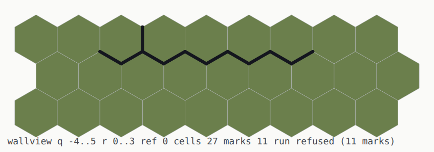

# `26` — The blueprint editor: the plan view first

**Issue:** [`jjstwerff/moros#26`](https://github.com/jjstwerff/moros/issues/26) ·
**Value:** `F` · **Effort:** `H` (`B0` is the step in hand)

## Status

[BLUEPRINT.md](../../doc/claude/BLUEPRINT.md) is designed and **nothing of it is built**.
Four falsification probes have run — `B0p` withdrew its own premise, `B1p` measured the
palette round-tripping, `B2p` confirmed a 45° face claims its own edges, `B3p` split in
two — so the design's load-bearing claims are settled and the geometry is upstream's.
What is open is the editor, and its §0 decides the order: **the view before the
authoring**, because a plan view is the format the libraries get reviewed in.

`B0` is the field half: what the STORE holds, drawn. Nothing in this tree can show that
today — the only picture is a 3D render whose own defects are what a plan view is for.

## Goal

A plan view of a hex world: cells and their stored edges, drawn from a saved world into a
format a person can open, exact enough that what it draws can be compared against the
store digit for digit — and then the authored description beside it, so field and
description are in one picture.

## Anchors

- [`doc/claude/BLUEPRINT.md`](../../doc/claude/BLUEPRINT.md) — the design; §0 is the order
  of work, §1 the invariant, §2 the three wall types
- [`doc/claude/FORMAL_CORE.md`](../../doc/claude/FORMAL_CORE.md) §2.4.3 — *the canonical
  text must not become a second editor representation*; a blueprint is a **stencil's
  description**, authored then extruded
- [`doc/claude/EDITOR_DEFECTS.md`](../../doc/claude/EDITOR_DEFECTS.md) 4 and 5 — the wall
  drawn twice, and the copy a reload deletes. Plan [#24](https://github.com/jjstwerff/moros/issues/24)
  fixes it; this plan is how it gets **seen**
- [`probe/b0p`](../../probe/b0p/README.md) · [`probe/b1p`](../../probe/b1p/README.md) ·
  [`probe/b2p`](../../probe/b2p/README.md) · [`probe/b3p`](../../probe/b3p/README.md)
- Source: `lib/hex_mesh/src/planview.loft` (the view), `src/plan_view.loft` (the driver),
  `lib/hex_mesh/tests/planview.loft` (the gate)

## Invariant gate

The plan view's surface is exact — a mark is at a lattice corner pair or it is not — so
each phase states all three parts.

**`B0`**

- **Expected result.** For a world holding one edge, `wall_set(w, 3, 0, 0, WALL_MAT, …)`,
  the emitted view holds **exactly one** edge mark, and its two endpoints are
  `hex_corner_world(3, 0, 0, (6 - c) % 6)` for the corner pair
  `hex_grid::hex_edge_corners(0)` — the same two calls `hex_mesh` already makes for a
  doorway, to the digit.
- **Invariant.** *The view draws what the store holds and nothing else* — one mark per
  non-zero wall byte in the window, none for a zero byte, none for a cell outside it.
- **Negative control.** Four seeded faults must go **red**, not merely look wrong: the
  corner mirror `(6 - c) % 6` dropped, the slot→direction table permuted, a zero byte
  drawn, and the window's upper bound made inclusive.

⛔ **`B1`'s gate is RESTATED, and the correction is the library's own.** It read *a wall
authored at 15° emits a recovered line at 30°*, which compares HEADINGS — and
`wall_read_run` says at its own signature that the field stores no orientation, so the
answer comes back as `d24` **or** `d24 + 12` with the ends swapped: *"`read.d == d` is
therefore the wrong round-trip assertion; compare the ENDPOINTS."* Written as measured:

- **Expected result.** A run laid by the editor's own `run_between` from `(0,0)` towards
  `(6,0)` recovers to **its own two endpoints**, in either order, and the description
  drawn from it stays within **0.6 wu** of every mark it was recovered from.
- **Invariant.** *The description is `wall_read_run`'s answer, drawn in the field's own
  frame* — never a line fitted to the marks.
- **Negative control.** A gesture-style chain — anchor where the author stood, 15° off
  the lattice — must draw a description that **misses its own wall** by more than 0.6 wu.
  If that stray is small too, the picture cannot show a difference it does not have.

**`B2`** — **expected result**: the world key is byte-identical before and after emitting
a two-level view. **Invariant**: *the page offset never reaches the field*. **Negative
control**: an offset applied to the store must be refused by the same check.

**`B3`** has no exact-invariant surface beyond the pose it prints, which is `Walker`'s own
two floats.

**`B4a`** — **expected result**: for every cell of a two-level window, the page point at
that cell's own centre picks **that cell**, on the panel it was drawn in. **Invariant**:
*page → cell is the exact inverse of the placement `B2` declared* — one pitch, one origin,
no second derivation of either. **Negative control**: three points must be **refused with a
reason**, never snapped to the nearest cell — one in the gutter between panels, one in a
panel's margin outside the window, and one left of the page entirely (where truncating
division would otherwise answer *panel 0*).

**`B4b`** — **expected result**: the world key after authoring at a picked spot equals the
key after the same verb authored by standing there. **Invariant**: *a pick is a TARGET, not
a teleport* — the `Author` is built at the picked spot and the walker does not move.
**Negative control**: a pick that lands on no panel must author **nothing**, and the world
key must be unchanged.

## Phases

| Phase | Effort | Verify | Status |
|---|---|---|---|
| **`B0`** — the field, drawn: cells and stored edges from a saved world | M | `lib/hex_mesh/tests/planview.loft` — the emitted text parsed back and compared against a second, independent walk of the store; four seeded faults seen red | ✅ **SHIPPED** `6bc8144` |
| **`B1`** — the description beside it: the recovered run over the same window | M | `lib/hex_editor/tests/edges_mat.loft` + `lib/hex_mesh/tests/planview.loft` — the authored run's ENDPOINTS come back, the description stays within 0.6 wu of its own marks, a wandering chain's does not; four seeded faults seen red | ✅ **SHIPPED** `ba3af3c` |
| **`B2`** — levels side by side, offset in the page frame only (§3.4) | S | `lib/hex_mesh/tests/planview.loft` — the world key is unmoved by an emit (checked against a mutation), the same cell has identical `points` in every panel, the panels do not overlap, and the two levels are not the same picture; four seeded faults seen red | ✅ **SHIPPED** `0c35614` |
| **`B3`** — the author on the plan: pose and facing, from the walker | S | `probe/plan` — three stations of a committed script, `feet` against the marker READ BACK out of the picture, with a control that the three differ; four suite faults and the probe's own seen red | ✅ **SHIPPED** `9d81b93` |
| **`B4a`** — page → cell: the inverse of the panel transform, refusing what is on no panel | S | `planview.loft` — round trip over all 338 cells of a two-level window; the gutter, the margin, past-the-end and a point left of the page each **refused** with a reason; four seeded faults seen red | ✅ **SHIPPED** `e70efbf` |
| **`B4b`** — a gesture from a picked spot, with the walker left where it is | M | `probe/plan` rows D–F — picked and stood-on key one world, the walker does not move, a pick off the page authors nothing; the teleport seen red | ✅ **SHIPPED** `e70efbf` |
| **`B4c`** — the picked spot drawn back, so you can see what you are about to author | S | the marker's own coordinates equal `plan_pick`'s answer for the page point that produced it | Open |
| **`B4d`** — wall TYPE and thickness, from the palette (§3.3) | M | a wall authored as a second palette entry reads back with that entry's `wd_body`/`wd_thickness` | Blocked on `@HB-X63` |

### Why `B0` is one phase and not two

- **Upper (safety).** Nothing is replaced: the view is additive, and its own test runs the
  emitted picture and the store side by side and compares them exactly. There is no
  moment where the only way to see whether it worked is to swap and look.
- **Lower (validity).** It goes red on its own for four real reasons, listed above, and it
  is **called** the moment it lands — `make plan-view` over a world the corpus already
  builds. Splitting *write the emitter* from *call it* would manufacture this tree's
  commonest defect on purpose.

⚠ **And `B0` deliberately stops at the FIELD.** The description half needs the run record,
which the save does not carry ([EDITOR_DEFECTS](../../doc/claude/EDITOR_DEFECTS.md) 5) —
so `B1` is a different question with a different source, not the second half of one step.

⚠ **THIS FILE IS OVER `plans/README.md`'s 100–300 LINE BUDGET, AND IT IS THE FOUR STEP
RECORDS BELOW THAT PUT IT THERE.** The convention says length means reference content is
leaking in — and the fix is the one the closing checklist already names: each finding
moves to the doc that owns it (`BLUEPRINT.md` §0 and §3.4 and `EDITOR_DEFECTS.md` entry 6
already carry the load-bearing halves), and this keeps the closure record. ⚠ Thinning
them **before** that move is how a finding that cost a day becomes a line nobody can
check — `STATE.md`'s own lesson, in its own banner.

## What `B0` turned up

**Shipped `6bc8144`.** `hex_mesh::plan_svg` + `src/plan_view.loft` + six tests;
`make plan-view WORLD=<name>`. The four seeded faults were each seen red on their own
row — the mirror dropped (2 failed), the slot table permuted (2), a zero byte drawn (3),
the window bound made inclusive (1) — with the control green either side of the sweep.

### ⚠ The first picture it drew found two things, and neither is what it was aimed at

`house.keys` is the oldest script in the corpus and the one every acceptance shot is
taken from. Drawn flat, its house is **27 floor cells with a closed wall around them —
and four wall edges that bound none of them.**

*Three black stubs hang off the corners and a fourth stray edge is the orange one below the
south wall — the window. `make plan-view WORLD=headless Q0=-7 R0=-8 Q1=5 R1=5`.*

| | |
|---|---|
| stray edges | `(-2,-6)` slot E · `(2,-4)` slot NE · `(-5,-1)` slot NE · `(-1,2)` slot E |
| what they touch | each shares **exactly one vertex** with the footprint, and no cell of it |
| how many | **four** — and the house has four sides |

⚠ **AND ONE OF THEM IS AN OPENING.** `house.keys` cuts two, and its own comment
records the day they finally landed — *"`opened profile 1 at (-2,1)` and `opened
profile 2 at (-1,2)` come back on the wire"*. Measured in the field: profile 1 bounds
floor cell `(-2,1)`; **profile 2 bounds nothing at all.** It hangs off a corner by one
vertex, which is why nobody saw it — a window at the corner of a house is exactly where
a window looks right.

⚠ **THIS IS NOT YET A DEFECT CLAIM, AND THE DIFFERENCE IS THE WHOLE PLAN.** A wall is a
straight RUN and a footprint is that run rasterised, so a stamp that over-runs the fill
at each corner may be drawing a wall that genuinely exists in the description and
genuinely bounds nothing in the field. **Which of the two is right is `B1`'s question**,
and it is the argument for `B1` rather than a bug report: the field half alone can say
*this edge bounds no room* and cannot say *and no wall was authored there*.

### ⚠ The gesture says 84 and the world holds 42

`place` acknowledges *"house placed 27 cells, **84** wall edges"*. The saved world holds
**42** non-zero wall bytes, counted over **every layer** rather than the drawn one — so
this is not the plan view looking at the wrong height.

They are different questions: `marked` counts what `wall_stamp` marked, and an edge is
stored once and read from both its cells. ⚠ **But this exact pair is the one that hid a
real defect** — `hex_editor.loft`'s own comment records `place_house` printing *84 wall
edges* while the store held **23**, two of the four walls destroyed, every suite green.
A number that cannot equal the store is a number no one can use as a health check, and
the plan view is the first thing here that draws the other side of it.

✅ **ANSWERED BY `B1`, AND IT WAS ALREADY WRITTEN DOWN.** `probe/l1` measured it a plan
earlier — *"`wall_stamp` writes every edge twice — 16 writes for 8 distinct edges …
every `marked` count this tree prints is double"* — so the two are one doubling and not
two questions. It is an assertion in the suite now rather than a sentence in a probe
write-up: `planview.loft` checks the drawn mark count against `m / 2`.

### What the instrument cannot see, said before it is trusted

- **One reference height per picture.** `plan_svg` takes a `ref` and draws the layer
  `edge_layer` selects for it — so a deck's fence and the yard below it are two
  pictures, not one. The driver defaults to the world's own ground default, and to `0`
  when it has none, which on a world with a cellar is **the cellar**.
- **The field only.** No run, no `rebuild`, no palette — `B1`.
- **It is not a gate.** The picture is for a person; the claims are the loft tests.

## What `B1` turned up

**Shipped `ba3af3c`.** `hex_editor::edges_mat` (the bridge `probe/l1` named and could not
put anywhere), `hex_editor::wall_recover` + `RunRead`, the dashed description in
`plan_svg`, and a caption that says which of three states the description is in. Four
seeded faults each seen red: the bridge writing nothing, the far end collapsed onto the
anchor, the triangle frame's axes swapped, and the caption's verdict hard-wired.

### ⚠ A house eight hexes away makes an unrelated wall unreadable

`tools/scripts/wall.keys` lays one wall west-to-east and then places a house at `(-8,-8)`.
The same window over the same wall, with and without that house:

| | marks | description |
|---|---|---|
| the wall alone | **10** | ✅ `run d0 p5` — the authored `(-4.3301, 0.5)`-`(4.3301, 0.5)` |
| the wall, with the house in the world | **11** | ⛔ `refused (11 marks)` |

**The eleventh mark is the short stub at the top left**, and it is one of the house's — the
same corner over-run `B0` found. It meets the wall's chain at a vertex, which makes three
marked edges at one point, and `wall_read_run` will not answer for a marking that is not a
path. ⚠ **So `B0`'s four stray edges are not cosmetic.** A structure eight hexes away
silently costs a wall its description, and nothing in this tree could see that before the
two were drawn together.

### Two things `probe/l1` wrote down, now pinned by tests rather than by prose

- **Every `marked` count this tree prints is double.** `lib/hex_mesh/tests/planview.loft`
  asserts the drawn mark count is exactly `m / 2` for the stamp's own return. That closes
  `B0`'s open pair — *the gesture says 84 and the world holds 42* was never two questions,
  it is one doubling, and the assertion is now in the suite.
- **A wandering chain is answered confidently, not refused.** `probe/l1`'s `P4` predicted
  `ok = false`; measured again at the new entry point, `wall_recover` returns `ok` with
  ends that are not the authored ones. The test says so, and says in its own message what
  it would mean if the library ever gained a path check.

### What the instrument still cannot see

- **One run per window.** `wall_read_run` asks *what run do these marks describe*, so a
  window holding a closed loop or two walls is refused whole. A house therefore draws no
  description at all — the caption says `refused (n marks)` rather than falling silent,
  because *no marks* and *marks the reader refused* are different facts.
- **No `rebuild`, no palette.** A wall type, a thickness, a bay — none of that is asked
  for yet; `wall_read_run` answers about a straight run and nothing else.

## What `B2` turned up

**Shipped `0c35614`.** `plan_levels` takes a list of reference heights and draws one panel
per level, each in its own `<g>` carrying `data-level`, `data-ref` and `data-dx`;
`plan_svg` is the one-level wrapper. `make plan-view WORLD=b2deck REFS=0,3`.

*`deck.keys`'s world, ground and the storey above it. Same window, same coordinates,
placed by one transform each.*

### The offset is declared, and the geometry never learns it

`plan_panel` draws in the world's own frame and does not take a `dx` at all; the group
places it. So the same cell has **byte-identical `points` in every panel**, and `data-dx`
and the `transform` are two statements of one number, checked against each other — a
picture whose two statements of its own offset disagreed would be unmappable and would
look perfectly right.

⚠ **THE REFACTOR WAS PROVEN BEFORE THE FEATURE WAS ADDED.** `plan_svg`'s body became
`plan_panel` + `plan_levels`, and the **282** emitted elements of one window were compared
byte-for-byte against the pre-refactor output: identical. `data-h` went on the cell only
after that, as a deliberate content change rather than a silent one.

### ⛔ And the sabotage sweep caught ME first

The first row-1 sabotage — *bake the offset into the geometry* — was spelled as a shift of
`hex_corner_world(q + 1, …)`, and the suite stayed **green**. That is correct: the test
asks whether the panels differ **from each other**, and a shift applied to all of them
equally is not that defect. The faithful sabotage is the obvious wrong implementation —
pass `dx` into `plan_panel` and add it to the coordinates — and it is caught, with the
assertion's own words. ⚠ **A sabotage has to BE the defect, not a change in its
neighbourhood**, and a green row is a claim about the sabotage before it is one about the
test.

### The upper panel draws the lawn, and that is the store's answer

A panel at `ref 3` shows the deck **and** the ground around it, because `world_surface`
answers *what would someone at this height be standing on* and outside the deck that is
still the ground. The answer is right and it looks like grass on the first floor.
`data-h` — the cell's own stored height — is what tells them apart, and it is the store's
number rather than a rule invented here. ⚠ Whether an upper panel should BLANK what is
not on its level is a decision for the authoring half, not a defect: on `b2deck` the
heights emitted are `0 1 2 3 5 6` for the raised ground and `12` for the deck, so the
plan already carries the contour a reader needs.

### What it still cannot see

- **A level here is a reference HEIGHT, not a sheet index.** `FORMAL_CORE` §2.4.3 says
  *"the level is a discrete sheet index and nothing else"*, and this store has layers and
  heights — `combine_cut_level`'s `at` is `hex_place`'s, and nothing in the editor writes
  one. So `data-level` is the panel's index and `data-ref` the height it was read at, and
  **neither is the formal level**. Naming them apart is the most this step can honestly do.
- **One run per window still**, per `B1`.

## What `B3` turned up

**Shipped `9d81b93`.** `plan_author` takes a `hex_editor::Author` — the same four
numbers every gesture takes — and the plan draws a marker at the author's own two floats
with a facing tick along `(cos yaw, sin yaw)`. `editor_run` gains `plan <tag>`: the view
at the current tick, windowed on the author. `make probe-plan`, and it is in `make fast`.

*A house, and the person who built it standing against its south wall, facing north. The
caption ends `you`; the same four stray edges `B0` found are on the corners of this
placement too.*

### The pose is read back OUT of the picture

`editor_run`'s `plan` line prints the marker it parsed from the SVG it just wrote — not
`wk_x`. ⚠ **A line that re-printed the walker would compare the walker against the walker
and pass for any drawing at all**, including one that put the marker at the origin. That
is exactly the row `probe/plan` catches: with the marker nailed to `(0,0)`, **station 1
still passes** — the author really is at the origin there — and stations 2 and 3 fail.
Three stations and the *are they even different points* control are what make the row an
answer.

### Which panel the author stands on is the store's answer

They are drawn on the level whose reference selects the same LAYER under their own cell as
their own feet do — `edge_layer` asked twice and compared. A rule of the shape *within half
a storey of the reference* would be a number invented here, and `FORMAL_CORE` is explicit
that a level is not a height. Tested both ways round on the two-storey fixture: standing on
the ground they are on `L0` and **not** `L1`; standing on the deck, `L1` and not `L0`.

### ⚠ A saved world has no author, and the picture says so

`src/plan_view.loft` reads a `.hxw` and reports `who none`, because the walker lives in
whichever driver is running the tick — the store carries the world and not the person.
**That is the same boundary `B1` found from the other side** (the run record is not saved
either), and it is why the author appears in `editor_run`'s `plan` rather than in the file
reader: a program that invented a pose from an argument would be drawing a claim rather
than a fact.

⚠ **AND THE THREE STATES DO NOT READ ALIKE** — `who none`, `who (x,z)`, `who (x,z)
OFF-PLAN`. An absent marker means *nobody was given* and *somebody is elsewhere* at once,
which is the collapse `probe/l1` lost a run to and the third time this plan has had to
separate one.

## What `B4a`/`B4b` turned up

**Shipped `e70efbf`.** `plan_pick` turns a page position back into a cell on a level;
`editor_run` gains `pick <x>,<y> <verb>`. [`probe/plan`](../../probe/plan/README.md) grew
rows D–F.

### One frame, and the extraction proven before it was used

`plan_bounds` and `plan_pitch` now answer for the drawing **and** the pick. A second
derivation of that arithmetic would be wrong by a margin — right in the middle of every
panel and wrong at its edges, which is where nothing is ever tested by hand. The
extraction was proven first: **282 emitted elements byte-for-byte identical** to before it.

### ⚠ `mesh_tile_of`'s bug, in a new place, caught before it shipped

loft's `/` truncates toward zero, so a page point **left** of the picture divides to
**panel 0** — a click a metre outside would author inside the first panel. The bound is
tested before the division, and the sweep row that removes that test goes red. ⚠ This tree
has already paid for this once, in `mesh_tile_of`, and its test file says why in its own
banner: *every fixture in this tree stands at the origin, which is the one place the wrong
spelling is right*. The refusals are checked as **four named reasons** — gutter, margin,
past-the-end, off-page — because *the nearest cell* is not an answer to *no cell*.

The accept side is a **round trip over all 338 cells** of a two-level window, for the same
reason: a transform wrong by a margin still picks the right cell in the middle of a panel.

### A pick is a TARGET, not a teleport

Clicking a plan to hang a door does not walk the person across the room. The `Author` is
built at the picked spot and handed to the same `press_verb` every other spelling uses —
so the verb is the verb, and this is not the fifth place that decides what a key means
([EDITING_MODES](../../doc/claude/EDITING_MODES.md) already counts four). ⚠ **That is what
`Author` being a type of its own is FOR**, and until this step nothing in the tree had used
the distinction.

Measured, and it is the whole argument for the step: **picked and stood-on key the same
world**, `32952:2278076870` — with the control that the fence moved the world off the bare
key `32952:3318286153` at all, because two worlds nobody authored in agree perfectly.

### ⚠ And a failure that was not this tree's

Three runs died on `unable to find library -lloft_graphics_native`. It is a **sibling's
loft CI** rebuilding the native cdylibs: `~/.loft/build-cache/graphics-0.8.0/release` is
emptied and refilled, and every `--lib lib/` link here fails while it is empty. Nothing to
fix and nothing to kill. `LOFT_NO_NATIVE_LIBS=1` is the way through, and it changes what is
exercised. [`probe/plan/README.md`](../../probe/plan/README.md) carries the incantation.

✅ **RE-RUN PLAINLY ONCE THE CACHE REFILLED AND THE CAVEAT IS DISCHARGED**: `make fast`
exits 0 with `probe/plan` green on the native path inside it, and `hex_mesh` is **94 on
both backends**. ⚠ The window it took was between two of the sibling's rebuilds, so the
green is a fact about this run and not a promise about the next one.

## Open questions

1. **Where does the view live once lavition splits?** It is in `hex_mesh` because that
   package already has the exact cone — `hex_voxel` for the store, `hex_proj` for the
   corners, `hex_editor` for the slot readers — and a package invented for one module is
   the speculative split plan 19 is already paying for. Decided by `B2`, which is the
   first phase that would need anything `hex_mesh` does not already have.
2. **Does the plan view belong in the running editor as a mode?** Not for `B0`: a file a
   person opens needs no server, no port and no tunnel, and the user is off-LAN. Revisit
   at `B3`, where the walker is on the plan and the two views want the same pose.
3. **What draws a wall's THICKNESS?** `@HB-X69` puts it in the palette, so the view must
   read `wd_thickness` through the palette rather than measure the cells. Untouched by
   `B0` — which draws edges, not bands — and it is the first thing `B1` will want.
